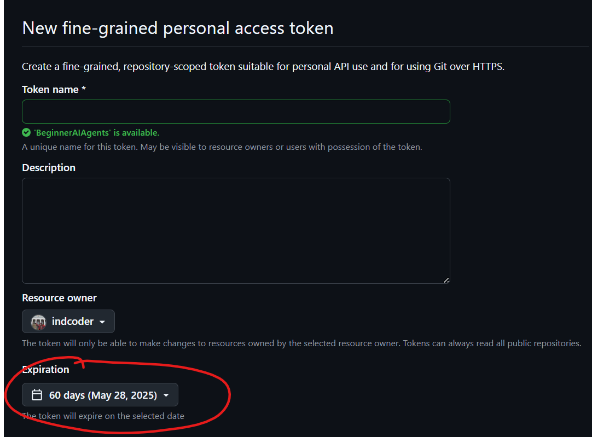
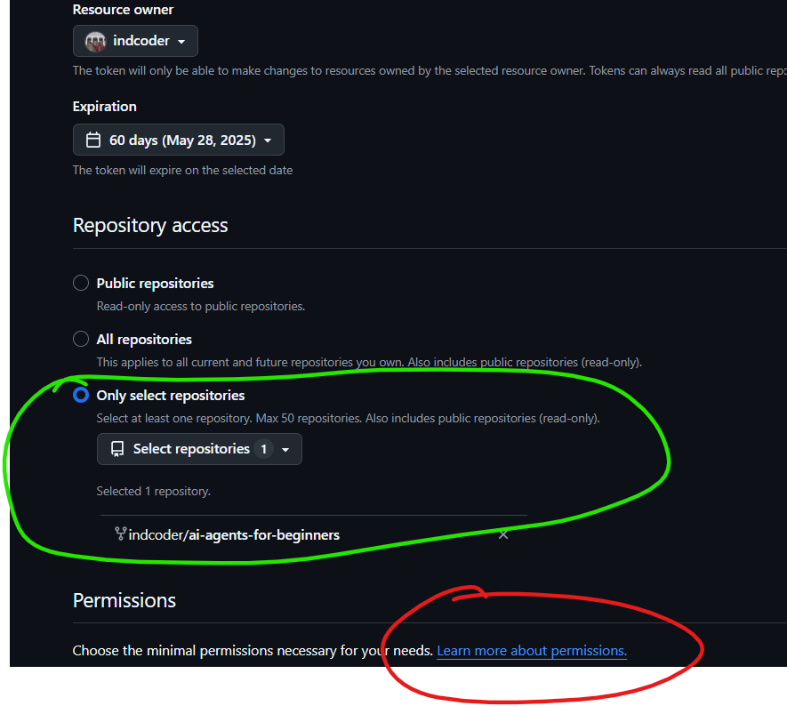
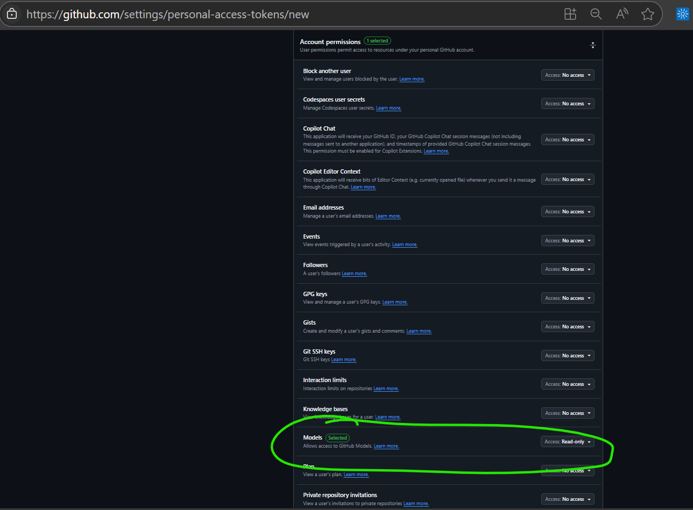

# Course Setup

## Introduction

This lesson will cover how to run the code samples of this course.

## Requirements

- A GitHub Account
- Python 3.12+
- Azure Subscription
- Azure AI Foundry Account

## Clone or Fork this Repo

To begin, please clone or fork the GitHub Repository. This will make your own version of the course material so that you can run, test, and tweak the code!

This can be done by clicking the link to <a href="https://github.com/microsoft/ai-agents-for-beginners/fork" target="_blank">fork the repo</a>

You should now have your own forked version of this course in the following link:


## Retrieve Your GitHub Personal Access Token (PAT)

Currently, this course uses the Github Models Marketplace to offer free access to Large Language Models(LLMs) that will be used to create AI Agents.

To access this service, you will need to create a GitHub Personal Access Token.

This can be done by going to your <a href="https://github.com/settings/personal-access-tokens" target="_blank">Personal Access Tokens settings</a> in your GitHub Account.

Select the `Fine-grained tokens` option on the left side of your screen.

Then select `Generate new token`.


Instead of a token with no expiration date, we  recommend creating one for limited days eg: 60 days [if done at the start of April 2025 conveniently coincides with the duration of [AI Skills fest](https://techcommunity.microsoft.com/blog/microsoftlearnblog/register-now-for-the-microsoft-ai-skills-fest/4292261?wt.mc_id=DT-MVP-500304



Also, as an additional security measure, we can restrict the token to only be used for the `ai-agents-for-beginners` repository [[Least Privilege Principle](https://en.wikipedia.
org/wiki/Principle_of_least_privilege)].



Finally, select the **Models** scope under Permissions and the `Read-only` access.


Please copy your new token that you have just created, and set it as your `GITHUB_TOKEN` in your `.env` file you have created from `.env-sample` in this course.

## Add this to your Environment Variables

To create your `.env` file run the following command in your terminal:

```bash
cp .env.example .env
```

This will copy the example file and create a `.env` in your directory, fill in the values for the environment variables. You can locate the values for each environment variable in the following locations of the [Azure AI Foundry](https://ai.azure.com?WT.mc_id=academic-105485-koreyst) portal:

Open that file and paste the token you created into the `GITHUB_TOKEN=` field of the .env file.

- `AZURE_SUBSCRIPTION_ID` - On the **Overview** page of your project within **Project details**.
- `AZURE_AI_PROJECT_NAME` - At the top of the **Overview** page for your project.
- `AZURE_OPENAI_RESOURCE_GROUP` - On the **Overview** page of the **Management Center** within **Project properties**.
- `AZURE_OPENAI_SERVICE` - On the **Overview** page of your project in the **Included capabilities** tab for **Azure OpenAI Service**.
- `AZURE_OPENAI_API_VERSION` - On the [API version lifecycle](https://learn.microsoft.com/azure/ai-services/openai/api-version-deprecation#latest-ga-api-release?WT.mc_id=academic-105485-koreyst) webpage within the **Latest GA API release** section.
- `AZURE_OPENAI_ENDPOINT` - On the **Details** tab of your model deployment within **Endpoint** (i.e. **Target URI**)

## Install Required Packages

To ensure you have all the required Python packages to run the code, run the following command in your terminal.

We recommend creating a Python virtual environment to avoid any conflicts and issues.

```bash
pip install -r requirements.txt
```

This should install the required Python packages.

# Sign in to Azure

As a security best practice, we'll use [keyless authentication](https://learn.microsoft.com/azure/developer/ai/keyless-connections?tabs=csharp%2Cazure-cli?WT.mc_id=academic-105485-koreyst) to authenticate to Azure OpenAI with Microsoft Entra ID. Before you can do so, you'll first need to install the **Azure CLI** per the [installation instructions](https://learn.microsoft.com/cli/azure/install-azure-cli?WT.mc_id=academic-105485-koreyst) for your operating system.

Next, open a terminal and run `az login` to sign in to your Azure account.

## Keyless Authentication

Login with your Azure AI account used to provision the Azure resources.

Open a new terminal and enter the following command and follow the instructions in the terminal:

`az login --use-device-code`

Once you've logged in, select your subscription in the terminal.

## Access the environment variables

We'll import `os` and `load_dotenv` so that you can access the environment variables.

```python
import os
from dotenv import load_dotenv

load_dotenv()
```

## Setup keyless authentication

Rather than hardcode your credentials, we'll use a keyless connection with Azure OpenAI. To do so, we'll import `DefaultAzureCredential` and later call the `DefaultAzureCredential` function to get the credential.

```python
from azure.identity import DefaultAzureCredential, InteractiveBrowserCredential
```

You are now ready to run the code of this course, happy learning more about the world of AI Agents!

If you have any issues running this setup, hop into our <a href="https://discord.gg/kzRShWzttr" target="_blank">Azure AI Community Discord</a> or <a href="https://github.com/microsoft/ai-agents-for-beginners/issues?WT.mc_id=academic-105485-koreyst" target="_blank">create an issue</a>.

## Next Lesson

[Introduction to AI Agents and Agent Use Cases](../01-intro-to-ai-agents/README.md)
