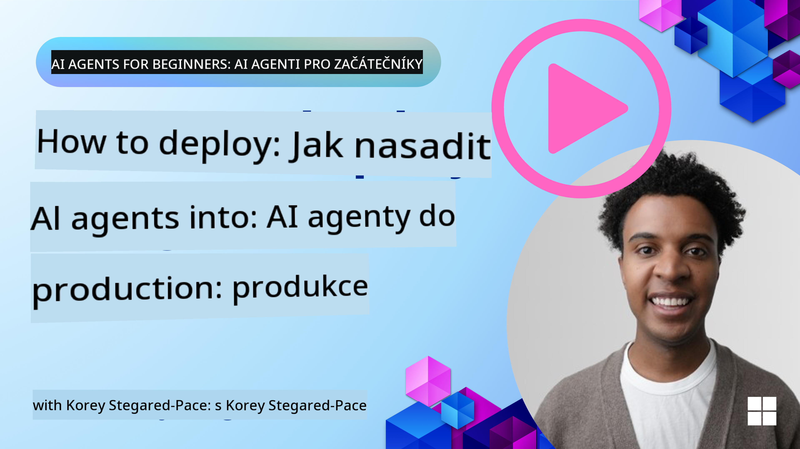

<!--
CO_OP_TRANSLATOR_METADATA:
{
  "original_hash": "1ad5de6a6388d02c145a92dd04358bab",
  "translation_date": "2025-07-12T13:41:36+00:00",
  "source_file": "10-ai-agents-production/README.md",
  "language_code": "cs"
}
-->

> _(Klikněte na obrázek výše pro zhlédnutí videa této lekce)_
# AI Agenti v produkci

## Úvod

Tato lekce pokryje:

- Jak efektivně naplánovat nasazení vašeho AI Agenta do produkce.
- Běžné chyby a problémy, na které můžete narazit při nasazování AI Agenta do produkce.
- Jak řídit náklady a zároveň udržet výkon vašeho AI Agenta.

## Cíle učení

Po dokončení této lekce budete vědět, jak/pochopíte:

- Techniky pro zlepšení výkonu, nákladů a efektivity produkčního systému AI Agenta.
- Co a jak hodnotit u vašich AI Agentů.
- Jak kontrolovat náklady při nasazování AI Agentů do produkce.

Je důležité nasazovat AI Agenty, kterým lze důvěřovat. Podívejte se také na lekci „Building Trustworthy AI Agents“.

## Hodnocení AI Agentů

Před, během i po nasazení AI Agentů je klíčové mít správný systém pro jejich hodnocení. To zajistí, že váš systém bude v souladu s vašimi a uživatelskými cíli.

Pro hodnocení AI Agenta je důležité mít možnost hodnotit nejen výstup agenta, ale i celý systém, ve kterém váš AI Agent funguje. To zahrnuje, ale není omezeno na:

- Počáteční požadavek na model.
- Schopnost agenta rozpoznat záměr uživatele.
- Schopnost agenta vybrat správný nástroj pro vykonání úkolu.
- Odezvu nástroje na požadavek agenta.
- Schopnost agenta interpretovat odpověď nástroje.
- Zpětnou vazbu uživatele na odpověď agenta.

Tímto způsobem můžete identifikovat oblasti pro zlepšení modulárněji. Následně můžete efektivněji sledovat dopad změn modelů, promptů, nástrojů a dalších komponent.

## Běžné problémy a možná řešení s AI Agenty

| **Problém**                                    | **Možné řešení**                                                                                                                                                                                                           |
| ---------------------------------------------- | -------------------------------------------------------------------------------------------------------------------------------------------------------------------------------------------------------------------------- |
| AI Agent neplní úkoly konzistentně             | - Upřesněte prompt pro AI Agenta; buďte jasní v cílech. - Identifikujte, kde může pomoci rozdělení úkolů na dílčí a jejich řešení více agenty.                                                                          |
| AI Agent se dostává do nekonečných smyček      | - Zajistěte jasná pravidla ukončení, aby agent věděl, kdy proces zastavit. - Pro složité úkoly vyžadující uvažování a plánování použijte větší model specializovaný na tyto úkoly.                                         |
| Volání nástrojů AI Agenta nefungují správně    | - Testujte a ověřujte výstupy nástrojů mimo systém agenta. - Upřesněte definované parametry, prompty a pojmenování nástrojů.                                                                                              |
| Multi-agentní systém nefunguje konzistentně    | - Upřesněte prompty pro jednotlivé agenty, aby byly specifické a odlišné. - Vytvořte hierarchický systém s „routing“ nebo řídícím agentem, který určí, který agent je ten správný.                                        |

## Řízení nákladů

Zde jsou některé strategie, jak řídit náklady při nasazování AI Agentů do produkce:

- **Ukládání odpovědí do cache** – Identifikace běžných požadavků a úkolů a poskytování odpovědí ještě před tím, než projdou vaším agentním systémem, je dobrý způsob, jak snížit počet podobných požadavků. Můžete dokonce implementovat tok, který pomocí jednodušších AI modelů určí, jak moc je požadavek podobný těm uloženým v cache.

- **Používání menších modelů** – Malé jazykové modely (SLM) mohou dobře fungovat u určitých agentních případů použití a výrazně sníží náklady. Jak bylo zmíněno dříve, nejlepší je vytvořit hodnotící systém, který porovná výkon menších modelů s většími, abyste pochopili, jak dobře SLM zvládne váš případ použití.

- **Použití router modelu** – Podobnou strategií je využití různých modelů a velikostí. Můžete použít LLM/SLM nebo serverless funkci k směrování požadavků podle složitosti na nejvhodnější modely. To pomůže snížit náklady a zároveň zajistit výkon na správných úkolech.

## Gratulujeme

Toto je zatím poslední lekce kurzu „AI Agents for Beginners“.

Plánujeme pokračovat v přidávání lekcí na základě zpětné vazby a změn v tomto neustále rostoucím odvětví, tak se brzy zase zastavte.

Pokud chcete pokračovat ve vzdělávání a tvorbě s AI Agenty, připojte se k <a href="https://discord.gg/kzRShWzttr" target="_blank">Azure AI Community Discord</a>.

Pořádáme tam workshopy, komunitní kulaté stoly a „ask me anything“ sezení.

Máme také kolekci Learn s dalšími materiály, které vám pomohou začít stavět AI Agenty v produkci.

## Předchozí lekce

[Metacognition Design Pattern](../09-metacognition/README.md)

**Prohlášení o vyloučení odpovědnosti**:  
Tento dokument byl přeložen pomocí AI překladatelské služby [Co-op Translator](https://github.com/Azure/co-op-translator). I když usilujeme o přesnost, mějte prosím na paměti, že automatické překlady mohou obsahovat chyby nebo nepřesnosti. Původní dokument v jeho mateřském jazyce by měl být považován za závazný zdroj. Pro důležité informace se doporučuje profesionální lidský překlad. Nejsme odpovědní za jakékoliv nedorozumění nebo nesprávné výklady vyplývající z použití tohoto překladu.