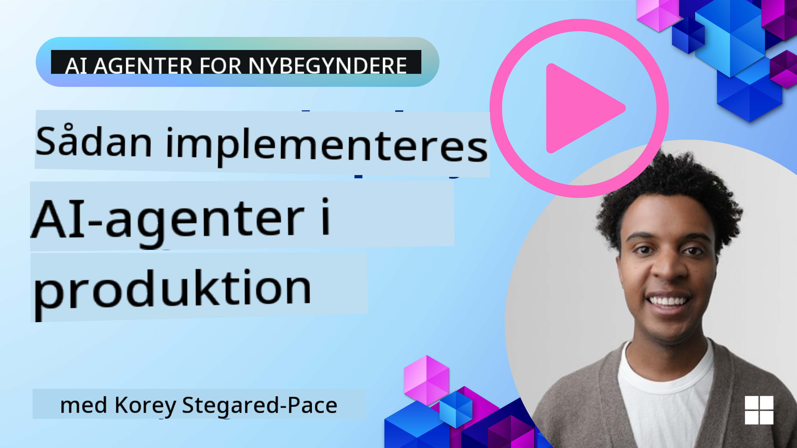

<!--
CO_OP_TRANSLATOR_METADATA:
{
  "original_hash": "1ad5de6a6388d02c145a92dd04358bab",
  "translation_date": "2025-07-12T13:39:29+00:00",
  "source_file": "10-ai-agents-production/README.md",
  "language_code": "da"
}
-->

> _(Klik på billedet ovenfor for at se videoen til denne lektion)_
# AI Agents i produktion

## Introduktion

Denne lektion vil dække:

- Hvordan du effektivt planlægger udrulningen af din AI Agent til produktion.
- Almindelige fejl og problemer, du kan støde på, når du implementerer din AI Agent i produktion.
- Hvordan du styrer omkostningerne, samtidig med at du opretholder din AI Agents ydeevne.

## Læringsmål

Efter at have gennemført denne lektion vil du vide, hvordan du/forstå:

- Teknikker til at forbedre ydeevne, omkostninger og effektivitet i et produktionssystem med AI Agents.
- Hvad og hvordan du evaluerer dine AI Agents.
- Hvordan du kontrollerer omkostninger ved udrulning af AI Agents i produktion.

Det er vigtigt at implementere AI Agents, der er pålidelige. Tag også et kig på lektionen "Building Trustworthy AI Agents".

## Evaluering af AI Agents

Før, under og efter udrulning af AI Agents er det afgørende at have et ordentligt system til at evaluere dine AI Agents. Det sikrer, at dit system er i overensstemmelse med dine og dine brugeres mål.

For at evaluere en AI Agent er det vigtigt ikke kun at kunne vurdere agentens output, men også hele det system, som din AI Agent opererer i. Dette inkluderer, men er ikke begrænset til:

- Den oprindelige modelanmodning.
- Agentens evne til at identificere brugerens intention.
- Agentens evne til at vælge det rette værktøj til opgaven.
- Værktøjets respons på agentens anmodning.
- Agentens evne til at fortolke værktøjets svar.
- Brugerens feedback på agentens respons.

Dette gør det muligt at identificere forbedringsområder på en mere modulær måde. Du kan derefter overvåge effekten af ændringer i modeller, prompts, værktøjer og andre komponenter mere effektivt.

## Almindelige problemer og mulige løsninger med AI Agents

| **Problem**                                    | **Mulig løsning**                                                                                                                                                                                                          |
| ---------------------------------------------- | -------------------------------------------------------------------------------------------------------------------------------------------------------------------------------------------------------------------------- |
| AI Agent udfører ikke opgaver konsekvent       | - Forfin prompten til AI Agenten; vær tydelig omkring målene. - Identificer, hvor opdeling af opgaver i delopgaver og håndtering af dem af flere agenter kan hjælpe.                                                      |
| AI Agent kører i kontinuerlige løkker          | - Sørg for klare afslutningsbetingelser, så agenten ved, hvornår processen skal stoppe. - Til komplekse opgaver, der kræver ræsonnering og planlægning, brug en større model, der er specialiseret til ræsonneringsopgaver. |
| AI Agent værktøjsopkald fungerer ikke godt    | - Test og valider værktøjets output uden for agentsystemet. - Forfin de definerede parametre, prompts og navngivning af værktøjer.                                                                                        |
| Multi-Agent system fungerer ikke konsekvent    | - Forfin prompts til hver agent for at sikre, at de er specifikke og adskilte fra hinanden. - Byg et hierarkisk system med en "routing" eller controller-agent, der bestemmer, hvilken agent der er den rette.             |

## Omkostningsstyring

Her er nogle strategier til at styre omkostningerne ved udrulning af AI Agents i produktion:

- **Caching af svar** – Identificer almindelige forespørgsler og opgaver, og lever svarene, før de går gennem dit agentiske system. Det er en god måde at reducere mængden af lignende forespørgsler på. Du kan endda implementere en flow, der vurderer, hvor ens en forespørgsel er i forhold til dine cachede svar ved hjælp af mere simple AI-modeller.

- **Brug af mindre modeller** – Små sprogmodeller (SLMs) kan klare visse agentiske brugsscenarier godt og vil reducere omkostningerne betydeligt. Som nævnt tidligere er det bedste at bygge et evalueringssystem til at bestemme og sammenligne ydeevne i forhold til større modeller for at forstå, hvor godt en SLM vil klare sig i dit tilfælde.

- **Brug af en Router Model** – En lignende strategi er at bruge en variation af modeller og størrelser. Du kan bruge en LLM/SLM eller en serverløs funktion til at dirigere forespørgsler baseret på kompleksitet til de bedst egnede modeller. Dette hjælper også med at reducere omkostninger samtidig med, at ydeevnen sikres på de rette opgaver.

## Tillykke

Dette er i øjeblikket den sidste lektion i "AI Agents for Beginners".

Vi planlægger at fortsætte med at tilføje lektioner baseret på feedback og ændringer i denne stadigt voksende branche, så kig forbi igen i den nærmeste fremtid.

Hvis du vil fortsætte din læring og opbygning med AI Agents, så deltag i <a href="https://discord.gg/kzRShWzttr" target="_blank">Azure AI Community Discord</a>.

Vi afholder workshops, community roundtables og "ask me anything"-sessioner der.

Vi har også en Learn-samling med yderligere materialer, der kan hjælpe dig med at komme i gang med at bygge AI Agents i produktion.

## Forrige lektion

[Metacognition Design Pattern](../09-metacognition/README.md)

**Ansvarsfraskrivelse**:  
Dette dokument er blevet oversat ved hjælp af AI-oversættelsestjenesten [Co-op Translator](https://github.com/Azure/co-op-translator). Selvom vi bestræber os på nøjagtighed, bedes du være opmærksom på, at automatiserede oversættelser kan indeholde fejl eller unøjagtigheder. Det oprindelige dokument på dets oprindelige sprog bør betragtes som den autoritative kilde. For kritisk information anbefales professionel menneskelig oversættelse. Vi påtager os intet ansvar for misforståelser eller fejltolkninger, der opstår som følge af brugen af denne oversættelse.