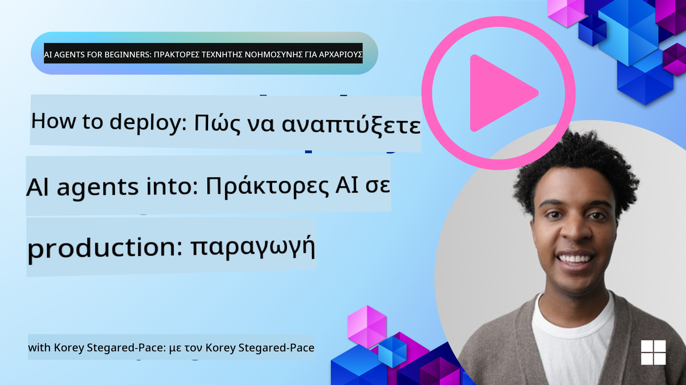

<!--
CO_OP_TRANSLATOR_METADATA:
{
  "original_hash": "1ad5de6a6388d02c145a92dd04358bab",
  "translation_date": "2025-07-12T13:38:46+00:00",
  "source_file": "10-ai-agents-production/README.md",
  "language_code": "el"
}
-->

> _(Κάντε κλικ στην εικόνα παραπάνω για να δείτε το βίντεο αυτού του μαθήματος)_
# AI Agents στην Παραγωγή

## Εισαγωγή

Αυτό το μάθημα θα καλύψει:

- Πώς να σχεδιάσετε αποτελεσματικά την ανάπτυξη του AI Agent σας στην παραγωγή.
- Συνηθισμένα λάθη και προβλήματα που μπορεί να αντιμετωπίσετε κατά την ανάπτυξη του AI Agent σας στην παραγωγή.
- Πώς να διαχειριστείτε τα κόστη διατηρώντας παράλληλα την απόδοση του AI Agent σας.

## Στόχοι Μάθησης

Μετά την ολοκλήρωση αυτού του μαθήματος, θα γνωρίζετε/κατανοείτε:

- Τεχνικές για τη βελτίωση της απόδοσης, του κόστους και της αποτελεσματικότητας ενός συστήματος AI Agent στην παραγωγή.
- Τι και πώς να αξιολογείτε τους AI Agents σας.
- Πώς να ελέγχετε τα κόστη κατά την ανάπτυξη AI Agents στην παραγωγή.

Είναι σημαντικό να αναπτύσσετε AI Agents που εμπνέουν εμπιστοσύνη. Ρίξτε μια ματιά και στο μάθημα "Building Trustworthy AI Agents".

## Αξιολόγηση AI Agents

Πριν, κατά τη διάρκεια και μετά την ανάπτυξη των AI Agents, η ύπαρξη ενός κατάλληλου συστήματος αξιολόγησης είναι κρίσιμη. Αυτό θα διασφαλίσει ότι το σύστημά σας ευθυγραμμίζεται με τους στόχους σας και των χρηστών σας.

Για να αξιολογήσετε έναν AI Agent, είναι σημαντικό να έχετε τη δυνατότητα να αξιολογήσετε όχι μόνο το αποτέλεσμα του agent αλλά και ολόκληρο το σύστημα στο οποίο λειτουργεί ο AI Agent. Αυτό περιλαμβάνει, αλλά δεν περιορίζεται σε:

- Το αρχικό αίτημα προς το μοντέλο.
- Την ικανότητα του agent να αναγνωρίζει την πρόθεση του χρήστη.
- Την ικανότητα του agent να επιλέγει το σωστό εργαλείο για την εκτέλεση της εργασίας.
- Την απόκριση του εργαλείου στο αίτημα του agent.
- Την ικανότητα του agent να ερμηνεύει την απόκριση του εργαλείου.
- Τα σχόλια του χρήστη στην απόκριση του agent.

Αυτό σας επιτρέπει να εντοπίζετε περιοχές για βελτίωση με πιο αρθρωτό τρόπο. Μπορείτε στη συνέχεια να παρακολουθείτε την επίδραση των αλλαγών σε μοντέλα, prompts, εργαλεία και άλλα στοιχεία με μεγαλύτερη αποδοτικότητα.

## Συνηθισμένα Προβλήματα και Πιθανές Λύσεις με AI Agents

| **Πρόβλημα**                                   | **Πιθανή Λύση**                                                                                                                                                                                                             |
| ---------------------------------------------- | -------------------------------------------------------------------------------------------------------------------------------------------------------------------------------------------------------------------------- |
| Ο AI Agent δεν εκτελεί τις εργασίες σταθερά    | - Βελτιώστε το prompt που δίνεται στον AI Agent· να είστε σαφείς στους στόχους. - Εντοπίστε πού η διαίρεση των εργασιών σε υποεργασίες και η ανάθεσή τους σε πολλαπλούς agents μπορεί να βοηθήσει.                          |
| Ο AI Agent μπαίνει σε συνεχείς βρόχους         | - Βεβαιωθείτε ότι υπάρχουν σαφείς όροι και προϋποθέσεις τερματισμού ώστε ο Agent να γνωρίζει πότε να σταματήσει τη διαδικασία. - Για σύνθετες εργασίες που απαιτούν συλλογισμό και σχεδιασμό, χρησιμοποιήστε μεγαλύτερο μοντέλο εξειδικευμένο σε τέτοιες εργασίες. |
| Οι κλήσεις εργαλείων του AI Agent δεν αποδίδουν καλά | - Δοκιμάστε και επικυρώστε την απόδοση του εργαλείου εκτός του συστήματος του agent. - Βελτιώστε τις ορισμένες παραμέτρους, τα prompts και την ονοματοδοσία των εργαλείων.                                                    |
| Το σύστημα με πολλούς agents δεν αποδίδει σταθερά | - Βελτιώστε τα prompts που δίνονται σε κάθε agent ώστε να είναι συγκεκριμένα και διακριτά μεταξύ τους. - Δημιουργήστε ένα ιεραρχικό σύστημα χρησιμοποιώντας έναν "routing" ή controller agent για να καθορίζει ποιος agent είναι ο κατάλληλος. |

## Διαχείριση Κόστους

Ακολουθούν μερικές στρατηγικές για τη διαχείριση του κόστους ανάπτυξης AI Agents στην παραγωγή:

- **Caching Responses** - Η αναγνώριση κοινών αιτημάτων και εργασιών και η παροχή των απαντήσεων πριν περάσουν από το σύστημα των agents είναι ένας καλός τρόπος για να μειώσετε τον όγκο παρόμοιων αιτημάτων. Μπορείτε ακόμη να υλοποιήσετε μια ροή για να εντοπίζετε πόσο παρόμοιο είναι ένα αίτημα με τα αποθηκευμένα χρησιμοποιώντας πιο βασικά AI μοντέλα.

- **Χρήση Μικρότερων Μοντέλων** - Τα Small Language Models (SLMs) μπορούν να αποδώσουν καλά σε ορισμένες περιπτώσεις χρήσης με agents και θα μειώσουν σημαντικά το κόστος. Όπως αναφέρθηκε νωρίτερα, η δημιουργία ενός συστήματος αξιολόγησης για να καθορίσετε και να συγκρίνετε την απόδοση έναντι μεγαλύτερων μοντέλων είναι ο καλύτερος τρόπος να κατανοήσετε πόσο καλά θα αποδώσει ένα SLM στην περίπτωσή σας.

- **Χρήση Router Model** - Μια παρόμοια στρατηγική είναι η χρήση ποικιλίας μοντέλων και μεγεθών. Μπορείτε να χρησιμοποιήσετε ένα LLM/SLM ή μια serverless λειτουργία για να δρομολογείτε τα αιτήματα ανάλογα με την πολυπλοκότητα προς τα πιο κατάλληλα μοντέλα. Αυτό θα βοηθήσει επίσης στη μείωση του κόστους ενώ διασφαλίζει την απόδοση στις σωστές εργασίες.

## Συγχαρητήρια

Αυτή είναι προς το παρόν η τελευταία ενότητα του "AI Agents for Beginners".

Σκοπεύουμε να συνεχίσουμε να προσθέτουμε μαθήματα βάσει σχολίων και αλλαγών σε αυτή τη διαρκώς αναπτυσσόμενη βιομηχανία, οπότε επισκεφθείτε μας ξανά σύντομα.

Αν θέλετε να συνεχίσετε τη μάθηση και την κατασκευή με AI Agents, εγγραφείτε στο <a href="https://discord.gg/kzRShWzttr" target="_blank">Azure AI Community Discord</a>.

Εκεί διοργανώνουμε εργαστήρια, στρογγυλές τράπεζες της κοινότητας και συνεδρίες "ask me anything".

Έχουμε επίσης μια συλλογή Learn με επιπλέον υλικά που μπορούν να σας βοηθήσουν να ξεκινήσετε να δημιουργείτε AI Agents στην παραγωγή.

## Προηγούμενο Μάθημα

[Metacognition Design Pattern](../09-metacognition/README.md)

**Αποποίηση ευθυνών**:  
Αυτό το έγγραφο έχει μεταφραστεί χρησιμοποιώντας την υπηρεσία αυτόματης μετάφρασης AI [Co-op Translator](https://github.com/Azure/co-op-translator). Παρόλο που επιδιώκουμε την ακρίβεια, παρακαλούμε να γνωρίζετε ότι οι αυτόματες μεταφράσεις ενδέχεται να περιέχουν λάθη ή ανακρίβειες. Το πρωτότυπο έγγραφο στη μητρική του γλώσσα πρέπει να θεωρείται η αυθεντική πηγή. Για κρίσιμες πληροφορίες, συνιστάται επαγγελματική ανθρώπινη μετάφραση. Δεν φέρουμε ευθύνη για τυχόν παρεξηγήσεις ή λανθασμένες ερμηνείες που προκύπτουν από τη χρήση αυτής της μετάφρασης.