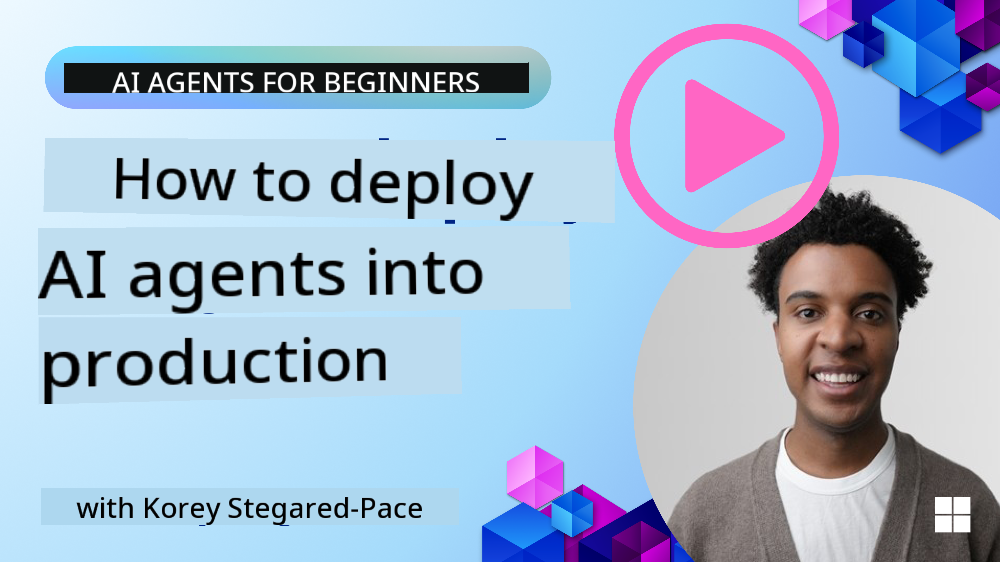

<!--
CO_OP_TRANSLATOR_METADATA:
{
  "original_hash": "1ad5de6a6388d02c145a92dd04358bab",
  "translation_date": "2025-07-12T13:34:11+00:00",
  "source_file": "10-ai-agents-production/README.md",
  "language_code": "en"
}
-->

> _(Click the image above to watch the video for this lesson)_
# AI Agents in Production

## Introduction

This lesson will cover:

- How to effectively plan the deployment of your AI Agent to production.
- Common mistakes and challenges you might encounter when deploying your AI Agent to production.
- How to manage costs while maintaining your AI Agent’s performance.

## Learning Goals

By the end of this lesson, you will understand how to:

- Improve the performance, cost-efficiency, and effectiveness of a production AI Agent system.
- Evaluate your AI Agents and know what to assess.
- Control costs when deploying AI Agents to production.

Deploying trustworthy AI Agents is crucial. Be sure to check out the "Building Trustworthy AI Agents" lesson as well.

## Evaluating AI Agents

Before, during, and after deployment, having a solid evaluation system for your AI Agents is essential. This ensures your system aligns with your goals and those of your users.

To evaluate an AI Agent properly, you need to assess not only the agent’s output but also the entire system it operates within. This includes, but is not limited to:

- The initial model request.
- The agent’s ability to understand the user’s intent.
- The agent’s ability to select the right tool for the task.
- The tool’s response to the agent’s request.
- The agent’s ability to interpret the tool’s response.
- The user’s feedback on the agent’s response.

This modular approach helps you pinpoint areas for improvement. It also allows you to monitor the impact of changes to models, prompts, tools, and other components more efficiently.

## Common Issues and Potential Solutions with AI Agents

| **Issue**                                      | **Potential Solution**                                                                                                                                                                                                     |
| ---------------------------------------------- | -------------------------------------------------------------------------------------------------------------------------------------------------------------------------------------------------------------------------- |
| AI Agent not performing tasks consistently     | - Refine the prompt given to the AI Agent; be clear about the objectives. - Consider breaking tasks into subtasks handled by multiple agents.                                                                           |
| AI Agent running into continuous loops         | - Set clear termination conditions so the Agent knows when to stop. - For complex tasks requiring reasoning and planning, use a larger model specialized in reasoning.                                                  |
| AI Agent tool calls are not performing well    | - Test and validate the tool’s output independently from the agent system. - Refine the parameters, prompts, and naming conventions of the tools.                                                                       |
| Multi-Agent system not performing consistently | - Refine prompts for each agent to ensure they are specific and distinct. - Create a hierarchical system with a "routing" or controller agent to decide which agent should handle each task.                            |

## Managing Costs

Here are some strategies to help manage the costs of deploying AI Agents to production:

- **Caching Responses** – Identify common requests and tasks, and provide responses before they reach your agent system. This reduces the number of repeated requests. You can even implement a process to measure how similar a new request is to cached ones using simpler AI models.

- **Using Smaller Models** – Small Language Models (SLMs) can perform well for certain agent use cases and significantly reduce costs. As mentioned earlier, building an evaluation system to compare their performance against larger models is the best way to determine if an SLM fits your use case.

- **Using a Router Model** – Another approach is to use a variety of models and sizes. You can use an LLM, SLM, or serverless function to route requests based on complexity to the most appropriate model. This helps reduce costs while ensuring the right performance for each task.

## Congratulations

This is currently the final lesson of "AI Agents for Beginners."

We plan to add more lessons based on feedback and developments in this rapidly evolving field, so be sure to check back soon.

If you want to continue learning and building with AI Agents, join the <a href="https://discord.gg/kzRShWzttr" target="_blank">Azure AI Community Discord</a>.

We host workshops, community roundtables, and "ask me anything" sessions there.

We also offer a Learn collection with additional resources to help you start building AI Agents in production.

## Previous Lesson

[Metacognition Design Pattern](../09-metacognition/README.md)

**Disclaimer**:  
This document has been translated using the AI translation service [Co-op Translator](https://github.com/Azure/co-op-translator). While we strive for accuracy, please be aware that automated translations may contain errors or inaccuracies. The original document in its native language should be considered the authoritative source. For critical information, professional human translation is recommended. We are not liable for any misunderstandings or misinterpretations arising from the use of this translation.