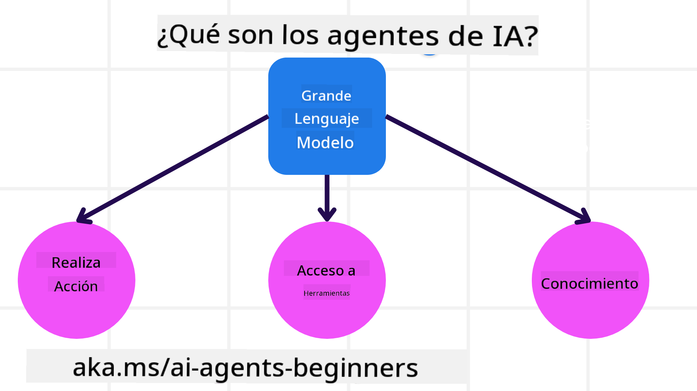
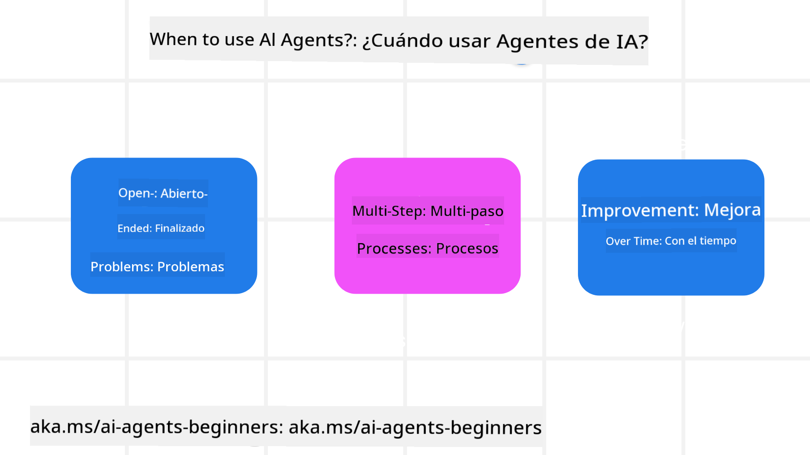

<!--
CO_OP_TRANSLATOR_METADATA:
{
  "original_hash": "d84943abc8f001ad4670418d32c2d899",
  "translation_date": "2025-07-12T08:00:28+00:00",
  "source_file": "01-intro-to-ai-agents/README.md",
  "language_code": "es"
}
-->
para conocer a otros estudiantes y creadores de agentes de IA y hacer cualquier pregunta que tengas sobre este curso.

Para comenzar este curso, empezamos por entender mejor qué son los agentes de IA y cómo podemos usarlos en las aplicaciones y flujos de trabajo que construimos.

## Introducción

Esta lección cubre:

- ¿Qué son los agentes de IA y cuáles son los diferentes tipos de agentes?
- ¿Para qué casos de uso son más adecuados los agentes de IA y cómo pueden ayudarnos?
- ¿Cuáles son algunos de los elementos básicos al diseñar soluciones agenticas?

## Objetivos de aprendizaje
Después de completar esta lección, deberías ser capaz de:

- Entender los conceptos de agentes de IA y cómo se diferencian de otras soluciones de IA.
- Aplicar agentes de IA de manera más eficiente.
- Diseñar soluciones agenticas de forma productiva tanto para usuarios como para clientes.

## Definiendo agentes de IA y tipos de agentes de IA

### ¿Qué son los agentes de IA?

Los agentes de IA son **sistemas** que permiten a los **Modelos de Lenguaje Extensos (LLMs)** **realizar acciones** ampliando sus capacidades al dar a los LLMs **acceso a herramientas** y **conocimiento**.

Desglosemos esta definición en partes más pequeñas:

- **Sistema** - Es importante pensar en los agentes no solo como un componente único, sino como un sistema de muchos componentes. A nivel básico, los componentes de un agente de IA son:
  - **Entorno** - El espacio definido donde el agente de IA opera. Por ejemplo, si tuviéramos un agente de IA para reservas de viajes, el entorno podría ser el sistema de reservas de viajes que el agente usa para completar tareas.
  - **Sensores** - Los entornos tienen información y proporcionan retroalimentación. Los agentes de IA usan sensores para recopilar e interpretar esta información sobre el estado actual del entorno. En el ejemplo del agente de reservas, el sistema puede proporcionar información como disponibilidad de hoteles o precios de vuelos.
  - **Actuadores** - Una vez que el agente de IA recibe el estado actual del entorno, para la tarea actual el agente determina qué acción realizar para cambiar el entorno. Para el agente de reservas, podría ser reservar una habitación disponible para el usuario.

**Modelos de Lenguaje Extensos** - El concepto de agentes existía antes de la creación de los LLMs. La ventaja de construir agentes de IA con LLMs es su capacidad para interpretar el lenguaje humano y los datos. Esta habilidad permite a los LLMs interpretar la información del entorno y definir un plan para cambiarlo.

**Realizar acciones** - Fuera de los sistemas de agentes de IA, los LLMs están limitados a situaciones donde la acción es generar contenido o información basada en la solicitud del usuario. Dentro de los sistemas de agentes de IA, los LLMs pueden cumplir tareas interpretando la solicitud del usuario y usando herramientas disponibles en su entorno.

**Acceso a herramientas** - Las herramientas a las que el LLM tiene acceso están definidas por 1) el entorno en el que opera y 2) el desarrollador del agente de IA. En nuestro ejemplo del agente de viajes, las herramientas del agente están limitadas por las operaciones disponibles en el sistema de reservas, y/o el desarrollador puede limitar el acceso del agente a herramientas específicas como vuelos.

**Memoria+Conocimiento** - La memoria puede ser a corto plazo en el contexto de la conversación entre el usuario y el agente. A largo plazo, fuera de la información proporcionada por el entorno, los agentes de IA también pueden recuperar conocimiento de otros sistemas, servicios, herramientas e incluso otros agentes. En el ejemplo del agente de viajes, este conocimiento podría ser la información sobre las preferencias de viaje del usuario almacenada en una base de datos de clientes.

### Los diferentes tipos de agentes

Ahora que tenemos una definición general de agentes de IA, veamos algunos tipos específicos de agentes y cómo se aplicarían a un agente de reservas de viajes.

| **Tipo de Agente**            | **Descripción**                                                                                                                       | **Ejemplo**                                                                                                                                                                                                                   |
| ----------------------------- | ------------------------------------------------------------------------------------------------------------------------------------- | ----------------------------------------------------------------------------------------------------------------------------------------------------------------------------------------------------------------------------- |
| **Agentes Reflexivos Simples**| Realizan acciones inmediatas basadas en reglas predefinidas.                                                                          | El agente de viajes interpreta el contexto del correo electrónico y reenvía quejas de viajes al servicio al cliente.                                                                                                          |
| **Agentes Reflexivos Basados en Modelo** | Realizan acciones basadas en un modelo del mundo y cambios en ese modelo.                                                              | El agente de viajes prioriza rutas con cambios significativos de precio basándose en acceso a datos históricos de precios.                                                                                                     |
| **Agentes Basados en Objetivos** | Crean planes para alcanzar objetivos específicos interpretando el objetivo y determinando acciones para lograrlo.                      | El agente de viajes reserva un viaje determinando los arreglos necesarios (auto, transporte público, vuelos) desde la ubicación actual hasta el destino.                                                                        |
| **Agentes Basados en Utilidad** | Consideran preferencias y sopesan compensaciones numéricamente para determinar cómo alcanzar objetivos.                               | El agente de viajes maximiza la utilidad sopesando conveniencia vs. costo al reservar viajes.                                                                                                                                  |
| **Agentes de Aprendizaje**    | Mejoran con el tiempo respondiendo a retroalimentación y ajustando acciones en consecuencia.                                          | El agente de viajes mejora usando la retroalimentación de clientes de encuestas post-viaje para hacer ajustes en futuras reservas.                                                                                            |
| **Agentes Jerárquicos**       | Cuentan con múltiples agentes en un sistema escalonado, donde agentes de nivel superior dividen tareas en subtareas para agentes de nivel inferior. | El agente de viajes cancela un viaje dividiendo la tarea en subtareas (por ejemplo, cancelar reservas específicas) y haciendo que agentes de nivel inferior las completen, reportando al agente de nivel superior.               |
| **Sistemas Multi-Agente (MAS)** | Los agentes completan tareas de forma independiente, ya sea cooperativa o competitivamente.                                           | Cooperativo: Múltiples agentes reservan servicios específicos como hoteles, vuelos y entretenimiento. Competitivo: Múltiples agentes gestionan y compiten por un calendario compartido de reservas de hotel para alojar clientes. |

## Cuándo usar agentes de IA

En la sección anterior, usamos el caso de uso del agente de viajes para explicar cómo los diferentes tipos de agentes pueden usarse en distintos escenarios de reservas de viaje. Continuaremos usando esta aplicación a lo largo del curso.

Veamos los tipos de casos de uso para los que los agentes de IA son más adecuados:

- **Problemas Abiertos** - permitir que el LLM determine los pasos necesarios para completar una tarea porque no siempre se puede codificar directamente en un flujo de trabajo.
- **Procesos de Múltiples Pasos** - tareas que requieren un nivel de complejidad en el que el agente de IA necesita usar herramientas o información a lo largo de varios turnos en lugar de una sola consulta.
- **Mejora con el Tiempo** - tareas donde el agente puede mejorar con el tiempo recibiendo retroalimentación de su entorno o usuarios para proporcionar mejor utilidad.

Cubrirémos más consideraciones sobre el uso de agentes de IA en la lección Construyendo agentes de IA confiables.

## Conceptos básicos de soluciones agenticas

### Desarrollo de agentes

El primer paso para diseñar un sistema de agentes de IA es definir las herramientas, acciones y comportamientos. En este curso, nos enfocamos en usar el **Azure AI Agent Service** para definir nuestros agentes. Ofrece características como:

- Selección de modelos abiertos como OpenAI, Mistral y Llama
- Uso de datos licenciados a través de proveedores como Tripadvisor
- Uso de herramientas estandarizadas OpenAPI 3.0

### Patrones agenticos

La comunicación con los LLMs es a través de prompts. Dada la naturaleza semi-autónoma de los agentes de IA, no siempre es posible o necesario volver a enviar un prompt manualmente al LLM después de un cambio en el entorno. Usamos **patrones agenticos** que nos permiten enviar prompts al LLM en múltiples pasos de manera más escalable.

Este curso está dividido en algunos de los patrones agenticos populares actuales.

### Frameworks agenticos

Los frameworks agenticos permiten a los desarrolladores implementar patrones agenticos mediante código. Estos frameworks ofrecen plantillas, plugins y herramientas para una mejor colaboración entre agentes de IA. Estos beneficios proporcionan capacidades para una mejor observabilidad y solución de problemas en sistemas de agentes de IA.

En este curso, exploraremos el framework AutoGen basado en investigación y el framework Agent listo para producción de Semantic Kernel.

## Lección anterior

[Configuración del curso](../00-course-setup/README.md)

## Próxima lección

[Explorando frameworks agenticos](../02-explore-agentic-frameworks/README.md)

**Aviso legal**:  
Este documento ha sido traducido utilizando el servicio de traducción automática [Co-op Translator](https://github.com/Azure/co-op-translator). Aunque nos esforzamos por la precisión, tenga en cuenta que las traducciones automáticas pueden contener errores o inexactitudes. El documento original en su idioma nativo debe considerarse la fuente autorizada. Para información crítica, se recomienda la traducción profesional realizada por humanos. No nos hacemos responsables de malentendidos o interpretaciones erróneas derivadas del uso de esta traducción.