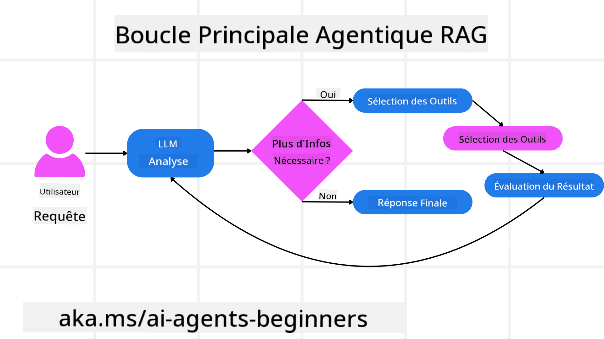
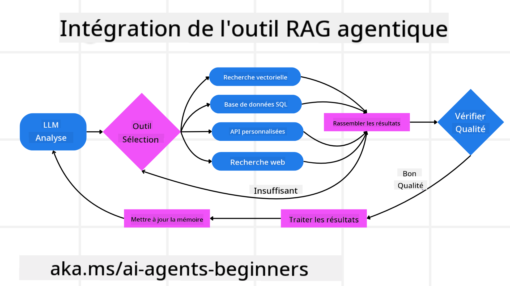
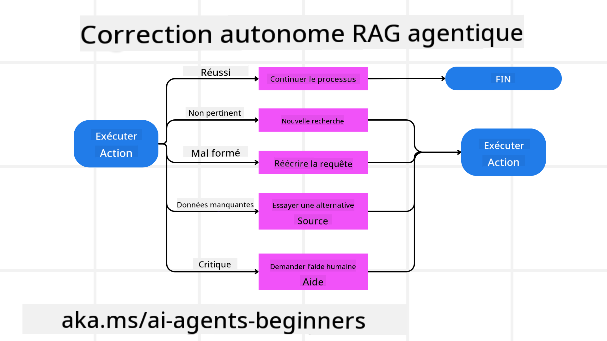
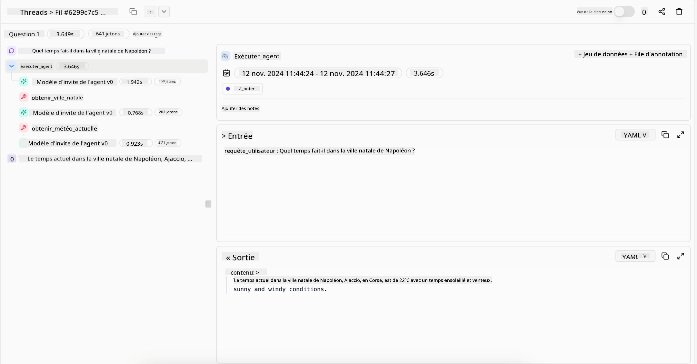

<!--
CO_OP_TRANSLATOR_METADATA:
{
  "original_hash": "7622aa72f9e676e593339f5f694ecd7d",
  "translation_date": "2025-07-12T09:48:56+00:00",
  "source_file": "05-agentic-rag/README.md",
  "language_code": "fr"
}
-->

> _(Cliquez sur l’image ci-dessus pour visionner la vidéo de cette leçon)_

# Agentic RAG

Cette leçon offre un aperçu complet de l’Agentic Retrieval-Augmented Generation (Agentic RAG), un paradigme émergent en IA où les grands modèles de langage (LLM) planifient de manière autonome leurs prochaines étapes tout en extrayant des informations de sources externes. Contrairement aux schémas statiques de récupération puis lecture, Agentic RAG implique des appels itératifs au LLM, entrecoupés d’appels à des outils ou fonctions et de sorties structurées. Le système évalue les résultats, affine les requêtes, fait appel à des outils supplémentaires si nécessaire, et poursuit ce cycle jusqu’à obtenir une solution satisfaisante.

## Introduction

Cette leçon abordera :

- **Comprendre Agentic RAG :** Découvrir ce paradigme émergent en IA où les grands modèles de langage (LLM) planifient de manière autonome leurs prochaines étapes tout en extrayant des informations de sources de données externes.
- **Saisir le style itératif Maker-Checker :** Comprendre la boucle d’appels itératifs au LLM, entrecoupés d’appels à des outils ou fonctions et de sorties structurées, conçue pour améliorer la justesse et gérer les requêtes mal formées.
- **Explorer les applications pratiques :** Identifier les scénarios où Agentic RAG excelle, comme les environnements axés sur la précision, les interactions complexes avec des bases de données, et les workflows étendus.

## Objectifs d’apprentissage

Après avoir terminé cette leçon, vous saurez/comment comprendre :

- **Comprendre Agentic RAG :** Appréhender ce paradigme émergent en IA où les grands modèles de langage (LLM) planifient de manière autonome leurs prochaines étapes tout en extrayant des informations de sources de données externes.
- **Style itératif Maker-Checker :** Saisir le concept d’une boucle d’appels itératifs au LLM, entrecoupés d’appels à des outils ou fonctions et de sorties structurées, conçue pour améliorer la justesse et gérer les requêtes mal formées.
- **Maîtriser le processus de raisonnement :** Comprendre la capacité du système à s’approprier son processus de raisonnement, en décidant comment aborder les problèmes sans s’appuyer sur des chemins pré-définis.
- **Workflow :** Comprendre comment un modèle agentic décide de manière autonome de récupérer des rapports sur les tendances du marché, d’identifier des données concurrentielles, de corréler des métriques internes de ventes, de synthétiser les résultats et d’évaluer la stratégie.
- **Boucles itératives, intégration d’outils et mémoire :** Découvrir comment le système s’appuie sur un schéma d’interaction en boucle, maintenant l’état et la mémoire à travers les étapes pour éviter les répétitions et prendre des décisions éclairées.
- **Gestion des modes d’échec et auto-correction :** Explorer les mécanismes robustes d’auto-correction du système, incluant l’itération et la reformulation des requêtes, l’utilisation d’outils de diagnostic, et le recours à la supervision humaine.
- **Limites de l’autonomie :** Comprendre les limites d’Agentic RAG, en se concentrant sur l’autonomie spécifique au domaine, la dépendance à l’infrastructure, et le respect des garde-fous.
- **Cas d’usage pratiques et valeur ajoutée :** Identifier les scénarios où Agentic RAG brille, comme les environnements axés sur la précision, les interactions complexes avec des bases de données, et les workflows étendus.
- **Gouvernance, transparence et confiance :** Apprendre l’importance de la gouvernance et de la transparence, incluant un raisonnement explicable, le contrôle des biais, et la supervision humaine.

## Qu’est-ce que Agentic RAG ?

Agentic Retrieval-Augmented Generation (Agentic RAG) est un paradigme émergent en IA où les grands modèles de langage (LLM) planifient de manière autonome leurs prochaines étapes tout en extrayant des informations de sources externes. Contrairement aux schémas statiques de récupération puis lecture, Agentic RAG implique des appels itératifs au LLM, entrecoupés d’appels à des outils ou fonctions et de sorties structurées. Le système évalue les résultats, affine les requêtes, fait appel à des outils supplémentaires si nécessaire, et poursuit ce cycle jusqu’à obtenir une solution satisfaisante. Ce style itératif « maker-checker » améliore la justesse, gère les requêtes mal formées, et garantit des résultats de haute qualité.

Le système s’approprie activement son processus de raisonnement, reformulant les requêtes échouées, choisissant différentes méthodes de récupération, et intégrant plusieurs outils — tels que la recherche vectorielle dans Azure AI Search, les bases de données SQL, ou des API personnalisées — avant de finaliser sa réponse. La qualité distinctive d’un système agentic est sa capacité à s’approprier son processus de raisonnement. Les implémentations RAG traditionnelles reposent sur des chemins pré-définis, mais un système agentic détermine de manière autonome la séquence des étapes en fonction de la qualité des informations qu’il trouve.

## Définition de Agentic Retrieval-Augmented Generation (Agentic RAG)

Agentic Retrieval-Augmented Generation (Agentic RAG) est un paradigme émergent dans le développement de l’IA où les LLM ne se contentent pas d’extraire des informations de sources de données externes, mais planifient aussi de manière autonome leurs prochaines étapes. Contrairement aux schémas statiques de récupération puis lecture ou aux séquences de prompts soigneusement scriptées, Agentic RAG implique une boucle d’appels itératifs au LLM, entrecoupés d’appels à des outils ou fonctions et de sorties structurées. À chaque étape, le système évalue les résultats obtenus, décide s’il doit affiner ses requêtes, fait appel à des outils supplémentaires si nécessaire, et poursuit ce cycle jusqu’à obtenir une solution satisfaisante.

Ce style itératif « maker-checker » est conçu pour améliorer la justesse, gérer les requêtes mal formées vers des bases de données structurées (par exemple NL2SQL), et garantir des résultats équilibrés et de haute qualité. Plutôt que de s’appuyer uniquement sur des chaînes de prompts soigneusement conçues, le système s’approprie activement son processus de raisonnement. Il peut reformuler les requêtes qui échouent, choisir différentes méthodes de récupération, et intégrer plusieurs outils — tels que la recherche vectorielle dans Azure AI Search, les bases de données SQL, ou des API personnalisées — avant de finaliser sa réponse. Cela élimine le besoin de cadres d’orchestration trop complexes. À la place, une boucle relativement simple de « appel LLM → utilisation d’outil → appel LLM → … » peut produire des résultats sophistiqués et bien fondés.

## Maîtriser le processus de raisonnement

La qualité distinctive qui rend un système « agentic » est sa capacité à s’approprier son processus de raisonnement. Les implémentations RAG traditionnelles dépendent souvent d’un chemin pré-défini par des humains : une chaîne de pensée qui décrit ce qu’il faut récupérer et quand.
Mais lorsqu’un système est vraiment agentic, il décide en interne comment aborder le problème. Il ne se contente pas d’exécuter un script ; il détermine de manière autonome la séquence des étapes en fonction de la qualité des informations qu’il trouve.
Par exemple, s’il doit créer une stratégie de lancement produit, il ne s’appuie pas uniquement sur un prompt qui détaille tout le workflow de recherche et de prise de décision. Au contraire, le modèle agentic décide de manière autonome de :

1. Récupérer les rapports actuels sur les tendances du marché en utilisant Bing Web Grounding
2. Identifier les données pertinentes des concurrents via Azure AI Search.
3. Corréler les métriques historiques internes de ventes avec Azure SQL Database.
4. Synthétiser les résultats en une stratégie cohérente orchestrée via Azure OpenAI Service.
5. Évaluer la stratégie pour détecter des lacunes ou incohérences, lançant une nouvelle phase de récupération si nécessaire.
Toutes ces étapes — affiner les requêtes, choisir les sources, itérer jusqu’à être « satisfait » de la réponse — sont décidées par le modèle, et non pré-scriptées par un humain.

## Boucles itératives, intégration d’outils et mémoire

Un système agentic s’appuie sur un schéma d’interaction en boucle :

- **Appel initial :** L’objectif de l’utilisateur (c’est-à-dire le prompt utilisateur) est présenté au LLM.
- **Invocation d’outil :** Si le modèle identifie des informations manquantes ou des instructions ambiguës, il sélectionne un outil ou une méthode de récupération — comme une requête dans une base vectorielle (par exemple Azure AI Search Hybrid sur des données privées) ou un appel SQL structuré — pour obtenir plus de contexte.
- **Évaluation & Affinement :** Après avoir examiné les données retournées, le modèle décide si l’information est suffisante. Sinon, il affine la requête, essaie un autre outil, ou ajuste son approche.
- **Répéter jusqu’à satisfaction :** Ce cycle continue jusqu’à ce que le modèle estime avoir assez de clarté et de preuves pour fournir une réponse finale bien argumentée.
- **Mémoire & État :** Parce que le système maintient l’état et la mémoire à travers les étapes, il peut se souvenir des tentatives précédentes et de leurs résultats, évitant les boucles répétitives et prenant des décisions plus éclairées au fur et à mesure.

Au fil du temps, cela crée une impression de compréhension évolutive, permettant au modèle de gérer des tâches complexes en plusieurs étapes sans nécessiter une intervention humaine constante ou une reformulation du prompt.

## Gestion des modes d’échec et auto-correction

L’autonomie d’Agentic RAG inclut aussi des mécanismes robustes d’auto-correction. Lorsque le système rencontre des impasses — comme la récupération de documents non pertinents ou des requêtes mal formées — il peut :

- **Itérer et reformuler :** Plutôt que de retourner des réponses peu pertinentes, le modèle tente de nouvelles stratégies de recherche, reformule les requêtes vers la base de données, ou consulte des ensembles de données alternatifs.
- **Utiliser des outils de diagnostic :** Le système peut invoquer des fonctions supplémentaires conçues pour l’aider à déboguer ses étapes de raisonnement ou confirmer la justesse des données récupérées. Des outils comme Azure AI Tracing seront importants pour permettre une observabilité et un suivi robustes.
- **Recours à la supervision humaine :** Pour les scénarios à enjeux élevés ou en cas d’échecs répétés, le modèle peut signaler une incertitude et demander une intervention humaine. Une fois que l’humain fournit un retour correctif, le modèle peut intégrer cette leçon pour la suite.

Cette approche itérative et dynamique permet au modèle de s’améliorer continuellement, garantissant qu’il ne s’agit pas d’un système à usage unique, mais d’un système qui apprend de ses erreurs au cours d’une session donnée.

## Limites de l’autonomie

Malgré son autonomie dans une tâche, Agentic RAG n’est pas comparable à une Intelligence Artificielle Générale. Ses capacités « agentic » sont limitées aux outils, sources de données, et politiques fournies par les développeurs humains. Il ne peut pas inventer ses propres outils ni sortir des limites du domaine définies. En revanche, il excelle à orchestrer dynamiquement les ressources disponibles.
Les principales différences avec des formes d’IA plus avancées incluent :

1. **Autonomie spécifique au domaine :** Les systèmes Agentic RAG se concentrent sur l’atteinte d’objectifs définis par l’utilisateur dans un domaine connu, employant des stratégies comme la reformulation de requêtes ou la sélection d’outils pour améliorer les résultats.
2. **Dépendance à l’infrastructure :** Les capacités du système dépendent des outils et données intégrés par les développeurs. Il ne peut pas dépasser ces limites sans intervention humaine.
3. **Respect des garde-fous :** Les directives éthiques, règles de conformité, et politiques d’entreprise restent très importantes. La liberté de l’agent est toujours contrainte par des mesures de sécurité et des mécanismes de supervision (espérons-le ?)

## Cas d’usage pratiques et valeur ajoutée

Agentic RAG excelle dans les scénarios nécessitant un affinage itératif et une grande précision :

1. **Environnements axés sur la justesse :** Dans les contrôles de conformité, l’analyse réglementaire, ou la recherche juridique, le modèle agentic peut vérifier les faits à plusieurs reprises, consulter plusieurs sources, et reformuler les requêtes jusqu’à produire une réponse rigoureusement validée.
2. **Interactions complexes avec des bases de données :** Lorsqu’il s’agit de données structurées où les requêtes peuvent souvent échouer ou nécessiter des ajustements, le système peut affiner de manière autonome ses requêtes en utilisant Azure SQL ou Microsoft Fabric OneLake, garantissant que la récupération finale correspond à l’intention de l’utilisateur.
3. **Workflows étendus :** Les sessions de longue durée peuvent évoluer à mesure que de nouvelles informations apparaissent. Agentic RAG peut continuellement intégrer de nouvelles données, adaptant ses stratégies au fur et à mesure qu’il en apprend davantage sur le problème.

## Gouvernance, transparence et confiance

À mesure que ces systèmes gagnent en autonomie dans leur raisonnement, la gouvernance et la transparence deviennent cruciales :

- **Raisonnement explicable :** Le modèle peut fournir une trace d’audit des requêtes qu’il a effectuées, des sources consultées, et des étapes de raisonnement suivies pour parvenir à sa conclusion. Des outils comme Azure AI Content Safety et Azure AI Tracing / GenAIOps peuvent aider à maintenir la transparence et à réduire les risques.
- **Contrôle des biais et récupération équilibrée :** Les développeurs peuvent ajuster les stratégies de récupération pour garantir que des sources de données équilibrées et représentatives sont prises en compte, et auditer régulièrement les résultats pour détecter des biais ou des tendances déformées en utilisant des modèles personnalisés pour les organisations avancées en data science avec Azure Machine Learning.
- **Supervision humaine et conformité :** Pour les tâches sensibles, la revue humaine reste essentielle. Agentic RAG ne remplace pas le jugement humain dans les décisions à fort enjeu — il le complète en fournissant des options plus rigoureusement validées.

Disposer d’outils fournissant un enregistrement clair des actions est indispensable. Sans cela, déboguer un processus multi-étapes peut être très difficile. Voici un exemple tiré de Literal AI (la société derrière Chainlit) pour une exécution d’Agent :

## Conclusion

Agentic RAG représente une évolution naturelle dans la manière dont les systèmes d’IA gèrent des tâches complexes et riches en données. En adoptant un schéma d’interaction en boucle, en sélectionnant de manière autonome des outils, et en affinant les requêtes jusqu’à obtenir un résultat de haute qualité, le système dépasse le simple suivi statique de prompts pour devenir un décideur plus adaptatif et conscient du contexte. Bien que toujours limité par des infrastructures et des directives éthiques définies par l’humain, ces capacités agentic permettent des interactions IA plus riches, dynamiques, et finalement plus utiles pour les entreprises comme pour les utilisateurs finaux.

## Ressources supplémentaires

- <a href="https://learn.microsoft.com/training/modules/use-own-data-azure-openai" target="_blank">Implémenter Retrieval Augmented Generation (RAG) avec Azure OpenAI Service : Apprenez à utiliser vos propres données avec Azure OpenAI Service. Ce module Microsoft Learn fournit un guide complet sur la mise en œuvre de RAG</a>

- <a href="https://learn.microsoft.com/azure/ai-studio/concepts/evaluation-approach-gen-ai" target="_blank">Évaluation des applications d’IA générative avec Azure AI Foundry : Cet article traite de l’évaluation et de la comparaison des modèles sur des jeux de données publics, y compris les applications Agentic AI et les architectures RAG</a>
- <a href="https://weaviate.io/blog/what-is-agentic-rag" target="_blank">Qu’est-ce que Agentic RAG | Weaviate</a>
- <a href="https://ragaboutit.com/agentic-rag-a-complete-guide-to-agent-based-retrieval-augmented-generation/" target="_blank">Agentic RAG : Guide complet sur la génération augmentée par récupération basée sur des agents – Actualités de generation RAG</a>
- <a href="https://huggingface.co/learn/cookbook/agent_rag" target="_blank">Agentic RAG : boostez votre RAG avec la reformulation de requêtes et l’auto-interrogation ! Hugging Face Open-Source AI Cookbook</a>
- <a href="https://youtu.be/aQ4yQXeB1Ss?si=2HUqBzHoeB5tR04U" target="_blank">Ajout de couches Agentic à RAG</a>
- <a href="https://www.youtube.com/watch?v=zeAyuLc_f3Q&t=244s" target="_blank">L’avenir des assistants de connaissance : Jerry Liu</a>
- <a href="https://www.youtube.com/watch?v=AOSjiXP1jmQ" target="_blank">Comment construire des systèmes Agentic RAG</a>
- <a href="https://ignite.microsoft.com/sessions/BRK102?source=sessions" target="_blank">Utiliser Azure AI Foundry Agent Service pour déployer vos agents IA à grande échelle</a>

### Articles académiques

- <a href="https://arxiv.org/abs/2303.17651" target="_blank">2303.17651 Self-Refine : Affinage itératif avec auto-retour</a>
- <a href="https://arxiv.org/abs/2303.11366" target="_blank">2303.11366 Reflexion : Agents linguistiques avec apprentissage par renforcement verbal</a>
- <a href="https://arxiv.org/abs/2305.11738" target="_blank">2305.11738 CRITIC : Les grands modèles de langage peuvent s’auto-corriger grâce à une critique interactive avec outils</a>
- <a href="https://arxiv.org/abs/2501.09136" target="_blank">2501.09136 Agentic Retrieval-Augmented Generation : Revue sur Agentic RAG</a>

## Leçon précédente

[Tool Use Design Pattern](../04-tool-use/README.md)

## Leçon suivante

[Building Trustworthy AI Agents](../06-building-trustworthy-agents/README.md)

**Avertissement** :  
Ce document a été traduit à l’aide du service de traduction automatique [Co-op Translator](https://github.com/Azure/co-op-translator). Bien que nous nous efforcions d’assurer l’exactitude, veuillez noter que les traductions automatiques peuvent contenir des erreurs ou des inexactitudes. Le document original dans sa langue d’origine doit être considéré comme la source faisant foi. Pour les informations critiques, une traduction professionnelle réalisée par un humain est recommandée. Nous déclinons toute responsabilité en cas de malentendus ou de mauvaises interprétations résultant de l’utilisation de cette traduction.