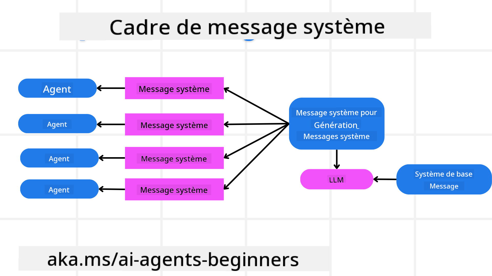
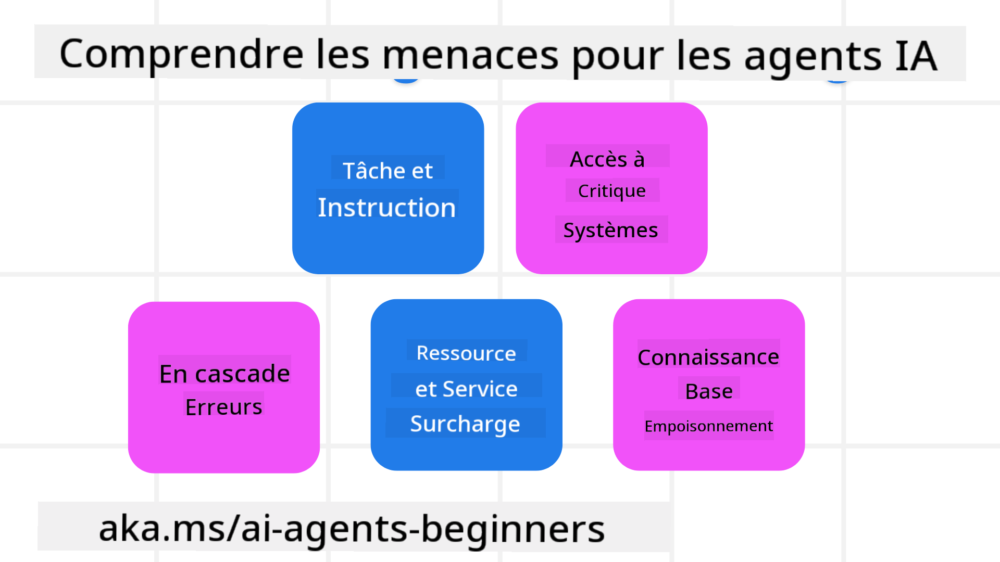
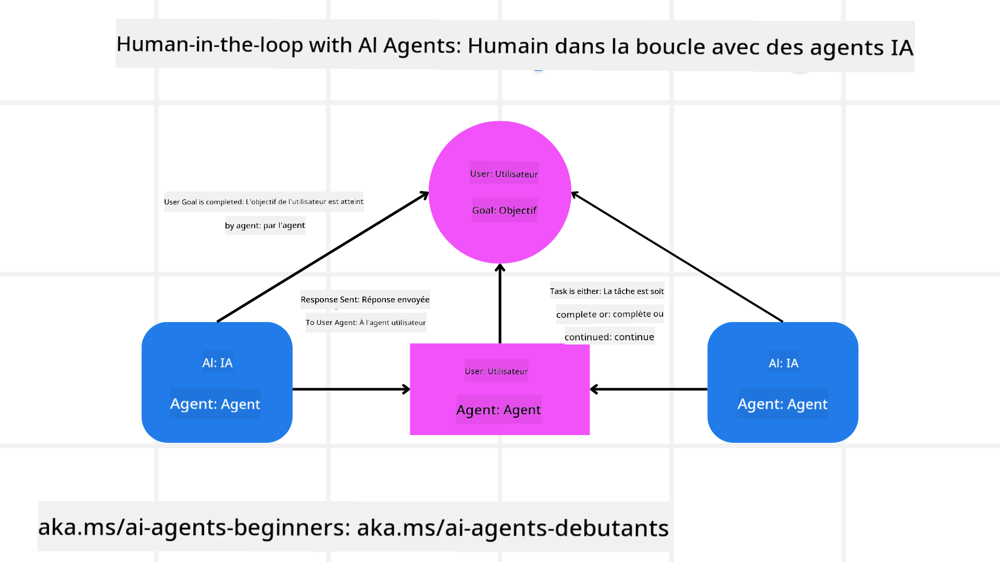

<!--
CO_OP_TRANSLATOR_METADATA:
{
  "original_hash": "f57852cac3a86c4a5ef47f793cc12178",
  "translation_date": "2025-07-12T10:20:53+00:00",
  "source_file": "06-building-trustworthy-agents/README.md",
  "language_code": "fr"
}
-->
[](https://youtu.be/iZKkMEGBCUQ?si=Q-kEbcyHUMPoHp8L)

> _(Cliquez sur l’image ci-dessus pour voir la vidéo de cette leçon)_

# Construire des Agents d’IA Fiables

## Introduction

Cette leçon abordera :

- Comment concevoir et déployer des agents d’IA sûrs et efficaces
- Les considérations importantes en matière de sécurité lors du développement d’agents d’IA
- Comment préserver la confidentialité des données et des utilisateurs lors du développement d’agents d’IA

## Objectifs d’apprentissage

À l’issue de cette leçon, vous saurez comment :

- Identifier et atténuer les risques lors de la création d’agents d’IA
- Mettre en œuvre des mesures de sécurité pour garantir une gestion appropriée des données et des accès
- Créer des agents d’IA qui respectent la confidentialité des données tout en offrant une expérience utilisateur de qualité

## Sécurité

Commençons par examiner la construction d’applications agentiques sûres. La sécurité signifie que l’agent d’IA fonctionne comme prévu. En tant que concepteurs d’applications agentiques, nous disposons de méthodes et d’outils pour maximiser la sécurité :

### Construire un Cadre de Messages Système

Si vous avez déjà développé une application d’IA utilisant des modèles de langage de grande taille (LLM), vous connaissez l’importance de concevoir une invite système robuste. Ces invites établissent les règles méta, instructions et directives sur la manière dont le LLM interagira avec l’utilisateur et les données.

Pour les agents d’IA, l’invite système est encore plus cruciale car les agents auront besoin d’instructions très spécifiques pour accomplir les tâches que nous leur avons assignées.

Pour créer des invites système évolutives, nous pouvons utiliser un cadre de messages système pour construire un ou plusieurs agents dans notre application :



#### Étape 1 : Créer un Message Système Méta

L’invite méta sera utilisée par un LLM pour générer les invites système des agents que nous créons. Nous la concevons comme un modèle afin de pouvoir créer efficacement plusieurs agents si nécessaire.

Voici un exemple de message système méta que nous donnerions au LLM :

```plaintext
You are an expert at creating AI agent assistants. 
You will be provided a company name, role, responsibilities and other
information that you will use to provide a system prompt for.
To create the system prompt, be descriptive as possible and provide a structure that a system using an LLM can better understand the role and responsibilities of the AI assistant. 
```

#### Étape 2 : Créer une invite basique

L’étape suivante consiste à créer une invite basique pour décrire l’agent d’IA. Vous devez inclure le rôle de l’agent, les tâches qu’il accomplira, ainsi que ses autres responsabilités.

Voici un exemple :

```plaintext
You are a travel agent for Contoso Travel that is great at booking flights for customers. To help customers you can perform the following tasks: lookup available flights, book flights, ask for preferences in seating and times for flights, cancel any previously booked flights and alert customers on any delays or cancellations of flights.  
```

#### Étape 3 : Fournir le Message Système Basique au LLM

Nous pouvons maintenant optimiser ce message système en fournissant le message système méta comme message système ainsi que notre message système basique.

Cela produira un message système mieux conçu pour guider nos agents d’IA :

```markdown
**Company Name:** Contoso Travel  
**Role:** Travel Agent Assistant

**Objective:**  
You are an AI-powered travel agent assistant for Contoso Travel, specializing in booking flights and providing exceptional customer service. Your main goal is to assist customers in finding, booking, and managing their flights, all while ensuring that their preferences and needs are met efficiently.

**Key Responsibilities:**

1. **Flight Lookup:**
    
    - Assist customers in searching for available flights based on their specified destination, dates, and any other relevant preferences.
    - Provide a list of options, including flight times, airlines, layovers, and pricing.
2. **Flight Booking:**
    
    - Facilitate the booking of flights for customers, ensuring that all details are correctly entered into the system.
    - Confirm bookings and provide customers with their itinerary, including confirmation numbers and any other pertinent information.
3. **Customer Preference Inquiry:**
    
    - Actively ask customers for their preferences regarding seating (e.g., aisle, window, extra legroom) and preferred times for flights (e.g., morning, afternoon, evening).
    - Record these preferences for future reference and tailor suggestions accordingly.
4. **Flight Cancellation:**
    
    - Assist customers in canceling previously booked flights if needed, following company policies and procedures.
    - Notify customers of any necessary refunds or additional steps that may be required for cancellations.
5. **Flight Monitoring:**
    
    - Monitor the status of booked flights and alert customers in real-time about any delays, cancellations, or changes to their flight schedule.
    - Provide updates through preferred communication channels (e.g., email, SMS) as needed.

**Tone and Style:**

- Maintain a friendly, professional, and approachable demeanor in all interactions with customers.
- Ensure that all communication is clear, informative, and tailored to the customer's specific needs and inquiries.

**User Interaction Instructions:**

- Respond to customer queries promptly and accurately.
- Use a conversational style while ensuring professionalism.
- Prioritize customer satisfaction by being attentive, empathetic, and proactive in all assistance provided.

**Additional Notes:**

- Stay updated on any changes to airline policies, travel restrictions, and other relevant information that could impact flight bookings and customer experience.
- Use clear and concise language to explain options and processes, avoiding jargon where possible for better customer understanding.

This AI assistant is designed to streamline the flight booking process for customers of Contoso Travel, ensuring that all their travel needs are met efficiently and effectively.

```

#### Étape 4 : Itérer et Améliorer

L’intérêt de ce cadre de messages système est de faciliter la création à grande échelle de messages système pour plusieurs agents, tout en améliorant vos messages système au fil du temps. Il est rare qu’un message système fonctionne parfaitement dès la première utilisation pour votre cas d’usage complet. Pouvoir effectuer de petits ajustements et améliorations en modifiant le message système basique et en le faisant passer par le système vous permettra de comparer et d’évaluer les résultats.

## Comprendre les Menaces

Pour construire des agents d’IA fiables, il est important de comprendre et d’atténuer les risques et menaces pesant sur votre agent d’IA. Examinons quelques-unes des différentes menaces auxquelles les agents d’IA sont exposés et comment mieux les anticiper et s’y préparer.



### Tâche et Instruction

**Description :** Les attaquants tentent de modifier les instructions ou objectifs de l’agent d’IA via des invites ou en manipulant les entrées.

**Atténuation :** Effectuer des contrôles de validation et des filtres d’entrée pour détecter les invites potentiellement dangereuses avant qu’elles ne soient traitées par l’agent d’IA. Comme ces attaques nécessitent généralement une interaction fréquente avec l’agent, limiter le nombre de tours dans une conversation est une autre façon de prévenir ce type d’attaque.

### Accès aux Systèmes Critiques

**Description :** Si un agent d’IA a accès à des systèmes et services stockant des données sensibles, les attaquants peuvent compromettre la communication entre l’agent et ces services. Il peut s’agir d’attaques directes ou de tentatives indirectes d’obtenir des informations sur ces systèmes via l’agent.

**Atténuation :** Les agents d’IA doivent avoir accès aux systèmes uniquement en cas de besoin pour prévenir ce type d’attaque. La communication entre l’agent et le système doit également être sécurisée. Mettre en place une authentification et un contrôle d’accès est une autre manière de protéger ces informations.

### Surcharge des Ressources et Services

**Description :** Les agents d’IA peuvent accéder à différents outils et services pour accomplir des tâches. Les attaquants peuvent exploiter cette capacité pour attaquer ces services en envoyant un grand nombre de requêtes via l’agent d’IA, ce qui peut entraîner des pannes système ou des coûts élevés.

**Atténuation :** Mettre en place des politiques limitant le nombre de requêtes qu’un agent d’IA peut adresser à un service. Limiter le nombre de tours de conversation et de requêtes adressées à votre agent d’IA est une autre façon de prévenir ce type d’attaque.

### Empoisonnement de la Base de Connaissances

**Description :** Ce type d’attaque ne cible pas directement l’agent d’IA, mais la base de connaissances et autres services que l’agent utilisera. Cela peut consister à corrompre les données ou informations que l’agent utilisera pour accomplir une tâche, ce qui conduit à des réponses biaisées ou non souhaitées à l’utilisateur.

**Atténuation :** Effectuer des vérifications régulières des données utilisées par l’agent d’IA dans ses flux de travail. S’assurer que l’accès à ces données est sécurisé et que seules des personnes de confiance peuvent les modifier pour éviter ce type d’attaque.

### Erreurs en Cascade

**Description :** Les agents d’IA accèdent à divers outils et services pour accomplir des tâches. Les erreurs causées par des attaquants peuvent entraîner des défaillances d’autres systèmes connectés à l’agent, rendant l’attaque plus étendue et plus difficile à diagnostiquer.

**Atténuation :** Une méthode pour éviter cela est de faire fonctionner l’agent d’IA dans un environnement limité, comme l’exécution de tâches dans un conteneur Docker, afin de prévenir les attaques directes sur le système. Créer des mécanismes de secours et une logique de nouvelle tentative lorsque certains systèmes répondent par une erreur est une autre façon d’éviter des pannes système plus importantes.

## Human-in-the-Loop

Une autre méthode efficace pour construire des systèmes d’agents d’IA fiables est d’utiliser un Human-in-the-loop. Cela crée un flux où les utilisateurs peuvent fournir des retours aux agents pendant leur exécution. Les utilisateurs agissent essentiellement comme des agents dans un système multi-agents en approuvant ou en interrompant le processus en cours.



Voici un extrait de code utilisant AutoGen pour montrer comment ce concept est mis en œuvre :

```python

# Create the agents.
model_client = OpenAIChatCompletionClient(model="gpt-4o-mini")
assistant = AssistantAgent("assistant", model_client=model_client)
user_proxy = UserProxyAgent("user_proxy", input_func=input)  # Use input() to get user input from console.

# Create the termination condition which will end the conversation when the user says "APPROVE".
termination = TextMentionTermination("APPROVE")

# Create the team.
team = RoundRobinGroupChat([assistant, user_proxy], termination_condition=termination)

# Run the conversation and stream to the console.
stream = team.run_stream(task="Write a 4-line poem about the ocean.")
# Use asyncio.run(...) when running in a script.
await Console(stream)

```

## Conclusion

Construire des agents d’IA fiables nécessite une conception soignée, des mesures de sécurité robustes et une itération continue. En mettant en place des systèmes structurés de méta-invites, en comprenant les menaces potentielles et en appliquant des stratégies d’atténuation, les développeurs peuvent créer des agents d’IA à la fois sûrs et efficaces. De plus, intégrer une approche human-in-the-loop garantit que les agents d’IA restent alignés sur les besoins des utilisateurs tout en minimisant les risques. À mesure que l’IA évolue, adopter une posture proactive en matière de sécurité, de confidentialité et d’éthique sera essentiel pour instaurer la confiance et la fiabilité dans les systèmes pilotés par l’IA.

## Ressources supplémentaires

- <a href="https://learn.microsoft.com/azure/ai-studio/responsible-use-of-ai-overview" target="_blank">Présentation de l’IA responsable</a>
- <a href="https://learn.microsoft.com/azure/ai-studio/concepts/evaluation-approach-gen-ai" target="_blank">Évaluation des modèles d’IA générative et des applications d’IA</a>
- <a href="https://learn.microsoft.com/azure/ai-services/openai/concepts/system-message?context=%2Fazure%2Fai-studio%2Fcontext%2Fcontext&tabs=top-techniques" target="_blank">Messages système de sécurité</a>
- <a href="https://blogs.microsoft.com/wp-content/uploads/prod/sites/5/2022/06/Microsoft-RAI-Impact-Assessment-Template.pdf?culture=en-us&country=us" target="_blank">Modèle d’évaluation des risques</a>

## Leçon précédente

[Agentic RAG](../05-agentic-rag/README.md)

## Leçon suivante

[Planning Design Pattern](../07-planning-design/README.md)

**Avertissement** :  
Ce document a été traduit à l’aide du service de traduction automatique [Co-op Translator](https://github.com/Azure/co-op-translator). Bien que nous nous efforcions d’assurer l’exactitude, veuillez noter que les traductions automatiques peuvent contenir des erreurs ou des inexactitudes. Le document original dans sa langue d’origine doit être considéré comme la source faisant foi. Pour les informations critiques, une traduction professionnelle réalisée par un humain est recommandée. Nous déclinons toute responsabilité en cas de malentendus ou de mauvaises interprétations résultant de l’utilisation de cette traduction.