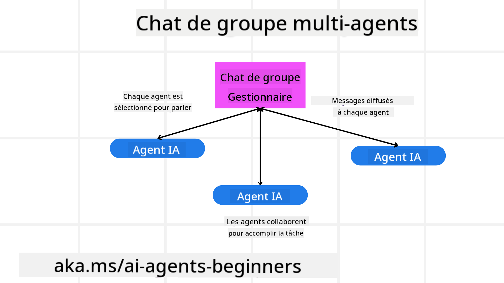
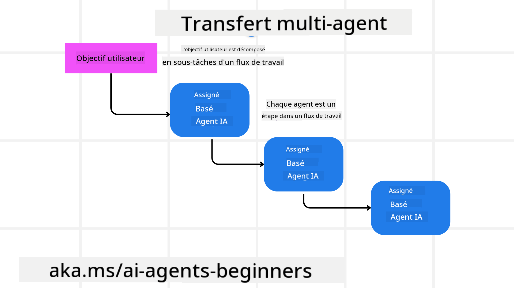
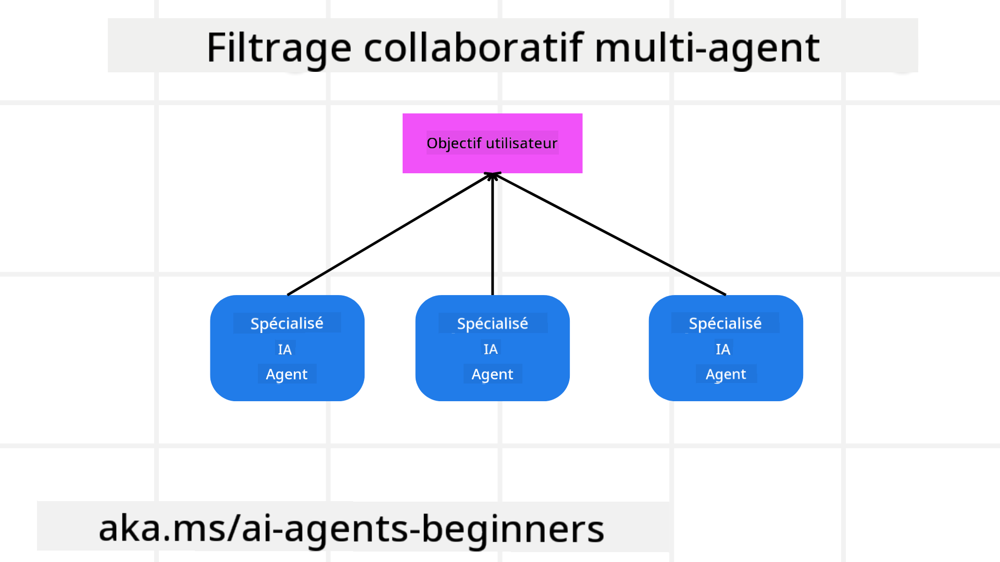

<!--
CO_OP_TRANSLATOR_METADATA:
{
  "original_hash": "c692a8975d7d5b99575a553de1c5e8a7",
  "translation_date": "2025-07-12T10:49:46+00:00",
  "source_file": "08-multi-agent/README.md",
  "language_code": "fr"
}
-->

> _(Cliquez sur l’image ci-dessus pour voir la vidéo de cette leçon)_

# Modèles de conception multi-agents

Dès que vous commencez à travailler sur un projet impliquant plusieurs agents, vous devrez prendre en compte le modèle de conception multi-agents. Cependant, il n’est pas toujours évident de savoir quand passer à une approche multi-agents ni quels en sont les avantages.

## Introduction

Dans cette leçon, nous allons répondre aux questions suivantes :

- Dans quels scénarios les multi-agents sont-ils applicables ?
- Quels sont les avantages d’utiliser plusieurs agents plutôt qu’un seul agent effectuant plusieurs tâches ?
- Quels sont les éléments de base pour implémenter le modèle de conception multi-agents ?
- Comment avoir une visibilité sur les interactions entre les différents agents ?

## Objectifs d’apprentissage

À l’issue de cette leçon, vous devriez être capable de :

- Identifier les scénarios où les multi-agents sont pertinents
- Reconnaître les avantages d’utiliser plusieurs agents plutôt qu’un agent unique
- Comprendre les éléments de base pour implémenter le modèle de conception multi-agents

Quelle est la vision d’ensemble ?

*Les multi-agents sont un modèle de conception qui permet à plusieurs agents de collaborer pour atteindre un objectif commun*.

Ce modèle est largement utilisé dans divers domaines, notamment la robotique, les systèmes autonomes et l’informatique distribuée.

## Scénarios où les multi-agents sont pertinents

Alors, dans quels cas l’utilisation de plusieurs agents est-elle judicieuse ? La réponse est qu’il existe de nombreux scénarios où le recours à plusieurs agents est bénéfique, notamment dans les cas suivants :

- **Charges de travail importantes** : Les charges de travail importantes peuvent être divisées en tâches plus petites et attribuées à différents agents, ce qui permet un traitement parallèle et une exécution plus rapide. Un exemple est le traitement de grandes quantités de données.
- **Tâches complexes** : Comme pour les charges importantes, les tâches complexes peuvent être décomposées en sous-tâches plus petites, confiées à différents agents, chacun spécialisé dans un aspect particulier. Un bon exemple est celui des véhicules autonomes où différents agents gèrent la navigation, la détection d’obstacles et la communication avec d’autres véhicules.
- **Expertises variées** : Différents agents peuvent posséder des expertises diverses, leur permettant de gérer différents aspects d’une tâche plus efficacement qu’un agent unique. Par exemple, dans le domaine de la santé, certains agents peuvent s’occuper du diagnostic, d’autres des plans de traitement ou du suivi des patients.

## Avantages d’utiliser plusieurs agents plutôt qu’un agent unique

Un système à agent unique peut suffire pour des tâches simples, mais pour des tâches plus complexes, plusieurs agents offrent plusieurs avantages :

- **Spécialisation** : Chaque agent peut être spécialisé dans une tâche précise. L’absence de spécialisation dans un agent unique signifie qu’il peut être polyvalent mais risquer de se perdre face à une tâche complexe, par exemple en réalisant une tâche pour laquelle il n’est pas le plus adapté.
- **Scalabilité** : Il est plus facile de faire évoluer un système en ajoutant des agents plutôt qu’en surchargeant un seul agent.
- **Tolérance aux pannes** : Si un agent tombe en panne, les autres peuvent continuer à fonctionner, assurant ainsi la fiabilité du système.

Prenons un exemple : réserver un voyage pour un utilisateur. Un système à agent unique devrait gérer tous les aspects de la réservation, de la recherche de vols à la réservation d’hôtels et de voitures de location. Pour cela, l’agent devrait disposer d’outils pour gérer toutes ces tâches, ce qui pourrait aboutir à un système complexe et monolithique, difficile à maintenir et à faire évoluer. Un système multi-agents, en revanche, pourrait avoir différents agents spécialisés dans la recherche de vols, la réservation d’hôtels et de voitures. Cela rendrait le système plus modulaire, plus facile à maintenir et évolutif.

Comparez cela à une agence de voyages tenue par un couple (mom-and-pop store) versus une agence franchisée. Le couple gérerait tous les aspects de la réservation, tandis que la franchise aurait différents agents s’occupant de différentes parties du processus.

## Éléments de base pour implémenter le modèle de conception multi-agents

Avant de pouvoir implémenter le modèle multi-agents, il faut comprendre les éléments qui le composent.

Pour rendre cela plus concret, reprenons l’exemple de la réservation d’un voyage. Les éléments de base incluraient :

- **Communication entre agents** : Les agents chargés de trouver les vols, réserver les hôtels et les voitures doivent communiquer et partager des informations sur les préférences et contraintes de l’utilisateur. Il faut définir les protocoles et méthodes de communication. Concrètement, l’agent chargé des vols doit communiquer avec celui des hôtels pour s’assurer que l’hôtel est réservé aux mêmes dates que le vol. Cela signifie que les agents doivent partager des informations sur les dates de voyage de l’utilisateur, donc il faut décider *quels agents partagent quelles informations et comment*.
- **Mécanismes de coordination** : Les agents doivent coordonner leurs actions pour respecter les préférences et contraintes de l’utilisateur. Par exemple, une préférence utilisateur peut être un hôtel proche de l’aéroport, tandis qu’une contrainte peut être que les voitures de location ne sont disponibles qu’à l’aéroport. L’agent des hôtels doit donc coordonner avec celui des voitures pour respecter ces critères. Il faut donc décider *comment les agents coordonnent leurs actions*.
- **Architecture des agents** : Les agents doivent avoir une structure interne leur permettant de prendre des décisions et d’apprendre de leurs interactions avec l’utilisateur. Par exemple, l’agent chargé des vols doit pouvoir décider quels vols recommander. Il faut donc définir *comment les agents prennent des décisions et apprennent de leurs interactions*. Par exemple, l’agent des vols pourrait utiliser un modèle d’apprentissage automatique pour recommander des vols en fonction des préférences passées de l’utilisateur.
- **Visibilité des interactions multi-agents** : Il est nécessaire d’avoir une visibilité sur la manière dont les agents interagissent entre eux. Cela implique d’avoir des outils et techniques pour suivre les activités et interactions des agents, comme des outils de journalisation, de surveillance, de visualisation et des indicateurs de performance.
- **Modèles multi-agents** : Il existe différents modèles pour implémenter des systèmes multi-agents, comme les architectures centralisées, décentralisées ou hybrides. Il faut choisir le modèle le plus adapté à votre cas d’usage.
- **Humain dans la boucle** : Dans la plupart des cas, un humain intervient dans le processus, et il faut indiquer aux agents quand demander une intervention humaine. Par exemple, un utilisateur peut demander un hôtel ou un vol spécifique que les agents n’ont pas recommandé, ou demander une confirmation avant de finaliser une réservation.

## Visibilité des interactions multi-agents

Il est important d’avoir une visibilité sur la manière dont les agents interagissent. Cette visibilité est essentielle pour déboguer, optimiser et garantir l’efficacité globale du système. Pour cela, il faut disposer d’outils et techniques permettant de suivre les activités et interactions des agents, comme des outils de journalisation, de surveillance, de visualisation et des indicateurs de performance.

Par exemple, dans le cas de la réservation d’un voyage, vous pourriez avoir un tableau de bord affichant le statut de chaque agent, les préférences et contraintes de l’utilisateur, ainsi que les interactions entre agents. Ce tableau de bord pourrait montrer les dates de voyage, les vols recommandés par l’agent des vols, les hôtels recommandés par l’agent des hôtels, et les voitures recommandées par l’agent des locations. Cela vous donnerait une vue claire des interactions entre agents et de la prise en compte des préférences et contraintes de l’utilisateur.

Examinons ces aspects plus en détail.

- **Outils de journalisation et de surveillance** : Il est important de consigner chaque action effectuée par un agent. Une entrée de journal peut contenir des informations sur l’agent ayant effectué l’action, l’action elle-même, l’heure à laquelle elle a été réalisée, et le résultat obtenu. Ces informations servent ensuite au débogage, à l’optimisation, etc.

- **Outils de visualisation** : Ces outils permettent de visualiser les interactions entre agents de manière plus intuitive. Par exemple, un graphe montrant le flux d’informations entre agents peut aider à identifier les goulets d’étranglement, inefficacités et autres problèmes.

- **Indicateurs de performance** : Ils permettent de suivre l’efficacité du système multi-agents. Par exemple, on peut mesurer le temps nécessaire pour accomplir une tâche, le nombre de tâches réalisées par unité de temps, ou la précision des recommandations faites par les agents. Ces données aident à identifier les points à améliorer et à optimiser le système.

## Modèles multi-agents

Explorons quelques modèles concrets pour créer des applications multi-agents. Voici quelques modèles intéressants à considérer :

### Discussion de groupe

Ce modèle est utile pour créer une application de chat de groupe où plusieurs agents peuvent communiquer entre eux. Les cas d’usage typiques incluent la collaboration en équipe, le support client et les réseaux sociaux.

Dans ce modèle, chaque agent représente un utilisateur dans le chat de groupe, et les messages sont échangés entre agents via un protocole de messagerie. Les agents peuvent envoyer des messages au groupe, recevoir des messages du groupe et répondre aux messages des autres agents.

Ce modèle peut être implémenté avec une architecture centralisée où tous les messages passent par un serveur central, ou une architecture décentralisée où les messages sont échangés directement.

### Transfert de tâches

Ce modèle est utile pour créer une application où plusieurs agents peuvent se transmettre des tâches.

Les cas d’usage typiques incluent le support client, la gestion des tâches et l’automatisation des flux de travail.

Dans ce modèle, chaque agent représente une tâche ou une étape dans un flux de travail, et les agents peuvent transférer des tâches à d’autres agents selon des règles prédéfinies.

### Filtrage collaboratif

Ce modèle est utile pour créer une application où plusieurs agents collaborent pour faire des recommandations aux utilisateurs.

La raison d’avoir plusieurs agents collaborant est que chacun peut avoir une expertise différente et contribuer au processus de recommandation de manière complémentaire.

Prenons l’exemple d’un utilisateur cherchant une recommandation sur la meilleure action à acheter en bourse.

- **Expert sectoriel** : Un agent pourrait être expert dans un secteur spécifique.
- **Analyse technique** : Un autre agent pourrait être expert en analyse technique.
- **Analyse fondamentale** : Un autre agent pourrait être expert en analyse fondamentale. En collaborant, ces agents peuvent fournir une recommandation plus complète à l’utilisateur.

## Scénario : Processus de remboursement

Considérons un scénario où un client cherche à obtenir un remboursement pour un produit. Plusieurs agents peuvent être impliqués dans ce processus, mais divisons-les entre agents spécifiques à ce processus et agents généraux pouvant être utilisés dans d’autres processus.

**Agents spécifiques au processus de remboursement** :

Voici quelques agents qui pourraient intervenir dans le processus de remboursement :

- **Agent client** : Représente le client et est responsable de l’initiation du processus de remboursement.
- **Agent vendeur** : Représente le vendeur et est responsable du traitement du remboursement.
- **Agent paiement** : Représente le processus de paiement et est responsable du remboursement du paiement au client.
- **Agent résolution** : Représente le processus de résolution et est responsable de régler les problèmes survenant durant le remboursement.
- **Agent conformité** : Représente le processus de conformité et veille à ce que le remboursement respecte les réglementations et politiques.

**Agents généraux** :

Ces agents peuvent être utilisés dans d’autres parties de votre activité.

- **Agent expédition** : Représente le processus d’expédition et est responsable du retour du produit au vendeur. Cet agent peut être utilisé aussi bien pour le remboursement que pour l’expédition générale d’un produit suite à un achat.
- **Agent feedback** : Représente le processus de collecte de retours clients. Les retours peuvent être recueillis à tout moment, pas seulement lors du remboursement.
- **Agent escalade** : Représente le processus d’escalade et est responsable de faire remonter les problèmes à un niveau de support supérieur. Ce type d’agent peut être utilisé pour tout processus nécessitant une escalade.
- **Agent notification** : Représente le processus de notification et envoie des alertes au client à différentes étapes du remboursement.
- **Agent analytique** : Représente le processus d’analyse des données liées au remboursement.
- **Agent audit** : Représente le processus d’audit et vérifie que le remboursement est effectué correctement.
- **Agent reporting** : Représente le processus de génération de rapports sur le remboursement.
- **Agent connaissance** : Représente la gestion des connaissances et maintient une base d’informations liée au remboursement. Cet agent peut être expert à la fois sur les remboursements et d’autres aspects de votre activité.
- **Agent sécurité** : Représente le processus de sécurité et veille à la sûreté du processus de remboursement.
- **Agent qualité** : Représente le processus qualité et garantit la qualité du processus de remboursement.

Il y a donc plusieurs agents listés, à la fois pour le processus spécifique de remboursement et pour les agents généraux pouvant être utilisés ailleurs dans votre entreprise. Cela vous donne une idée de la manière de choisir les agents à intégrer dans votre système multi-agents.

## Exercice
## Leçon précédente

[Conception de la planification](../07-planning-design/README.md)

## Leçon suivante

[Métacognition chez les agents IA](../09-metacognition/README.md)

**Avertissement** :  
Ce document a été traduit à l’aide du service de traduction automatique [Co-op Translator](https://github.com/Azure/co-op-translator). Bien que nous nous efforcions d’assurer l’exactitude, veuillez noter que les traductions automatiques peuvent contenir des erreurs ou des inexactitudes. Le document original dans sa langue d’origine doit être considéré comme la source faisant foi. Pour les informations critiques, une traduction professionnelle réalisée par un humain est recommandée. Nous déclinons toute responsabilité en cas de malentendus ou de mauvaises interprétations résultant de l’utilisation de cette traduction.