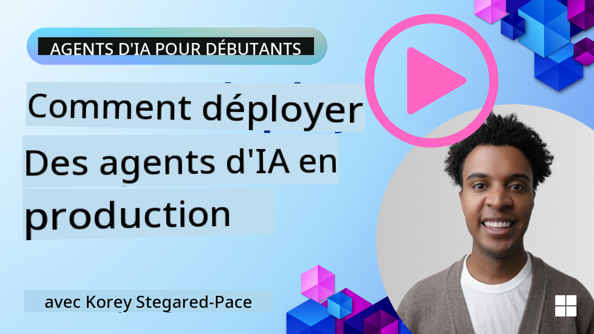

<!--
CO_OP_TRANSLATOR_METADATA:
{
  "original_hash": "1ad5de6a6388d02c145a92dd04358bab",
  "translation_date": "2025-07-12T13:34:21+00:00",
  "source_file": "10-ai-agents-production/README.md",
  "language_code": "fr"
}
-->

> _(Cliquez sur l'image ci-dessus pour voir la vidéo de cette leçon)_
# Agents IA en Production

## Introduction

Cette leçon abordera :

- Comment planifier efficacement le déploiement de votre Agent IA en production.
- Les erreurs courantes et les problèmes que vous pouvez rencontrer lors du déploiement de votre Agent IA en production.
- Comment gérer les coûts tout en maintenant la performance de votre Agent IA.

## Objectifs d'apprentissage

Après avoir terminé cette leçon, vous saurez/comment comprendre :

- Les techniques pour améliorer la performance, les coûts et l’efficacité d’un système d’Agent IA en production.
- Ce qu’il faut évaluer et comment évaluer vos Agents IA.
- Comment maîtriser les coûts lors du déploiement des Agents IA en production.

Il est important de déployer des Agents IA fiables. Consultez également la leçon « Building Trustworthy AI Agents ».

## Évaluation des Agents IA

Avant, pendant et après le déploiement des Agents IA, disposer d’un système adéquat pour évaluer vos Agents IA est essentiel. Cela garantit que votre système est aligné avec vos objectifs et ceux de vos utilisateurs.

Pour évaluer un Agent IA, il est important de pouvoir évaluer non seulement la sortie de l’agent, mais aussi l’ensemble du système dans lequel votre Agent IA opère. Cela inclut, sans s’y limiter :

- La requête initiale au modèle.
- La capacité de l’agent à identifier l’intention de l’utilisateur.
- La capacité de l’agent à choisir le bon outil pour accomplir la tâche.
- La réponse de l’outil à la requête de l’agent.
- La capacité de l’agent à interpréter la réponse de l’outil.
- Le retour de l’utilisateur sur la réponse de l’agent.

Cela vous permet d’identifier les points à améliorer de manière plus modulaire. Vous pouvez ensuite suivre l’impact des modifications apportées aux modèles, prompts, outils et autres composants avec une meilleure efficacité.

## Problèmes courants et solutions potentielles avec les Agents IA

| **Problème**                                   | **Solution Potentielle**                                                                                                                                                                                                    |
| ---------------------------------------------- | -------------------------------------------------------------------------------------------------------------------------------------------------------------------------------------------------------------------------- |
| L’Agent IA n’exécute pas les tâches de façon cohérente | - Affinez le prompt donné à l’Agent IA ; soyez clair sur les objectifs. - Identifiez les cas où diviser les tâches en sous-tâches et les confier à plusieurs agents peut aider.                                           |
| L’Agent IA entre dans des boucles infinies     | - Assurez-vous d’avoir des conditions claires d’arrêt pour que l’Agent sache quand interrompre le processus. - Pour les tâches complexes nécessitant raisonnement et planification, utilisez un modèle plus grand spécialisé. |
| Les appels aux outils de l’Agent IA ne fonctionnent pas bien | - Testez et validez la sortie de l’outil en dehors du système agent. - Affinez les paramètres définis, les prompts et la dénomination des outils.                                                                        |
| Le système multi-agents ne fonctionne pas de manière cohérente | - Affinez les prompts donnés à chaque agent pour qu’ils soient spécifiques et distincts les uns des autres. - Construisez un système hiérarchique avec un agent « routeur » ou contrôleur pour déterminer quel agent est le plus adapté. |

## Gestion des coûts

Voici quelques stratégies pour gérer les coûts liés au déploiement des Agents IA en production :

- **Mise en cache des réponses** – Identifier les requêtes et tâches fréquentes et fournir les réponses avant qu’elles ne passent par votre système agentique est un bon moyen de réduire le volume de requêtes similaires. Vous pouvez même mettre en place un flux pour évaluer la similarité d’une requête avec vos réponses mises en cache en utilisant des modèles IA plus simples.

- **Utilisation de modèles plus petits** – Les Small Language Models (SLM) peuvent bien fonctionner sur certains cas d’usage agentiques et réduiront significativement les coûts. Comme mentionné précédemment, construire un système d’évaluation pour déterminer et comparer la performance par rapport à des modèles plus grands est la meilleure façon de comprendre la pertinence d’un SLM pour votre cas d’usage.

- **Utilisation d’un modèle routeur** – Une stratégie similaire consiste à utiliser une diversité de modèles et de tailles. Vous pouvez utiliser un LLM/SLM ou une fonction serverless pour router les requêtes en fonction de leur complexité vers les modèles les plus adaptés. Cela aide aussi à réduire les coûts tout en garantissant la performance sur les bonnes tâches.

## Félicitations

C’est actuellement la dernière leçon de « AI Agents for Beginners ».

Nous prévoyons de continuer à ajouter des leçons en fonction des retours et des évolutions de cette industrie en pleine croissance, alors revenez bientôt.

Si vous souhaitez poursuivre votre apprentissage et votre développement avec les Agents IA, rejoignez le <a href="https://discord.gg/kzRShWzttr" target="_blank">Azure AI Community Discord</a>.

Nous y organisons des ateliers, des tables rondes communautaires et des sessions « ask me anything ».

Nous disposons également d’une collection Learn avec des ressources supplémentaires pour vous aider à commencer à construire des Agents IA en production.

## Leçon précédente

[Metacognition Design Pattern](../09-metacognition/README.md)

**Avertissement** :  
Ce document a été traduit à l’aide du service de traduction automatique [Co-op Translator](https://github.com/Azure/co-op-translator). Bien que nous nous efforcions d’assurer l’exactitude, veuillez noter que les traductions automatiques peuvent contenir des erreurs ou des inexactitudes. Le document original dans sa langue d’origine doit être considéré comme la source faisant foi. Pour les informations critiques, une traduction professionnelle réalisée par un humain est recommandée. Nous déclinons toute responsabilité en cas de malentendus ou de mauvaises interprétations résultant de l’utilisation de cette traduction.