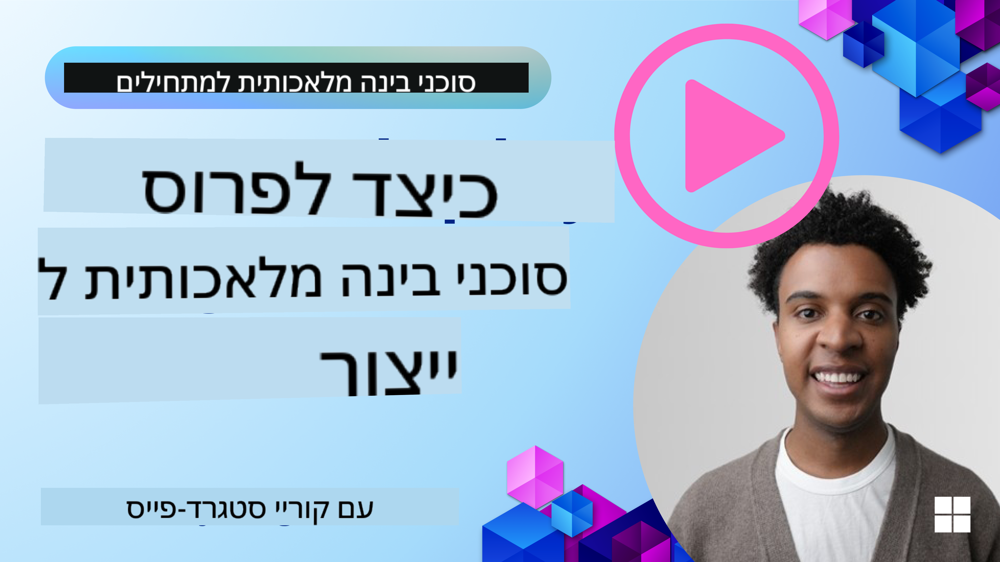

<!--
CO_OP_TRANSLATOR_METADATA:
{
  "original_hash": "1ad5de6a6388d02c145a92dd04358bab",
  "translation_date": "2025-07-12T13:40:15+00:00",
  "source_file": "10-ai-agents-production/README.md",
  "language_code": "he"
}
-->

> _(לחצו על התמונה למעלה לצפייה בסרטון של השיעור)_
# סוכני AI בפרודקשן

## מבוא

בשיעור זה נלמד על:

- כיצד לתכנן בצורה יעילה את פריסת סוכן ה-AI שלך בפרודקשן.
- טעויות ובעיות נפוצות שעשויות להתרחש בעת פריסת סוכן ה-AI בפרודקשן.
- כיצד לנהל עלויות תוך שמירה על ביצועי סוכן ה-AI שלך.

## מטרות הלמידה

בסיום השיעור תדע/י כיצד להבין ולבצע:

- טכניקות לשיפור ביצועים, עלויות ויעילות של מערכת סוכני AI בפרודקשן.
- מה ואיך להעריך את סוכני ה-AI שלך.
- כיצד לשלוט בעלויות בעת פריסת סוכני AI בפרודקשן.

חשוב לפרוס סוכני AI אמינים. מומלץ לעיין גם בשיעור "Building Trustworthy AI Agents".

## הערכת סוכני AI

לפני, במהלך ואחרי פריסת סוכני AI, חשוב שיהיה לך מערכת מתאימה להערכת הסוכנים. זה יבטיח שהמערכת שלך תתאים למטרות שלך ושל המשתמשים.

כדי להעריך סוכן AI, חשוב להעריך לא רק את הפלט של הסוכן אלא גם את כל המערכת שבה הוא פועל. זה כולל אך לא מוגבל ל:

- בקשת המודל הראשונית.
- יכולת הסוכן לזהות את כוונת המשתמש.
- יכולת הסוכן לזהות את הכלי המתאים לביצוע המשימה.
- תגובת הכלי לבקשת הסוכן.
- יכולת הסוכן לפרש את תגובת הכלי.
- המשוב של המשתמש על תגובת הסוכן.

כך ניתן לזהות נקודות לשיפור בצורה מודולרית. ניתן לעקוב אחר השפעת שינויים במודלים, פרומפטים, כלים ורכיבים אחרים ביעילות רבה יותר.

## בעיות נפוצות ופתרונות אפשריים עם סוכני AI

| **בעיה**                                      | **פתרון אפשרי**                                                                                                                                                                                                             |
| ---------------------------------------------- | ---------------------------------------------------------------------------------------------------------------------------------------------------------------------------------------------------------------------------- |
| סוכן AI לא מבצע משימות בעקביות               | - לחדד את הפרומפט שניתן לסוכן; להיות ברורים לגבי המטרות. - לזהות מתי כדאי לחלק את המשימות לתת-משימות ולטפל בהן על ידי מספר סוכנים.                                                                              |
| סוכן AI נכנס ללולאות אינסופיות                | - לוודא שיש תנאי סיום ברורים כדי שהסוכן ידע מתי להפסיק את התהליך. - למשימות מורכבות שדורשות חשיבה ותכנון, להשתמש במודל גדול יותר שמתמחה במשימות חשיבה.                                                           |
| קריאות כלים של סוכן AI לא מתפקדות טוב        | - לבדוק ולאמת את פלט הכלי מחוץ למערכת הסוכן. - לחדד את הפרמטרים, הפרומפטים ושמות הכלים שהוגדרו.                                                                                                                     |
| מערכת רב-סוכנים לא מתפקדת בעקביות            | - לחדד את הפרומפטים שניתנים לכל סוכן כדי לוודא שהם ספציפיים ומובחנים זה מזה. - לבנות מערכת היררכית עם סוכן "נתב" או בקרה שיקבע איזה סוכן הוא המתאים.                                                               |

## ניהול עלויות

הנה כמה אסטרטגיות לניהול עלויות בפריסת סוכני AI בפרודקשן:

- **שמירת תגובות במטמון** - זיהוי בקשות ומשימות נפוצות ומתן תגובות מראש לפני שהן עוברות במערכת הסוכנים שלך היא דרך טובה להפחית את נפח הבקשות החוזרות. ניתן אפילו ליישם תהליך לזיהוי דמיון בין בקשות חדשות לאלו שבמטמון באמצעות מודלים פשוטים יותר של AI.

- **שימוש במודלים קטנים יותר** - מודלים שפתיים קטנים (SLMs) יכולים להציג ביצועים טובים במקרים מסוימים של שימוש בסוכנים ולהפחית עלויות משמעותית. כפי שצוין קודם, בניית מערכת הערכה להשוואת ביצועים מול מודלים גדולים יותר היא הדרך הטובה ביותר להבין עד כמה SLM יתאים למקרה השימוש שלך.

- **שימוש במודל נתב** - אסטרטגיה דומה היא להשתמש במגוון מודלים וגדלים. ניתן להשתמש ב-LLM/SLM או פונקציה ללא שרת כדי לנתב בקשות לפי מורכבות למודלים המתאימים ביותר. זה גם יסייע בהפחתת עלויות וגם בשמירה על ביצועים במשימות הנכונות.

## ברכות

זהו כרגע השיעור האחרון בסדרה "AI Agents for Beginners".

אנו מתכננים להוסיף שיעורים נוספים בהתבסס על משוב ושינויים בתעשייה המתפתחת הזו, אז חזרו לביקור בעתיד הקרוב.

אם ברצונכם להמשיך ללמוד ולבנות עם סוכני AI, הצטרפו ל-<a href="https://discord.gg/kzRShWzttr" target="_blank">Azure AI Community Discord</a>.

אנחנו מארחים שם סדנאות, שולחנות עגולים קהילתיים ומפגשי "שאל אותי כל דבר".

יש לנו גם אוסף Learn של חומרים נוספים שיכולים לעזור לכם להתחיל לבנות סוכני AI בפרודקשן.

## שיעור קודם

[Metacognition Design Pattern](../09-metacognition/README.md)

**כתב ויתור**:  
מסמך זה תורגם באמצעות שירות תרגום מבוסס בינה מלאכותית [Co-op Translator](https://github.com/Azure/co-op-translator). למרות שאנו שואפים לדיוק, יש לקחת בחשבון כי תרגומים אוטומטיים עלולים להכיל שגיאות או אי-דיוקים. המסמך המקורי בשפת המקור שלו נחשב למקור הסמכותי. למידע קריטי מומלץ להשתמש בתרגום מקצועי על ידי מתרגם אנושי. אנו לא נושאים באחריות לכל אי-הבנה או פרשנות שגויה הנובעת משימוש בתרגום זה.