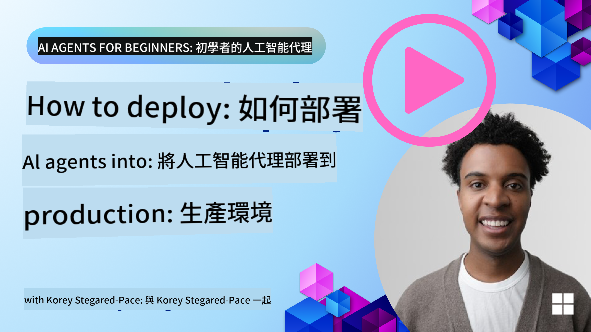

<!--
CO_OP_TRANSLATOR_METADATA:
{
  "original_hash": "1ad5de6a6388d02c145a92dd04358bab",
  "translation_date": "2025-07-12T13:35:58+00:00",
  "source_file": "10-ai-agents-production/README.md",
  "language_code": "hk"
}
-->

> _(點擊上方圖片觀看本課程影片)_
# AI Agents 在生產環境中的應用

## 介紹

本課程將涵蓋：

- 如何有效規劃 AI Agent 的生產部署。
- 部署 AI Agent 到生產環境時常見的錯誤與問題。
- 如何在維持 AI Agent 效能的同時控制成本。

## 學習目標

完成本課程後，你將能夠了解／掌握：

- 提升生產環境中 AI Agent 系統效能、成本與效益的技巧。
- 如何評估你的 AI Agents。
- 部署 AI Agents 到生產環境時如何控制成本。

部署值得信賴的 AI Agents 非常重要。也建議參考「Building Trustworthy AI Agents」課程。

## 評估 AI Agents

在部署 AI Agents 之前、過程中及之後，建立適當的評估系統至關重要。這能確保系統符合你和使用者的目標。

評估 AI Agent 時，不僅要評估代理的輸出，還要評估 AI Agent 運作的整個系統。這包括但不限於：

- 初始模型請求。
- 代理識別使用者意圖的能力。
- 代理選擇正確工具執行任務的能力。
- 工具對代理請求的回應。
- 代理解讀工具回應的能力。
- 使用者對代理回應的反饋。

這樣可以更模組化地找出改進空間，並更有效率地監控模型、提示詞、工具及其他元件變更的影響。

## AI Agents 常見問題與可能解決方案

| **問題**                                      | **可能解決方案**                                                                                                                                                                                                     |
| ---------------------------------------------- | -------------------------------------------------------------------------------------------------------------------------------------------------------------------------------------------------------------------------- |
| AI Agent 無法穩定完成任務                       | - 精煉給 AI Agent 的提示詞，明確目標。 - 找出將任務拆分成子任務並由多個代理處理的可能性。                                                                                                                      |
| AI Agent 進入無限迴圈                           | - 確保有明確的終止條件，讓 Agent 知道何時停止流程。 - 對於需要推理與規劃的複雜任務，使用專門處理推理任務的較大型模型。                                                                                       |
| AI Agent 工具呼叫表現不佳                       | - 在代理系統外測試並驗證工具輸出。 - 精煉工具的參數設定、提示詞及命名。                                                                                                                                            |
| 多代理系統表現不穩定                           | - 精煉給每個代理的提示詞，確保彼此具體且明確區分。 - 建立層級系統，使用「路由」或控制代理來決定正確的代理。                                                                                                   |

## 成本管理

以下是管理 AI Agents 生產部署成本的策略：

- **快取回應** — 識別常見請求與任務，並在進入代理系統前提供回應，是減少類似請求量的好方法。你甚至可以用較簡單的 AI 模型來判斷請求與快取請求的相似度。

- **使用較小模型** — 小型語言模型（SLMs）在某些代理應用場景中表現良好，且能大幅降低成本。如前所述，建立評估系統來比較小模型與大型模型的效能，是了解 SLM 在你案例中表現的最佳方式。

- **使用路由模型** — 類似策略是使用多樣化的模型與規模。你可以用 LLM/SLM 或無伺服器函數根據請求複雜度將其路由到最合適的模型。這不僅有助於降低成本，也能確保在適當任務上維持效能。

## 恭喜

這是「AI Agents for Beginners」課程的最後一課。

我們計劃根據回饋與產業變化持續新增課程，歡迎未來再回來看看。

如果你想繼續學習並打造 AI Agents，歡迎加入 <a href="https://discord.gg/kzRShWzttr" target="_blank">Azure AI Community Discord</a>。

我們會在那裡舉辦工作坊、社群圓桌會議及「問我任何事」活動。

我們也有一系列學習資源，幫助你開始在生產環境中打造 AI Agents。

## 上一課

[Metacognition Design Pattern](../09-metacognition/README.md)

**免責聲明**：  
本文件由 AI 翻譯服務 [Co-op Translator](https://github.com/Azure/co-op-translator) 進行翻譯。雖然我們致力於確保準確性，但請注意自動翻譯可能包含錯誤或不準確之處。原始文件的母語版本應被視為權威來源。對於重要資訊，建議採用專業人工翻譯。我們不對因使用本翻譯而引起的任何誤解或誤釋承擔責任。