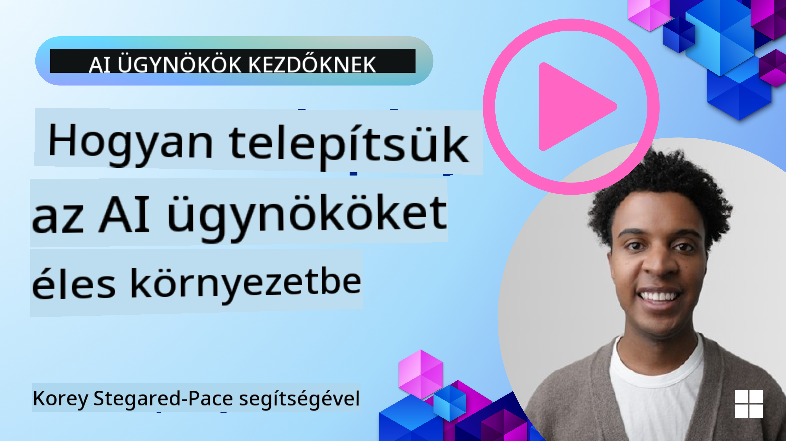

<!--
CO_OP_TRANSLATOR_METADATA:
{
  "original_hash": "1ad5de6a6388d02c145a92dd04358bab",
  "translation_date": "2025-07-12T13:41:21+00:00",
  "source_file": "10-ai-agents-production/README.md",
  "language_code": "hu"
}
-->

> _(Kattints a fenti képre a lecke videójának megtekintéséhez)_
# AI ügynökök éles környezetben

## Bevezetés

Ebben a leckében a következőkről lesz szó:

- Hogyan tervezzük meg hatékonyan AI ügynökünk éles környezetbe történő telepítését.
- Gyakori hibák és problémák, amelyekkel szembesülhetsz az AI ügynök éles környezetbe helyezése során.
- Hogyan kezelheted a költségeket úgy, hogy közben megőrzöd az AI ügynök teljesítményét.

## Tanulási célok

A lecke elvégzése után tudni fogod/érteni fogod:

- Módszerek az AI ügynökök éles rendszereinek teljesítményének, költségeinek és hatékonyságának javítására.
- Mit és hogyan értékelj az AI ügynökeiddel kapcsolatban.
- Hogyan kontrolláld a költségeket az AI ügynökök éles környezetbe helyezésekor.

Fontos, hogy megbízható AI ügynököket telepítsünk. Nézd meg a „Building Trustworthy AI Agents” leckét is.

## AI ügynökök értékelése

Az AI ügynökök telepítése előtt, közben és után is elengedhetetlen egy megfelelő értékelési rendszer megléte. Ez biztosítja, hogy a rendszer összhangban legyen veled és a felhasználóiddal.

Az AI ügynök értékeléséhez fontos, hogy ne csak az ügynök kimenetét, hanem az egész rendszert értékeld, amelyben az AI ügynök működik. Ez magában foglalja, de nem kizárólagosan:

- A kezdeti modellkérést.
- Az ügynök képességét a felhasználói szándék felismerésére.
- Az ügynök képességét a megfelelő eszköz kiválasztására a feladat elvégzéséhez.
- Az eszköz válaszát az ügynök kérésére.
- Az ügynök képességét az eszköz válaszának értelmezésére.
- A felhasználó visszajelzését az ügynök válaszára.

Ez lehetővé teszi, hogy modulárisabb módon azonosítsd a fejlesztendő területeket. Így hatékonyabban követheted a modellek, promptok, eszközök és egyéb komponensek változásainak hatását.

## Gyakori problémák és lehetséges megoldások AI ügynököknél

| **Probléma**                                   | **Lehetséges megoldás**                                                                                                                                                                                                    |
| ---------------------------------------------- | -------------------------------------------------------------------------------------------------------------------------------------------------------------------------------------------------------------------------- |
| Az AI ügynök nem végzi következetesen a feladatokat | - Finomítsd az AI ügynöknek adott promptot; légy egyértelmű a célokkal. - Azonosítsd, hol segíthet a feladatok kisebb részekre bontása és több ügynök bevonása.                                                           |
| Az AI ügynök folyamatos ciklusokba kerül       | - Biztosíts világos leállítási feltételeket, hogy az ügynök tudja, mikor kell befejezni a folyamatot. - Összetett, tervezést és érvelést igénylő feladatokhoz használj nagyobb, erre specializált modellt.                 |
| Az AI ügynök eszközhívásai nem működnek jól   | - Teszteld és validáld az eszköz kimenetét az ügynök rendszeren kívül. - Finomítsd az eszközök paramétereit, promptjait és elnevezéseit.                                                                                  |
| Több ügynökből álló rendszer nem működik következetesen | - Finomítsd az egyes ügynököknek adott promptokat, hogy azok specifikusak és jól elkülönüljenek egymástól. - Építs hierarchikus rendszert „irányító” vagy vezérlő ügynökkel, amely eldönti, melyik ügynök a megfelelő.         |

## Költségek kezelése

Íme néhány stratégia az AI ügynökök éles környezetbe helyezésének költségeinek kezelésére:

- **Válaszok gyorsítótárazása** – Gyakori kérések és feladatok azonosítása, majd ezek válaszainak előzetes biztosítása az ügynöki rendszer előtt jó módja a hasonló kérések számának csökkentésére. Alapvetőbb AI modellekkel akár azt is megvalósíthatod, hogy egy folyamat felismerje, mennyire hasonlít egy kérés a gyorsítótárazott válaszokra.

- **Kisebb modellek használata** – A kis nyelvi modellek (SLM-ek) bizonyos ügynöki feladatokban jól teljesítenek, és jelentősen csökkentik a költségeket. Ahogy korábban említettük, egy értékelési rendszer felépítése, amely összehasonlítja a teljesítményt a nagyobb modellekkel, a legjobb módja annak, hogy megértsd, mennyire alkalmas egy SLM az adott feladatra.

- **Router modell használata** – Hasonló megközelítés, ha különböző modelleket és méreteket használsz. Egy LLM/SLM vagy szerver nélküli funkció segítségével a kéréseket a bonyolultság alapján a legmegfelelőbb modellhez irányíthatod. Ez csökkenti a költségeket, miközben biztosítja a megfelelő teljesítményt a feladatokhoz.

## Gratulálunk

Ez jelenleg az „AI Agents for Beginners” utolsó leckéje.

Tervezzük, hogy a visszajelzések és az iparág folyamatos változásai alapján további leckéket adunk hozzá, szóval térj vissza a közeljövőben.

Ha szeretnéd folytatni a tanulást és az AI ügynökök fejlesztését, csatlakozz az <a href="https://discord.gg/kzRShWzttr" target="_blank">Azure AI Community Discord</a> közösséghez.

Ott workshopokat, közösségi kerekasztal-beszélgetéseket és „kérdezz-felelek” alkalmakat tartunk.

Továbbá van egy Learn gyűjteményünk további anyagokkal, amelyek segítenek az AI ügynökök éles környezetben történő fejlesztésében.

## Előző lecke

[Metacognition Design Pattern](../09-metacognition/README.md)

**Jogi nyilatkozat**:  
Ez a dokumentum az AI fordító szolgáltatás, a [Co-op Translator](https://github.com/Azure/co-op-translator) segítségével készült. Bár a pontosságra törekszünk, kérjük, vegye figyelembe, hogy az automatikus fordítások hibákat vagy pontatlanságokat tartalmazhatnak. Az eredeti dokumentum az anyanyelvén tekintendő hiteles forrásnak. Kritikus információk esetén professzionális emberi fordítást javaslunk. Nem vállalunk felelősséget a fordítás használatából eredő félreértésekért vagy téves értelmezésekért.