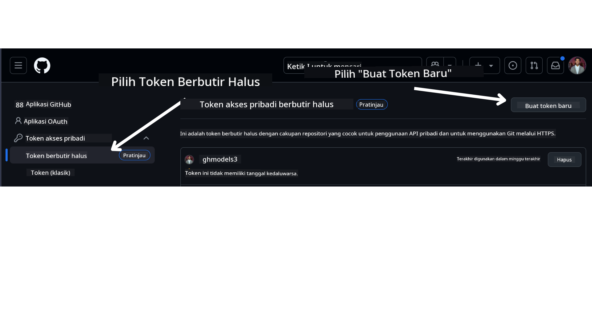
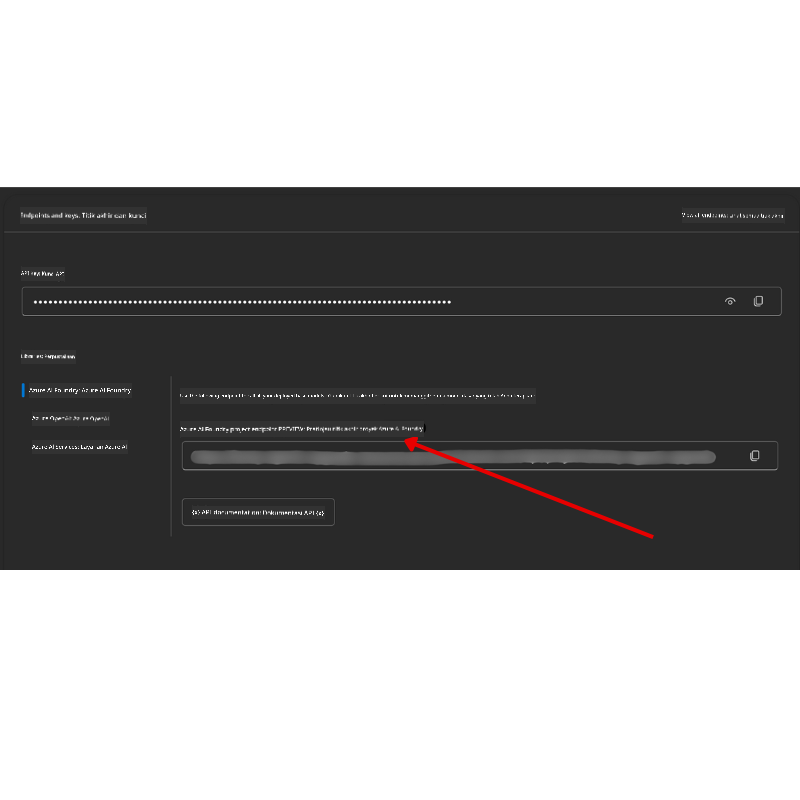

<!--
CO_OP_TRANSLATOR_METADATA:
{
  "original_hash": "76945069b52a49cd0432ae3e0b0ba22e",
  "translation_date": "2025-07-12T07:54:03+00:00",
  "source_file": "00-course-setup/README.md",
  "language_code": "id"
}
-->
di Akun GitHub Anda.

Pilih opsi `Fine-grained tokens` di sisi kiri layar Anda.

Kemudian pilih `Generate new token`.



Anda akan diminta untuk memasukkan nama token, memilih tanggal kedaluwarsa (Disarankan: 30 Hari), dan memilih cakupan untuk token Anda (Public Repositories).

Anda juga perlu mengedit izin token ini: Permissions -> Models -> Mengizinkan akses ke GitHub Models

Salin token baru yang baru saja Anda buat. Sekarang Anda akan menambahkan ini ke file `.env` yang disertakan dalam kursus ini.

### Langkah 2: Buat File `.env` Anda

Untuk membuat file `.env` jalankan perintah berikut di terminal Anda.

```bash
cp .env.example .env
```

Ini akan menyalin file contoh dan membuat file `.env` di direktori Anda, tempat Anda mengisi nilai untuk variabel lingkungan.

Setelah token Anda disalin, buka file `.env` di editor teks favorit Anda dan tempel token Anda ke dalam kolom `GITHUB_TOKEN`.

Sekarang Anda seharusnya dapat menjalankan contoh kode dari kursus ini.

## Pengaturan untuk Contoh menggunakan Azure AI Foundry dan Azure AI Agent Service

### Langkah 1: Ambil Endpoint Proyek Azure Anda

Ikuti langkah-langkah untuk membuat hub dan proyek di Azure AI Foundry yang dapat ditemukan di sini: [Hub resources overview](https://learn.microsoft.com/en-us/azure/ai-foundry/concepts/ai-resources)

Setelah Anda membuat proyek, Anda perlu mengambil string koneksi untuk proyek Anda.

Ini dapat dilakukan dengan membuka halaman **Overview** dari proyek Anda di portal Azure AI Foundry.



### Langkah 2: Buat File `.env` Anda

Untuk membuat file `.env` jalankan perintah berikut di terminal Anda.

```bash
cp .env.example .env
```

Ini akan menyalin file contoh dan membuat file `.env` di direktori Anda, tempat Anda mengisi nilai untuk variabel lingkungan.

Setelah token Anda disalin, buka file `.env` di editor teks favorit Anda dan tempel token Anda ke dalam kolom `PROJECT_ENDPOINT`.

### Langkah 3: Masuk ke Azure

Sebagai praktik keamanan terbaik, kita akan menggunakan [otentikasi tanpa kunci](https://learn.microsoft.com/azure/developer/ai/keyless-connections?tabs=csharp%2Cazure-cli?WT.mc_id=academic-105485-koreyst) untuk mengautentikasi ke Azure OpenAI dengan Microsoft Entra ID. Sebelum melakukannya, Anda harus menginstal **Azure CLI** sesuai dengan [instruksi instalasi](https://learn.microsoft.com/cli/azure/install-azure-cli?WT.mc_id=academic-105485-koreyst) untuk sistem operasi Anda.

Selanjutnya, buka terminal dan jalankan `az login --use-device-code` untuk masuk ke akun Azure Anda.

Setelah masuk, pilih langganan Anda di terminal.

## Variabel Lingkungan Tambahan - Azure Search dan Azure OpenAI

Untuk Pelajaran Agentic RAG - Pelajaran 5 - ada contoh yang menggunakan Azure Search dan Azure OpenAI.

Jika Anda ingin menjalankan contoh ini, Anda perlu menambahkan variabel lingkungan berikut ke file `.env` Anda:

### Halaman Overview (Proyek)

- `AZURE_SUBSCRIPTION_ID` - Periksa **Project details** di halaman **Overview** proyek Anda.

- `AZURE_AI_PROJECT_NAME` - Lihat di bagian atas halaman **Overview** proyek Anda.

- `AZURE_OPENAI_SERVICE` - Temukan di tab **Included capabilities** untuk **Azure OpenAI Service** di halaman **Overview**.

### Management Center

- `AZURE_OPENAI_RESOURCE_GROUP` - Buka **Project properties** di halaman **Overview** dari **Management Center**.

- `GLOBAL_LLM_SERVICE` - Di bawah **Connected resources**, temukan nama koneksi **Azure AI Services**. Jika tidak terdaftar, periksa di **Azure portal** di bawah grup sumber daya Anda untuk nama sumber daya AI Services.

### Halaman Models + Endpoints

- `AZURE_OPENAI_EMBEDDING_DEPLOYMENT_NAME` - Pilih model embedding Anda (misalnya, `text-embedding-ada-002`) dan catat **Deployment name** dari detail model.

- `AZURE_OPENAI_CHAT_DEPLOYMENT_NAME` - Pilih model chat Anda (misalnya, `gpt-4o-mini`) dan catat **Deployment name** dari detail model.

### Azure Portal

- `AZURE_OPENAI_ENDPOINT` - Cari **Azure AI services**, klik di situ, lalu buka **Resource Management**, **Keys and Endpoint**, gulir ke bawah ke "Azure OpenAI endpoints", dan salin yang bertuliskan "Language APIs".

- `AZURE_OPENAI_API_KEY` - Dari layar yang sama, salin KEY 1 atau KEY 2.

- `AZURE_SEARCH_SERVICE_ENDPOINT` - Temukan sumber daya **Azure AI Search** Anda, klik, dan lihat **Overview**.

- `AZURE_SEARCH_API_KEY` - Kemudian buka **Settings** dan kemudian **Keys** untuk menyalin kunci admin utama atau sekunder.

### Halaman Web Eksternal

- `AZURE_OPENAI_API_VERSION` - Kunjungi halaman [API version lifecycle](https://learn.microsoft.com/en-us/azure/ai-services/openai/api-version-deprecation#latest-ga-api-release) di bawah **Latest GA API release**.

### Pengaturan otentikasi tanpa kunci

Daripada menyimpan kredensial secara langsung, kita akan menggunakan koneksi tanpa kunci dengan Azure OpenAI. Untuk itu, kita akan mengimpor `DefaultAzureCredential` dan kemudian memanggil fungsi `DefaultAzureCredential` untuk mendapatkan kredensial.

```python
from azure.identity import DefaultAzureCredential, InteractiveBrowserCredential
```

## Terjebak di Mana?

Jika Anda mengalami masalah saat menjalankan pengaturan ini, bergabunglah dengan kami di

atau

.

## Pelajaran Selanjutnya

Anda sekarang siap untuk menjalankan kode untuk kursus ini. Selamat belajar lebih dalam tentang dunia AI Agents!

[Introduction to AI Agents and Agent Use Cases](../01-intro-to-ai-agents/README.md)

**Penafian**:  
Dokumen ini telah diterjemahkan menggunakan layanan terjemahan AI [Co-op Translator](https://github.com/Azure/co-op-translator). Meskipun kami berupaya untuk mencapai akurasi, harap diingat bahwa terjemahan otomatis mungkin mengandung kesalahan atau ketidakakuratan. Dokumen asli dalam bahasa aslinya harus dianggap sebagai sumber yang sahih. Untuk informasi penting, disarankan menggunakan terjemahan profesional oleh manusia. Kami tidak bertanggung jawab atas kesalahpahaman atau penafsiran yang keliru yang timbul dari penggunaan terjemahan ini.