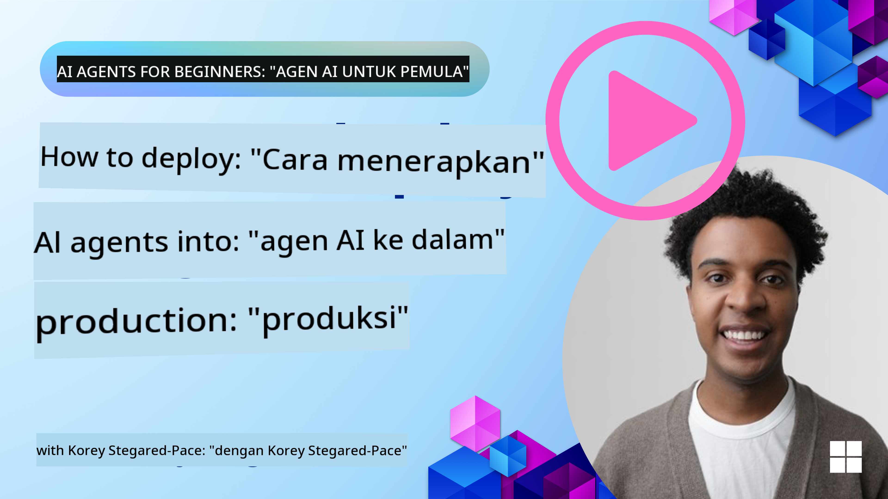

<!--
CO_OP_TRANSLATOR_METADATA:
{
  "original_hash": "1ad5de6a6388d02c145a92dd04358bab",
  "translation_date": "2025-07-12T13:40:38+00:00",
  "source_file": "10-ai-agents-production/README.md",
  "language_code": "id"
}
-->

> _(Klik gambar di atas untuk menonton video pelajaran ini)_
# AI Agents dalam Produksi

## Pendahuluan

Pelajaran ini akan membahas:

- Cara merencanakan penerapan AI Agent Anda ke produksi secara efektif.
- Kesalahan umum dan masalah yang mungkin Anda hadapi saat menerapkan AI Agent ke produksi.
- Cara mengelola biaya sambil tetap mempertahankan performa AI Agent Anda.

## Tujuan Pembelajaran

Setelah menyelesaikan pelajaran ini, Anda akan mengetahui/memahami:

- Teknik untuk meningkatkan performa, biaya, dan efektivitas sistem AI Agent produksi.
- Apa dan bagaimana mengevaluasi AI Agents Anda.
- Cara mengendalikan biaya saat menerapkan AI Agents ke produksi.

Penting untuk menerapkan AI Agents yang dapat dipercaya. Lihat juga pelajaran "Building Trustworthy AI Agents".

## Evaluasi AI Agents

Sebelum, selama, dan setelah menerapkan AI Agents, memiliki sistem evaluasi yang tepat sangat penting. Ini akan memastikan sistem Anda selaras dengan tujuan Anda dan pengguna.

Untuk mengevaluasi AI Agent, penting untuk dapat menilai tidak hanya output agent tetapi juga seluruh sistem tempat AI Agent Anda beroperasi. Ini mencakup namun tidak terbatas pada:

- Permintaan model awal.
- Kemampuan agent dalam mengidentifikasi maksud pengguna.
- Kemampuan agent dalam memilih alat yang tepat untuk menjalankan tugas.
- Respons alat terhadap permintaan agent.
- Kemampuan agent dalam menginterpretasi respons alat.
- Umpan balik pengguna terhadap respons agent.

Ini memungkinkan Anda mengidentifikasi area yang perlu diperbaiki dengan cara yang lebih modular. Anda kemudian dapat memantau efek perubahan pada model, prompt, alat, dan komponen lain dengan lebih efisien.

## Masalah Umum dan Solusi Potensial dengan AI Agents

| **Masalah**                                    | **Solusi Potensial**                                                                                                                                                                                                       |
| ---------------------------------------------- | -------------------------------------------------------------------------------------------------------------------------------------------------------------------------------------------------------------------------- |
| AI Agent tidak menjalankan tugas secara konsisten | - Perbaiki prompt yang diberikan ke AI Agent; jelaskan tujuan dengan jelas. - Identifikasi kapan membagi tugas menjadi subtugas dan menanganinya oleh beberapa agent dapat membantu.                                      |
| AI Agent mengalami loop berulang               | - Pastikan Anda memiliki syarat dan ketentuan penghentian yang jelas agar Agent tahu kapan harus menghentikan proses. - Untuk tugas kompleks yang memerlukan penalaran dan perencanaan, gunakan model yang lebih besar dan khusus untuk tugas penalaran. |
| Panggilan alat AI Agent tidak berjalan dengan baik | - Uji dan validasi output alat di luar sistem agent. - Perbaiki parameter, prompt, dan penamaan alat yang telah ditentukan.                                                                                               |
| Sistem Multi-Agent tidak berjalan konsisten    | - Perbaiki prompt yang diberikan ke setiap agent agar spesifik dan berbeda satu sama lain. - Bangun sistem hierarkis menggunakan agent "routing" atau controller untuk menentukan agent yang tepat.                      |

## Mengelola Biaya

Berikut beberapa strategi untuk mengelola biaya penerapan AI Agents ke produksi:

- **Caching Responses** - Mengidentifikasi permintaan dan tugas yang umum serta menyediakan respons sebelum melewati sistem agentik Anda adalah cara yang baik untuk mengurangi volume permintaan serupa. Anda bahkan dapat menerapkan alur untuk mengukur seberapa mirip permintaan dengan permintaan yang sudah di-cache menggunakan model AI yang lebih sederhana.

- **Menggunakan Model yang Lebih Kecil** - Small Language Models (SLM) dapat bekerja dengan baik pada beberapa kasus penggunaan agentik dan akan mengurangi biaya secara signifikan. Seperti yang disebutkan sebelumnya, membangun sistem evaluasi untuk menentukan dan membandingkan performa dengan model yang lebih besar adalah cara terbaik untuk memahami seberapa baik SLM akan bekerja pada kasus penggunaan Anda.

- **Menggunakan Router Model** - Strategi serupa adalah menggunakan beragam model dan ukuran. Anda dapat menggunakan LLM/SLM atau fungsi serverless untuk mengarahkan permintaan berdasarkan kompleksitas ke model yang paling sesuai. Ini juga membantu mengurangi biaya sekaligus memastikan performa pada tugas yang tepat.

## Selamat

Ini adalah pelajaran terakhir dari "AI Agents for Beginners".

Kami berencana untuk terus menambahkan pelajaran berdasarkan masukan dan perubahan di industri yang terus berkembang ini, jadi kunjungi lagi dalam waktu dekat.

Jika Anda ingin melanjutkan pembelajaran dan pembangunan dengan AI Agents, bergabunglah dengan <a href="https://discord.gg/kzRShWzttr" target="_blank">Azure AI Community Discord</a>.

Kami mengadakan workshop, diskusi komunitas, dan sesi "ask me anything" di sana.

Kami juga memiliki koleksi Learn dengan materi tambahan yang dapat membantu Anda mulai membangun AI Agents dalam produksi.

## Pelajaran Sebelumnya

[Metacognition Design Pattern](../09-metacognition/README.md)

**Penafian**:  
Dokumen ini telah diterjemahkan menggunakan layanan terjemahan AI [Co-op Translator](https://github.com/Azure/co-op-translator). Meskipun kami berupaya untuk akurasi, harap diketahui bahwa terjemahan otomatis mungkin mengandung kesalahan atau ketidakakuratan. Dokumen asli dalam bahasa aslinya harus dianggap sebagai sumber yang sah. Untuk informasi penting, disarankan menggunakan terjemahan profesional oleh manusia. Kami tidak bertanggung jawab atas kesalahpahaman atau penafsiran yang keliru yang timbul dari penggunaan terjemahan ini.