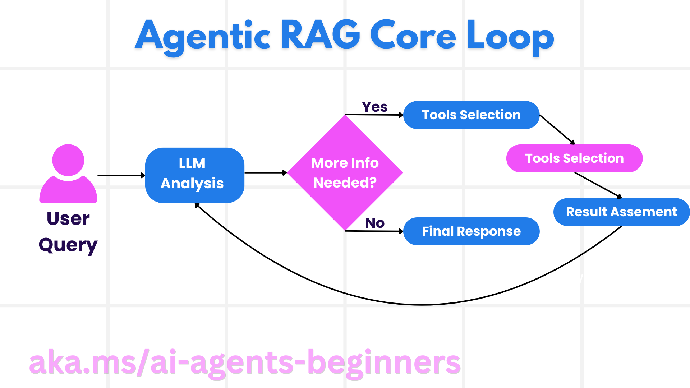

```markdown
# エージェンティックRAG

このレッスンでは、エージェンティック情報取得補強生成（Agentic Retrieval-Augmented Generation、以下エージェンティックRAG）について包括的に解説します。この新しいAIパラダイムでは、大規模言語モデル（LLM）が外部情報を取得しながら次のステップを自律的に計画します。静的な「取得して読む」パターンとは異なり、エージェンティックRAGでは、ツールや関数呼び出し、構造化された出力を交えた反復的なLLM呼び出しが行われます。システムは結果を評価し、必要に応じてクエリを洗練し、追加のツールを呼び出し、このサイクルを満足のいく解決策が得られるまで繰り返します。

## はじめに

このレッスンでは以下を学びます：

- **エージェンティックRAGの理解**: LLMが外部データソースから情報を取得しつつ、自律的に次のステップを計画するという新たなAIパラダイムを学びます。
- **反復的な「作成者-チェッカー」スタイルの理解**: LLMの呼び出し、ツールや関数呼び出し、構造化された出力を交えたループを理解し、正確性の向上や不正確なクエリへの対応方法を学びます。
- **実践的な応用の探求**: 正確性が重視される環境、複雑なデータベース操作、長期的なワークフローなど、エージェンティックRAGが活躍するシナリオを特定します。

## 学習目標

このレッスンを終えた後、以下を理解・実践できるようになります：

- **エージェンティックRAGの理解**: LLMが外部データソースから情報を取得しつつ、自律的に次のステップを計画する新たなAIパラダイムについて学びます。
- **反復的な「作成者-チェッカー」スタイル**: LLM呼び出し、ツールや関数呼び出し、構造化された出力を交えたループを理解し、正確性の向上や不正確なクエリへの対応方法を学びます。
- **推論プロセスの主体性**: システムが自らの推論プロセスを管理し、事前定義された手順に依存せず問題へのアプローチを決定する能力を理解します。
- **ワークフロー**: 市場動向レポートの取得、競合データの特定、内部販売指標の相関付け、結果の統合、戦略の評価といったプロセスをエージェンティックモデルが独立して決定する方法を理解します。
- **反復ループ、ツール統合、メモリ**: 反復的なインタラクションパターンに依存し、ステップ間で状態とメモリを維持しながら、無駄なループを避け、情報に基づいた意思決定を行う方法を学びます。
- **失敗モードの対応と自己修正**: クエリの再試行、診断ツールの使用、人間の監督に依存するなど、システムの強力な自己修正メカニズムを探ります。
- **エージェンシーの限界**: ドメイン固有の自律性、インフラ依存性、ガードレールの尊重に焦点を当て、エージェンティックRAGの限界を理解します。
- **実践的な利用ケースと価値**: 正確性が重視される環境、複雑なデータベース操作、長期的なワークフローなど、エージェンティックRAGが活躍するシナリオを特定します。
- **ガバナンス、透明性、信頼**: 説明可能な推論、バイアス制御、人間の監督の重要性を学びます。

## エージェンティックRAGとは？

エージェンティック情報取得補強生成（Agentic Retrieval-Augmented Generation、以下エージェンティックRAG）は、新たなAIパラダイムであり、大規模言語モデル（LLM）が外部情報を取得しながら次のステップを自律的に計画します。静的な「取得して読む」パターンとは異なり、エージェンティックRAGでは、ツールや関数呼び出し、構造化された出力を交えた反復的なLLM呼び出しが行われます。システムは結果を評価し、必要に応じてクエリを洗練し、追加のツールを呼び出し、このサイクルを満足のいく解決策が得られるまで繰り返します。この反復的な「作成者-チェッカー」スタイルは、正確性を向上させ、不正確なクエリに対応し、高品質な結果を確保します。

システムは推論プロセスを主体的に管理し、失敗したクエリを書き直したり、異なる取得方法を選択したり、複数のツール（Azure AI Searchのベクトル検索、SQLデータベース、カスタムAPIなど）を統合したりして、最終的な回答を出します。エージェンティックシステムの際立った特徴は、推論プロセスを自律的に管理する能力です。従来のRAG実装では事前定義された手順に依存しますが、エージェンティックシステムは見つけた情報の質に基づいて手順を自律的に決定します。

## エージェンティック情報取得補強生成（Agentic RAG）の定義

エージェンティックRAGは、LLMが外部データソースから情報を取得するだけでなく、次のステップを自律的に計画するAI開発の新たなパラダイムです。静的な「取得して読む」パターンや慎重にスクリプト化されたプロンプトシーケンスとは異なり、エージェンティックRAGでは、ツールや関数呼び出し、構造化された出力を交えた反復的なLLM呼び出しのループが行われます。システムは各ステップで得られた結果を評価し、クエリを洗練するかどうかを決定し、必要に応じて追加のツールを呼び出し、満足のいく解決策が得られるまでこのサイクルを繰り返します。

この反復的な「作成者-チェッカー」スタイルの操作は、正確性を向上させ、構造化データベース（例：NL2SQL）への不正確なクエリに対応し、バランスの取れた高品質な結果を確保することを目的としています。慎重に設計されたプロンプトチェーンに頼るのではなく、システムは推論プロセスを主体的に管理します。失敗したクエリを書き直し、異なる取得方法を選択し、複数のツール（Azure AI Searchのベクトル検索、SQLデータベース、カスタムAPIなど）を統合して最終的な回答を出します。これにより、過度に複雑なオーケストレーションフレームワークが不要になります。代わりに、「LLM呼び出し→ツール使用→LLM呼び出し→…」という比較的シンプルなループで洗練された、根拠のある出力を得ることができます。



## 推論プロセスの主体性

システムを「エージェンティック」とする際立った特徴は、推論プロセスを主体的に管理する能力です。従来のRAG実装では、モデルがどの情報をいつ取得するかを示すチェーン・オブ・ソートを人間が事前定義することに依存していました。しかし、真にエージェンティックなシステムでは、問題へのアプローチ方法を内部的に決定します。それは単なるスクリプトの実行ではなく、見つけた情報の質に基づいてステップの順序を自律的に決定します。

例えば、製品ローンチ戦略を作成するよう依頼された場合、エージェンティックモデルは以下のように独立して決定します：

1. Bing Web Groundingを使用して現在の市場動向レポートを取得する。
2. Azure AI Searchを使用して関連する競合データを特定する。
3. Azure SQL Databaseを使用して過去の内部販売指標を相関付ける。
4. Azure OpenAI Serviceを通じて統合された戦略を作成する。
5. 戦略のギャップや矛盾を評価し、必要に応じてもう一度取得を行う。

これらすべてのステップ（クエリの洗練、情報源の選択、回答に「満足」するまでの反復）は、モデル自身が決定し、人間がスクリプト化するものではありません。

## 反復ループ、ツール統合、メモリ


エージェンティックシステムは、以下のようなループ型のインタラクションパターンに依存します：

- **初回呼び出し**: ユーザーの目標（ユーザープロンプト）がLLMに提示されます。
- **ツールの呼び出し**: モデルが不足している情報や曖昧な指示を特定した場合、ベクトルデータベースクエリ（例：Azure AI Searchのプライベートデータ上のハイブリッド検索）や構造化されたSQL呼び出しなどのツールや取得方法を選択して、さらなるコンテキストを収集します。
- **評価と洗練**: 返されたデータをレビューした後、モデルは情報が十分かどうかを判断します。不十分な場合は、クエリを洗練したり、別のツールを試したり、アプローチを調整します。
- **満足するまで繰り返す**: モデルが十分な明確さと証拠を持って最終的な、よく考え抜かれた回答を提供できると判断するまで、このサイクルは続きます。
- **メモリと状態**: システムはステップ間で状態とメモリを維持するため、以前の試行とその結果を記憶し、無駄なループを避け、進行するにつれて情報に基づいた意思決定を行います。

このプロセスを通じて、モデルは進化する理解を形成し、人間がプロンプトを絶えず修正したり介入したりする必要なく、複雑なマルチステップタスクを進めることができます。

## 失敗モードの対応と自己修正

エージェンティックRAGの自律性には、強力な自己修正メカニズムも含まれています。システムが行き詰まった場合（例えば、無関係なドキュメントを取得したり、不正確なクエリに遭遇したりした場合）、以下を行います：

- **反復と再クエリ**: 価値の低い回答を返す代わりに、新しい検索戦略を試したり、データベースクエリを書き直したり、別のデータセットを調べたりします。
- **診断ツールの使用**: システムは、推論ステップをデバッグしたり、取得したデータの正確性を確認したりするための追加機能を呼び出す場合があります。Azure AI Tracingなどのツールは、堅牢な観測性とモニタリングを可能にします。
- **人間の監督へのフォールバック**: 高リスクまたは繰り返し失敗するシナリオでは、モデルが不確実性をフラグ付けし、人間のガイダンスを求めることがあります。一度人間が修正フィードバックを提供すると、モデルはそのレッスンを以降に活用できます。

この反復的かつ動的なアプローチにより、モデルはセッション中に学習し続けるシステムとなり、単なる一発回答型のシステムではなくなります。


## エージェンシーの限界

タスク内での自律性があるとはいえ、エージェンティックRAGは汎用人工知能と同義ではありません。その「エージェンティック」な能力は、人間の開発者が提供するツール、データソース、ポリシーに限定されています。独自のツールを発明したり、設定されたドメイン境界を超えたりすることはできません。むしろ、手元のリソースを動的に編成することに優れています。

より高度なAI形式との主な違いは以下の通りです：

1. **ドメイン固有の自律性**: エージェンティックRAGシステムは、クエリの書き換えやツール選択などの戦略を用いて、既知のドメイン内でユーザー定義の目標を達成することに焦点を当てています。
2. **インフラ依存性**: システムの能力は、開発者が統合したツールやデータに依存します。これらの境界を人間の介入なしに超えることはできません。
3. **ガードレールの尊重**: 倫理的ガイドライン、コンプライアンスルール、ビジネスポリシーは依然として非常に重要です。エージェントの自由度は常に安全対策と監視メカニズムによって制約されています（おそらく？）。

## 実践的な利用ケースと価値

エージェンティックRAGは、反復的な精緻化と正確性が求められるシナリオで特に効果を発揮します：

1. **正確性重視の環境**: コンプライアンスチェック、規制分析、法律調査などでは、エージェンティックモデルが事実を繰り返し検証し、複数の情報源を参照し、クエリを書き換えて徹底的に検証された回答を生成します。
2. **複雑なデータベース操作**: クエリが頻繁に失敗したり調整が必要な構造化データを扱う場合、Azure SQLやMicrosoft Fabric OneLakeを使用してクエリを自律的に精緻化し、最終的な取得がユーザーの意図に合致するようにします。
3. **拡張されたワークフロー**: 新しい情報が浮上するにつれて進化する長期的なセッションでは、エージェンティックRAGが新しいデータを継続的に取り込み、問題空間についてさらに学びながら戦略を変更できます。

## ガバナンス、透明性、信頼

これらのシステムが推論においてより自律的になるにつれ、ガバナンスと透明性が重要になります：

- **説明可能な推論**: モデルは、行ったクエリ、参照した情報源、結論に至るまでの推論ステップの監査記録を提供できます。Azure AI Content SafetyやAzure AI Tracing / GenAIOpsなどのツールは、透明性を維持し、リスクを軽減するのに役立ちます。
- **バイアス制御とバランスの取れた取得**: 開発者は取得戦略を調整して、バランスの取れた代表的なデータソースを考慮するようにし、Azure Machine Learningを使用してカスタムモデルで出力を定期的に監査し、バイアスや偏りのあるパターンを検出できます。
- **人間の監督とコンプライアンス**: 敏感なタスクでは、人間によるレビューが依然として不可欠です。エージェンティックRAGは高リスクの意思決定において人間の判断を置き換えるのではなく、より徹底的に検証された選択肢を提供することでそれを補完します。

行動の明確な記録を提供するツールを持つことは不可欠です。それがなければ、多段階プロセスをデバッグすることは非常に困

**免責事項**:  
この文書は、機械ベースのAI翻訳サービスを使用して翻訳されています。正確さを追求しておりますが、自動翻訳には誤りや不正確さが含まれる場合があります。原文（原言語の文書）を正式な情報源としてお考えください。重要な情報については、専門の人間による翻訳をお勧めします。この翻訳の使用に起因する誤解や誤解釈について、当社は一切の責任を負いません。