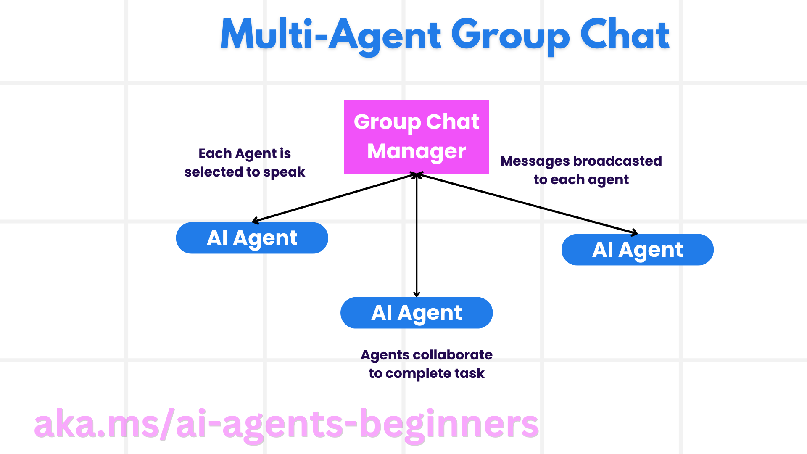

```markdown
# マルチエージェントデザインパターン

複数のエージェントを含むプロジェクトに取り組む際には、マルチエージェントデザインパターンを検討する必要があります。しかし、いつマルチエージェントに切り替えるべきか、そしてその利点は何かがすぐには明確でないかもしれません。

## はじめに

このレッスンでは、以下の質問に答えることを目指します：

- マルチエージェントが適用可能なシナリオはどのようなものか？
- 単一のエージェントが複数のタスクを行う場合と比べて、マルチエージェントを使用する利点は何か？
- マルチエージェントデザインパターンを実装するための構成要素は何か？
- 複数のエージェントがどのように相互作用しているかを可視化するにはどうすればよいか？

## 学習目標

このレッスンの後、以下ができるようになることを目指します：

- マルチエージェントが適用可能なシナリオを特定する。
- 単一エージェントと比較してマルチエージェントの利点を認識する。
- マルチエージェントデザインパターンを実装するための構成要素を理解する。

大きな視点で見てみましょう：

*マルチエージェントは、複数のエージェントが協力して共通の目標を達成するためのデザインパターン*です。

このパターンは、ロボティクス、自律システム、分散コンピューティングなど、さまざまな分野で広く使用されています。

## マルチエージェントが適用可能なシナリオ

では、どのようなシナリオがマルチエージェントの使用に適しているのでしょうか？答えは、多くのシナリオでマルチエージェントの採用が有益であり、特に以下の場合に役立ちます：

- **大規模な作業負荷**: 大規模な作業負荷を小さなタスクに分割し、異なるエージェントに割り当てることで、並列処理が可能になり、より迅速に完了します。例えば、大量のデータ処理タスクの場合がこれに該当します。
- **複雑なタスク**: 複雑なタスクも同様に、小さなサブタスクに分割し、それぞれのタスクを専門とするエージェントに割り当てることができます。自動運転車の場合、ナビゲーション、障害物検出、他の車両との通信を管理する異なるエージェントが例として挙げられます。
- **多様な専門性**: 異なるエージェントが多様な専門性を持つことで、単一のエージェントよりも効果的にタスクの異なる側面を処理できます。例えば、医療分野では、診断、治療計画、患者モニタリングを管理するエージェントが良い例です。

## 単一エージェントと比較したマルチエージェントの利点

単一エージェントシステムはシンプルなタスクには適していますが、より複雑なタスクではマルチエージェントを使用することでいくつかの利点が得られます：

- **専門性**: 各エージェントが特定のタスクに特化できます。単一エージェントでは、すべてのタスクを行うことができるものの、複雑なタスクに直面すると混乱する可能性があります。例えば、自分が得意ではないタスクを実行してしまうことがあります。
- **スケーラビリティ**: システムをスケールアップする際に、単一エージェントを過負荷にするよりも、エージェントを追加する方が容易です。
- **フォールトトレランス**: 一つのエージェントが失敗しても、他のエージェントが機能を続行できるため、システムの信頼性が向上します。

例として、ユーザーの旅行予約を考えてみましょう。単一エージェントシステムでは、フライトの検索からホテルやレンタカーの予約まで、旅行予約プロセスのすべてを処理する必要があります。この場合、単一エージェントはこれらのすべてのタスクを処理するツールを持つ必要があり、結果として保守やスケールが難しい複雑でモノリシックなシステムになる可能性があります。一方で、マルチエージェントシステムでは、フライト検索、ホテル予約、レンタカー予約を専門とする異なるエージェントを持つことができます。これにより、システムがよりモジュール化され、保守しやすく、スケーラブルになります。

これは、家族経営の旅行代理店とフランチャイズの旅行代理店の違いに例えることができます。家族経営の店では、一人のエージェントが旅行予約プロセスのすべてを処理しますが、フランチャイズでは、各エージェントがプロセスの異なる側面を処理します。

## マルチエージェントデザインパターンの構成要素

マルチエージェントデザインパターンを実装する前に、このパターンを構成する要素を理解する必要があります。

再び、ユーザーの旅行予約の例を見てみましょう。この場合、構成要素には以下が含まれます：

- **エージェント間の通信**: フライト検索、ホテル予約、レンタカー予約のエージェントが、ユーザーの好みや制約に関する情報を共有する必要があります。この通信のプロトコルや方法を決定する必要があります。具体的には、フライト検索エージェントがホテル予約エージェントと連携して、フライトの日程に合わせてホテルを予約する必要があります。つまり、*どのエージェントが情報を共有し、どのように共有するか*を決める必要があります。
- **調整メカニズム**: エージェントがユーザーの好みや制約を満たすために行動を調整する必要があります。ユーザーの好みとしては「空港に近いホテルを希望する」、制約としては「レンタカーは空港でしか利用できない」といった例があります。これにより、ホテル予約エージェントがレンタカー予約エージェントと連携して、ユーザーの希望や制約を満たす必要があります。つまり、*エージェントがどのように行動を調整するか*を決める必要があります。
- **エージェントアーキテクチャ**: エージェントがユーザーとのやり取りから意思決定を行い、学習するための内部構造を持つ必要があります。例えば、フライト検索エージェントは、どのフライトをユーザーに提案するかについて意思決定を行うための内部構造を持つ必要があります。これは、*エージェントがどのように意思決定を行い、学習するか*を決める必要があることを意味します。エージェントが学習し改善する例としては、過去のユーザーの好みに基づいてフライトを推薦するために機械学習モデルを使用することが挙げられます。
- **マルチエージェントの相互作用の可視化**: 複数のエージェントがどのように相互作用しているかを可視化する必要があります。これには、エージェントの活動や相互作用を追跡するためのツールや技術が必要です。これには、ログやモニタリングツール、可視化ツール、パフォーマンス指標が含まれることがあります。
- **マルチエージェントパターン**: マルチエージェントシステムを実装するためのパターンには、中央集権型、分散型、ハイブリッド型アーキテクチャなどがあります。ユースケースに最適なパターンを選択する必要があります。
- **人間の関与**: 多くの場合、人間がプロセスに関与し、エージェントが人間の介入を求めるタイミングを指示する必要があります。例えば、エージェントが提案しなかった特定のホテルやフライトをユーザーが希望する場合や、フライトやホテルを予約する前に確認を求める場合などです。

## マルチエージェントの相互作用の可視化

複数のエージェントがどのように相互作用しているかを可視化することは重要です。この可視化は、デバッグ、最適化、システム全体の有効性を確保するために不可欠です。この目的を達成するためには、エージェントの活動や相互作用を追跡するためのツールや技術が必要です。これには、ログやモニタリングツール、可視化ツール、パフォーマンス指標が含まれます。

例えば、ユーザーの旅行予約の場合、各エージェントのステータス、ユーザーの好みや制約、エージェント間の相互作用を表示するダッシュボードを用意することができます。このダッシュボードでは、ユーザーの旅行日程、フライトエージェントが提案するフライト、ホテルエージェントが提案するホテル、レンタカーエージェントが提案するレンタカーを表示することができます。これにより、エージェントがどのように相互作用しているか、ユーザーの好みや制約が満たされているかを明確に把握できます。

以下の各側面を詳しく見てみましょう：

- **ログとモニタリングツール**: 各エージェントが行ったアクションごとにログを記録します。ログエントリには、アクションを行ったエージェント、アクションの内容、アクションが行われた時間、アクションの結果に関する情報を保存します。この情報はデバッグや最適化などに使用できます。
- **可視化ツール**: 可視化ツールは、エージェント間の相互作用を直感的に理解するのに役立ちます。例えば、エージェント間の情報の流れを示すグラフを作成することができます。これにより、ボトルネックや非効率性、その他のシステム上の問題を特定するのに役立ちます。
- **パフォーマンス指標**: パフォーマンス指標は、マルチエージェントシステムの有効性を追跡するのに役立ちます。例えば、タスク完了までにかかる時間、単位時間あたりに完了したタスク数、エージェントが行った提案の正確性を追跡することができます。この情報をもとに、改善の余地を特定し、システムを最適化できます。

## マルチエージェントパターン

マルチエージェントアプリを作成するために使用できる具体的なパターンをいくつか見てみましょう。以下は検討に値する興味深いパターンです：

### グループチャット

このパターンは、複数のエージェントが互いに通信できるグループチャットアプリケーションを作成したい場合に有用です。典型的なユースケースには、チームコラボレーション、カスタマーサポート、ソーシャルネットワーキングが含まれます。

このパターンでは、各エージェントがグループチャット内のユーザーを表し、メッセージプロトコルを使用してエージェント間でメッセージが交換されます。エージェントはグループチャットにメッセージを送信したり、受信したり、他のエージェントからのメッセージに応答したりできます。

このパターンは、すべてのメッセージが中央サーバーを通じてルーティングされる中央集権型アーキテクチャ、またはメッセージが直接交換される分散型アーキテクチャで実装できます。



### タスクの引き継ぎ

このパターンは、複数のエージェントが互いにタスクを引き継ぐアプリケーションを作成したい場合に有用です。

典型的なユースケースには、カスタマーサポート、タスク管理、ワークフロー自動化が含まれます。

このパターンでは、各エージェントがタスクまたはワークフローのステップを表し、事前に定義されたルールに基づいてエージェント間でタスクが引き継がれます。


### 協調フィルタリング

このパターンは、複数のエージェントが協力してユーザーに推奨を行うアプリケーションを作成したい場合に有用です。

複数のエージェントが協力する理由は、各エージェントが異なる専門性を持ち、推奨プロセスに異なる方法で貢献できるからです。

例えば、ユーザーが株式市場で購入するのに最適な株を推奨してほしい場合を考えてみましょう。

- **業界の専門家**: あるエージェントは特定の業界の専門家である。
- **テクニカル分析**: 別のエージェントはテクニカル分析の専門家である。
- **ファンダメンタル分析**: 別のエージェントはファンダメンタル分析の専門家である。これらのエージェントが協力することで、ユーザーにより包括的な推奨を提供できます。


## シナリオ: 返金プロセス

顧客が商品の返金を求めるシナリオを考えてみましょう。このプロセスには多くのエージェントが関与する可能性がありますが、ここではこのプロセスに特化したエージェントと、他のプロセスでも使用できる汎用エージェントに分けて考えます。

**返金プロセスに特化したエージェント**:

以下は、返金プロセスに関与する可能性のあるエージェントです：

- **顧客エージェント**: 顧客を表し、返金プロセスを開始する役割を担います。
- **販売者エージェント**: 販売者を表し、返金処理を担当します。
- **支払いエージェント**: 支払いプロセスを表し、顧客への返金を担当します。
- **解決エージェント**: 解決プロセスを表し、返金プロセス中に発生する問題を解決します。
- **コンプライアンスエージェント**: コンプライアンスプロセスを表し、返金プロセスが規制やポリシーに準拠していることを確認します。

**汎用エージェント**:

これらのエージェントは、ビジネスの他の部分でも使用できます。

- **配送エージェント**: 配送プロセスを表し、商品を販売者に返送する役割を担います。このエージェントは、返金プロセスだけでなく、商品の購入時の配送にも使用できます。
- **フィードバックエージェント**: フィードバックプロセスを表し、顧客からのフィードバックを収集します。フィードバックは返金プロセスだけでなく、いつでも収集可能です。
- **エスカレーションエージェント**: エスカレーションプロセスを表し、問題をより高いレベルのサポートにエスカレーションします。このタイプのエージェントは、問題をエスカレーションする必要があるプロセス全般で使用できます。
- **通知エージェント**: 通知プロセスを表し、返金プロセスのさまざまな段階で顧客に通知を送信します。
- **分析エージェント**: 分析プロセスを表し、返金プロセスに関連するデータを分析します。
- **監査エージェント**: 監査プロセスを表し、返

**免責事項**:  
この文書は、機械ベースのAI翻訳サービスを使用して翻訳されています。正確さを期す努力をしておりますが、自動翻訳には誤りや不正確さが含まれる可能性があります。元の言語で記載された原文が正式な情報源とみなされるべきです。重要な情報については、専門の人間による翻訳を推奨します。本翻訳の使用に起因する誤解や解釈の誤りについて、当社は一切の責任を負いません。