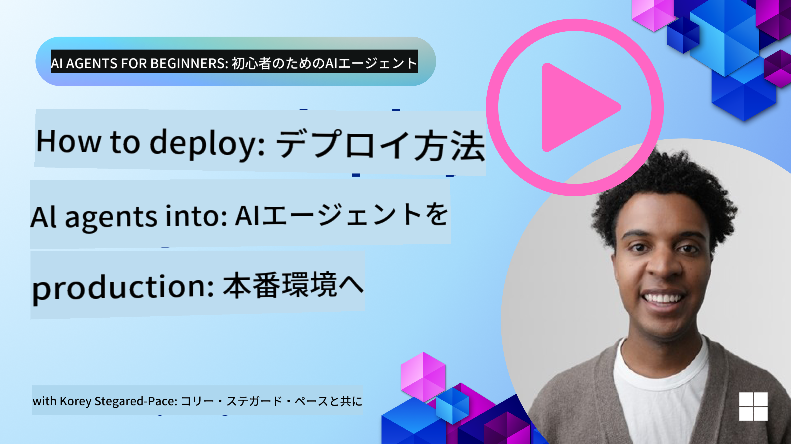

<!--
CO_OP_TRANSLATOR_METADATA:
{
  "original_hash": "1ad5de6a6388d02c145a92dd04358bab",
  "translation_date": "2025-07-12T13:36:19+00:00",
  "source_file": "10-ai-agents-production/README.md",
  "language_code": "ja"
}
-->

> _(上の画像をクリックすると、このレッスンの動画がご覧いただけます)_
# AIエージェントの本番運用

## はじめに

このレッスンでは以下の内容を扱います：

- AIエージェントを本番環境に効果的に展開するための計画方法
- 本番展開時に直面しやすい一般的な問題やミス
- AIエージェントのパフォーマンスを維持しつつコストを管理する方法

## 学習目標

このレッスンを終えた後、以下のことができるようになります／理解できます：

- 本番環境のAIエージェントシステムのパフォーマンス、コスト、効果を改善する技術
- AIエージェントの評価方法と評価すべきポイント
- AIエージェントを本番展開する際のコスト管理方法

信頼できるAIエージェントを展開することが重要です。「Building Trustworthy AI Agents」のレッスンもぜひご覧ください。

## AIエージェントの評価

AIエージェントを展開する前、展開中、そして展開後に、適切な評価システムを持つことは非常に重要です。これにより、システムがあなたやユーザーの目標に沿っていることを確認できます。

AIエージェントを評価するには、エージェントの出力だけでなく、エージェントが動作しているシステム全体を評価できることが重要です。これには以下が含まれますが、これらに限定されません：

- 初期のモデルリクエスト
- ユーザーの意図を特定するエージェントの能力
- タスクを実行するための適切なツールを選択するエージェントの能力
- ツールがエージェントのリクエストに返す応答
- ツールの応答を解釈するエージェントの能力
- エージェントの応答に対するユーザーのフィードバック

これにより、改善すべき箇所をよりモジュール化して特定でき、モデル、プロンプト、ツール、その他のコンポーネントの変更が与える影響を効率的に監視できます。

## AIエージェントに関するよくある問題とその解決策

| **問題**                                      | **考えられる解決策**                                                                                                                                                                                                     |
| ---------------------------------------------- | -------------------------------------------------------------------------------------------------------------------------------------------------------------------------------------------------------------------------- |
| AIエージェントがタスクを一貫して実行しない     | - AIエージェントに与えるプロンプトを明確にし、目的をはっきりさせる。 - タスクを細分化し、複数のエージェントで処理する方法を検討する。                                                      |
| AIエージェントが無限ループに陥る               | - エージェントが処理を停止すべき明確な終了条件を設定する。 - 複雑な推論や計画が必要なタスクには、推論に特化した大きなモデルを使用する。 |
| AIエージェントのツール呼び出しがうまく機能しない | - エージェントシステム外でツールの出力をテスト・検証する。 - ツールのパラメータ、プロンプト、名前付けを見直す。                                                                                        |
| マルチエージェントシステムが一貫して動作しない | - 各エージェントに与えるプロンプトを具体的かつ区別できるように改善する。 - 「ルーティング」やコントローラーエージェントを使った階層的なシステムを構築し、適切なエージェントを選定する。         |

## コスト管理

AIエージェントを本番展開する際のコスト管理のための戦略をいくつか紹介します：

- **レスポンスのキャッシュ** - よくあるリクエストやタスクを特定し、エージェントシステムを通す前にレスポンスを返すことで、類似リクエストの量を減らせます。より基本的なAIモデルを使って、リクエストの類似度を判定するフローを実装することも可能です。

- **小型モデルの活用** - Small Language Models（SLM）は特定のエージェント用途で良好なパフォーマンスを発揮し、コストを大幅に削減できます。前述の通り、評価システムを構築して大きなモデルと比較し、SLMがどの程度使えるかを判断するのが最善です。

- **ルーターモデルの利用** - 複数のモデルやサイズを使い分ける戦略もあります。LLM/SLMやサーバーレス関数を使って、リクエストの複雑さに応じて最適なモデルに振り分けることで、コスト削減とパフォーマンス維持を両立できます。

## おめでとうございます

これで「AI Agents for Beginners」の最後のレッスンとなります。

この急速に成長する業界の変化やフィードバックに応じて、今後もレッスンを追加していく予定ですので、また近いうちにぜひお立ち寄りください。

AIエージェントの学習や開発を続けたい方は、<a href="https://discord.gg/kzRShWzttr" target="_blank">Azure AI Community Discord</a>にご参加ください。

ワークショップやコミュニティラウンドテーブル、「なんでも質問」セッションを開催しています。

また、本番環境でAIエージェントを構築するための追加教材をまとめたLearnコレクションもご用意しています。

## 前のレッスン

[Metacognition Design Pattern](../09-metacognition/README.md)

**免責事項**：  
本書類はAI翻訳サービス「[Co-op Translator](https://github.com/Azure/co-op-translator)」を使用して翻訳されました。正確性を期しておりますが、自動翻訳には誤りや不正確な部分が含まれる可能性があります。原文の言語によるオリジナル文書が正式な情報源とみなされるべきです。重要な情報については、専門の人間による翻訳を推奨します。本翻訳の利用により生じた誤解や誤訳について、当方は一切の責任を負いかねます。