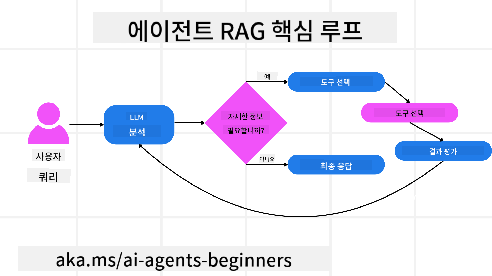
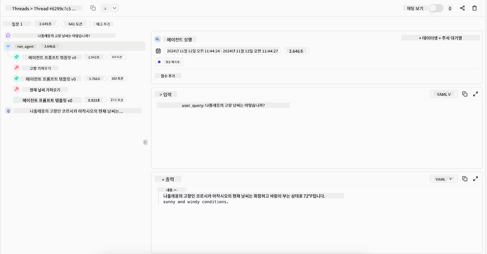

<!--
CO_OP_TRANSLATOR_METADATA:
{
  "original_hash": "7622aa72f9e676e593339f5f694ecd7d",
  "translation_date": "2025-07-12T09:55:37+00:00",
  "source_file": "05-agentic-rag/README.md",
  "language_code": "ko"
}
-->

> _(위 이미지를 클릭하면 이 강의의 영상을 볼 수 있습니다)_

# Agentic RAG

이 강의에서는 Agentic Retrieval-Augmented Generation(Agentic RAG)에 대해 종합적으로 다룹니다. Agentic RAG는 대형 언어 모델(LLM)이 외부 소스에서 정보를 가져오면서 스스로 다음 단계를 계획하는 새로운 AI 패러다임입니다. 정적인 검색 후 읽기 방식과 달리, Agentic RAG는 LLM에 반복적으로 호출을 하며 도구나 함수 호출, 구조화된 출력을 교차로 수행합니다. 시스템은 결과를 평가하고 쿼리를 다듬으며 필요 시 추가 도구를 호출하고, 만족스러운 해결책이 나올 때까지 이 과정을 계속합니다.

## 소개

이 강의에서는 다음 내용을 다룹니다

- **Agentic RAG 이해하기:** 대형 언어 모델(LLM)이 외부 데이터 소스에서 정보를 가져오면서 스스로 다음 단계를 계획하는 AI의 새로운 패러다임을 배웁니다.
- **반복적인 메이커-체커 스타일 이해하기:** 도구나 함수 호출과 구조화된 출력을 포함한 LLM에 대한 반복 호출 루프를 이해하여 정확성을 높이고 잘못된 쿼리를 처리하는 방식을 익힙니다.
- **실용적 적용 사례 탐색:** 정확성 우선 환경, 복잡한 데이터베이스 상호작용, 확장된 워크플로우 등 Agentic RAG가 빛을 발하는 시나리오를 확인합니다.

## 학습 목표

이 강의를 마치면 다음을 알게 됩니다/이해하게 됩니다:

- **Agentic RAG 이해:** 대형 언어 모델(LLM)이 외부 데이터 소스에서 정보를 가져오면서 스스로 다음 단계를 계획하는 AI의 새로운 패러다임을 배웁니다.
- **반복적인 메이커-체커 스타일:** 도구나 함수 호출과 구조화된 출력을 포함한 LLM에 대한 반복 호출 루프 개념을 이해하여 정확성을 높이고 잘못된 쿼리를 처리하는 방식을 익힙니다.
- **추론 과정 주도:** 사전에 정의된 경로에 의존하지 않고 문제 접근 방식을 스스로 결정하는 시스템의 추론 주도 능력을 이해합니다.
- **워크플로우:** 에이전트 모델이 시장 동향 보고서를 독립적으로 조회하고, 경쟁사 데이터를 식별하며, 내부 판매 지표를 연관시키고, 결과를 종합해 전략을 평가하는 과정을 이해합니다.
- **반복 루프, 도구 통합, 메모리:** 시스템이 상태와 메모리를 유지하며 반복 상호작용 패턴에 의존해 중복 루프를 피하고 정보에 기반한 결정을 내리는 방식을 배웁니다.
- **실패 모드 처리 및 자기 수정:** 반복 쿼리, 진단 도구 사용, 인간 감독에 의존하는 강력한 자기 수정 메커니즘을 탐구합니다.
- **에이전시의 한계:** 도메인별 자율성, 인프라 의존성, 가드레일 준수 등 Agentic RAG의 한계를 이해합니다.
- **실용적 사용 사례 및 가치:** 정확성 우선 환경, 복잡한 데이터베이스 상호작용, 확장된 워크플로우 등 Agentic RAG가 빛나는 시나리오를 확인합니다.
- **거버넌스, 투명성, 신뢰:** 설명 가능한 추론, 편향 제어, 인간 감독 등 거버넌스와 투명성의 중요성을 배웁니다.

## Agentic RAG란 무엇인가?

Agentic Retrieval-Augmented Generation(Agentic RAG)은 대형 언어 모델(LLM)이 외부 소스에서 정보를 가져오면서 스스로 다음 단계를 계획하는 새로운 AI 패러다임입니다. 정적인 검색 후 읽기 방식과 달리, Agentic RAG는 LLM에 반복적으로 호출을 하며 도구나 함수 호출, 구조화된 출력을 교차로 수행합니다. 시스템은 결과를 평가하고 쿼리를 다듬으며 필요 시 추가 도구를 호출하고, 만족스러운 해결책이 나올 때까지 이 과정을 계속합니다. 이러한 반복적인 “메이커-체커” 스타일은 정확성을 높이고, 잘못된 쿼리를 처리하며, 고품질 결과를 보장합니다.

시스템은 추론 과정을 적극적으로 주도하며 실패한 쿼리를 다시 작성하고, 다른 검색 방법을 선택하며, Azure AI Search의 벡터 검색, SQL 데이터베이스, 맞춤 API 등 여러 도구를 통합해 최종 답변을 완성합니다. 에이전트 시스템의 차별점은 추론 과정을 스스로 주도하는 능력입니다. 전통적인 RAG 구현은 사전에 정의된 경로에 의존하지만, 에이전트 시스템은 찾은 정보의 품질에 따라 단계 순서를 자율적으로 결정합니다.

## Agentic Retrieval-Augmented Generation(Agentic RAG) 정의

Agentic Retrieval-Augmented Generation(Agentic RAG)은 LLM이 외부 데이터 소스에서 정보를 가져올 뿐만 아니라 스스로 다음 단계를 계획하는 AI 개발의 새로운 패러다임입니다. 정적인 검색 후 읽기 방식이나 정교하게 스크립트된 프롬프트 시퀀스와 달리, Agentic RAG는 도구나 함수 호출과 구조화된 출력을 포함한 LLM에 대한 반복 호출 루프를 가집니다. 매 단계마다 시스템은 얻은 결과를 평가하고, 쿼리를 다듬을지 결정하며, 필요 시 추가 도구를 호출하고, 만족스러운 해결책이 나올 때까지 이 과정을 반복합니다.

이 반복적인 “메이커-체커” 스타일은 정확성을 높이고, 구조화된 데이터베이스(예: NL2SQL)에 대한 잘못된 쿼리를 처리하며, 균형 잡힌 고품질 결과를 보장하도록 설계되었습니다. 단순히 정교하게 설계된 프롬프트 체인에 의존하는 대신, 시스템은 추론 과정을 적극적으로 주도합니다. 실패한 쿼리를 다시 작성하고, 다른 검색 방법을 선택하며, Azure AI Search의 벡터 검색, SQL 데이터베이스, 맞춤 API 등 여러 도구를 통합해 최종 답변을 완성합니다. 이로 인해 지나치게 복잡한 오케스트레이션 프레임워크가 필요 없으며, “LLM 호출 → 도구 사용 → LLM 호출 → …”의 비교적 단순한 루프만으로도 정교하고 근거 있는 출력을 만들어냅니다.

## 추론 과정 주도

시스템을 “에이전트적”으로 만드는 핵심 특성은 추론 과정을 스스로 주도하는 능력입니다. 전통적인 RAG 구현은 모델이 무엇을 언제 검색할지 미리 정의된 사고의 흐름(chain-of-thought)에 의존하는 경우가 많습니다.  
하지만 진정한 에이전트 시스템은 문제 접근 방식을 내부에서 결정합니다. 단순히 스크립트를 실행하는 것이 아니라, 찾은 정보의 품질에 따라 단계 순서를 자율적으로 정합니다.  
예를 들어, 제품 출시 전략을 수립하라는 요청을 받으면, 전체 연구 및 의사결정 워크플로우를 모두 명시한 프롬프트에만 의존하지 않고, 에이전트 모델은 독립적으로 다음을 결정합니다:

1. Bing Web Grounding을 사용해 최신 시장 동향 보고서 조회  
2. Azure AI Search를 통해 관련 경쟁사 데이터 식별  
3. Azure SQL Database를 활용해 과거 내부 판매 지표 연관 분석  
4. Azure OpenAI Service를 통해 결과를 종합해 일관된 전략 수립  
5. 전략의 빈틈이나 불일치 여부 평가, 필요 시 추가 검색 수행  

이 모든 단계—쿼리 다듬기, 출처 선택, 답변에 만족할 때까지 반복—는 모델이 스스로 결정하며, 사람이 미리 스크립트화하지 않습니다.

## 반복 루프, 도구 통합, 메모리

에이전트 시스템은 반복적인 상호작용 패턴에 의존합니다:

- **초기 호출:** 사용자의 목표(즉, 사용자 프롬프트)가 LLM에 전달됩니다.  
- **도구 호출:** 모델이 누락된 정보나 모호한 지시를 감지하면, 벡터 데이터베이스 쿼리(예: Azure AI Search의 하이브리드 검색)나 구조화된 SQL 호출 같은 도구나 검색 방법을 선택해 추가 컨텍스트를 수집합니다.  
- **평가 및 다듬기:** 반환된 데이터를 검토한 후, 정보가 충분한지 판단합니다. 부족하면 쿼리를 다듬거나 다른 도구를 시도하거나 접근 방식을 조정합니다.  
- **만족할 때까지 반복:** 모델이 최종적으로 명확하고 근거 있는 답변을 제공할 수 있다고 판단할 때까지 이 과정을 반복합니다.  
- **메모리 및 상태 유지:** 시스템은 단계별 상태와 메모리를 유지해 이전 시도와 결과를 기억하며, 반복 루프를 피하고 더 현명한 결정을 내립니다.

이 과정은 시간이 지남에 따라 점진적으로 이해가 깊어지는 느낌을 만들어내며, 사람이 지속적으로 개입하거나 프롬프트를 재구성하지 않아도 복잡한 다단계 작업을 수행할 수 있게 합니다.

## 실패 모드 처리 및 자기 수정

Agentic RAG의 자율성은 강력한 자기 수정 메커니즘도 포함합니다. 시스템이 막다른 길에 부딪히거나(예: 관련 없는 문서 검색, 잘못된 쿼리 발생) 할 때 다음과 같은 조치를 취할 수 있습니다:

- **반복 및 재쿼리:** 낮은 가치의 응답을 반환하는 대신, 새로운 검색 전략을 시도하거나 데이터베이스 쿼리를 다시 작성하거나 대체 데이터 세트를 탐색합니다.  
- **진단 도구 사용:** 추론 단계를 디버깅하거나 검색된 데이터의 정확성을 확인하는 데 도움이 되는 추가 기능을 호출할 수 있습니다. Azure AI Tracing 같은 도구는 견고한 관찰성과 모니터링을 가능하게 합니다.  
- **인간 감독에 의존:** 고위험 상황이나 반복 실패 시, 불확실성을 표시하고 인간의 지도를 요청할 수 있습니다. 인간이 교정 피드백을 제공하면 모델은 이를 학습해 이후에 반영합니다.

이 반복적이고 동적인 접근법 덕분에 모델은 단발성 시스템이 아니라, 세션 중 실수를 통해 지속적으로 학습하고 개선하는 시스템이 됩니다.

## 에이전시의 한계

작업 내에서 자율성을 가지지만, Agentic RAG는 인공 일반 지능(AGI)과는 다릅니다. “에이전트적” 능력은 인간 개발자가 제공한 도구, 데이터 소스, 정책에 한정됩니다. 스스로 도구를 발명하거나 설정된 도메인 경계를 벗어날 수 없습니다. 대신, 주어진 자원을 동적으로 조율하는 데 뛰어납니다.  
더 발전된 AI 형태와의 주요 차이점은 다음과 같습니다:

1. **도메인별 자율성:** Agentic RAG 시스템은 알려진 도메인 내에서 사용자 정의 목표 달성에 집중하며, 쿼리 재작성이나 도구 선택 같은 전략을 사용해 결과를 개선합니다.  
2. **인프라 의존성:** 시스템 능력은 개발자가 통합한 도구와 데이터에 의존하며, 인간 개입 없이는 이 한계를 넘을 수 없습니다.  
3. **가드레일 준수:** 윤리 지침, 규정 준수, 비즈니스 정책이 매우 중요하며, 에이전트의 자유는 항상 안전 조치와 감독 메커니즘에 의해 제한됩니다(희망컨대).

## 실용적 사용 사례 및 가치

Agentic RAG는 반복적인 개선과 정밀함이 필요한 시나리오에서 빛을 발합니다:

1. **정확성 우선 환경:** 컴플라이언스 점검, 규제 분석, 법률 조사 등에서 에이전트 모델은 사실을 반복 검증하고 여러 출처를 참고하며 쿼리를 재작성해 철저히 검증된 답변을 제공합니다.  
2. **복잡한 데이터베이스 상호작용:** 쿼리가 자주 실패하거나 조정이 필요한 구조화된 데이터 처리 시, 시스템은 Azure SQL이나 Microsoft Fabric OneLake를 활용해 쿼리를 자율적으로 다듬어 최종 검색 결과가 사용자의 의도에 부합하도록 합니다.  
3. **확장된 워크플로우:** 장기 세션에서 새로운 정보가 나타나면, Agentic RAG는 지속적으로 데이터를 통합하고 문제 공간에 대해 더 많이 학습하면서 전략을 조정합니다.

## 거버넌스, 투명성, 신뢰

이러한 시스템이 추론에서 더 자율적으로 변함에 따라, 거버넌스와 투명성이 매우 중요해집니다:

- **설명 가능한 추론:** 모델은 수행한 쿼리, 참고한 출처, 결론에 이르기까지의 추론 단계를 감사 추적할 수 있습니다. Azure AI Content Safety, Azure AI Tracing / GenAIOps 같은 도구가 투명성을 유지하고 위험을 완화하는 데 도움을 줍니다.  
- **편향 제어 및 균형 잡힌 검색:** 개발자는 균형 잡히고 대표성 있는 데이터 소스를 고려하도록 검색 전략을 조정하고, Azure Machine Learning을 활용한 고급 데이터 과학 조직용 맞춤 모델로 출력물을 정기적으로 감사해 편향이나 왜곡된 패턴을 감지할 수 있습니다.  
- **인간 감독 및 준수:** 민감한 작업에서는 인간 검토가 필수적입니다. Agentic RAG는 고위험 결정에서 인간 판단을 대체하지 않고, 더 철저히 검증된 옵션을 제공해 보완합니다.

행동 기록을 명확히 제공하는 도구가 필수적입니다. 없으면 다단계 프로세스 디버깅이 매우 어려워집니다. 다음은 Literal AI(Chainlit의 개발사)에서 실행한 Agent 예시입니다:

## 결론

Agentic RAG는 AI 시스템이 복잡하고 데이터 집약적인 작업을 처리하는 자연스러운 진화를 나타냅니다. 반복적인 상호작용 패턴을 채택하고, 도구를 자율적으로 선택하며, 쿼리를 다듬어 고품질 결과를 달성함으로써, 정적인 프롬프트 실행을 넘어 더 적응적이고 상황 인지적인 의사결정자로 거듭납니다. 인간이 정의한 인프라와 윤리 지침에 여전히 제한되지만, 이러한 에이전트 능력은 기업과 최종 사용자 모두에게 더 풍부하고 역동적이며 궁극적으로 더 유용한 AI 상호작용을 가능하게 합니다.

## 추가 자료

- <a href="https://learn.microsoft.com/training/modules/use-own-data-azure-openai" target="_blank">Implement Retrieval Augmented Generation (RAG) with Azure OpenAI Service: Azure OpenAI Service에서 자체 데이터를 사용하는 방법을 배우세요. 이 Microsoft Learn 모듈은 RAG 구현에 대한 종합적인 가이드를 제공합니다.

- <a href="https://learn.microsoft.com/azure/ai-studio/concepts/evaluation-approach-gen-ai" target="_blank">Azure AI Foundry를 활용한 생성 AI 애플리케이션 평가: 이 문서에서는 공개 데이터셋을 기반으로 한 모델 평가 및 비교, Agentic AI 애플리케이션과 RAG 아키텍처를 다룹니다</a>
- <a href="https://weaviate.io/blog/what-is-agentic-rag" target="_blank">Agentic RAG란 무엇인가 | Weaviate</a>
- <a href="https://ragaboutit.com/agentic-rag-a-complete-guide-to-agent-based-retrieval-augmented-generation/" target="_blank">Agentic RAG: 에이전트 기반 검색 증강 생성에 대한 완벽 가이드 – generation RAG 소식</a>
- <a href="https://huggingface.co/learn/cookbook/agent_rag" target="_blank">Agentic RAG: 쿼리 재구성과 자체 쿼리로 RAG 성능 향상하기! Hugging Face 오픈소스 AI 요리책</a>
- <a href="https://youtu.be/aQ4yQXeB1Ss?si=2HUqBzHoeB5tR04U" target="_blank">RAG에 Agentic 레이어 추가하기</a>
- <a href="https://www.youtube.com/watch?v=zeAyuLc_f3Q&t=244s" target="_blank">지식 어시스턴트의 미래: Jerry Liu</a>
- <a href="https://www.youtube.com/watch?v=AOSjiXP1jmQ" target="_blank">Agentic RAG 시스템 구축 방법</a>
- <a href="https://ignite.microsoft.com/sessions/BRK102?source=sessions" target="_blank">Azure AI Foundry Agent Service를 활용해 AI 에이전트 확장하기</a>

### 학술 논문

- <a href="https://arxiv.org/abs/2303.17651" target="_blank">2303.17651 Self-Refine: 자기 피드백을 통한 반복적 개선</a>
- <a href="https://arxiv.org/abs/2303.11366" target="_blank">2303.11366 Reflexion: 언어 에이전트와 언어적 강화 학습</a>
- <a href="https://arxiv.org/abs/2305.11738" target="_blank">2305.11738 CRITIC: 도구 상호작용 비평을 통한 대형 언어 모델의 자기 수정</a>
- <a href="https://arxiv.org/abs/2501.09136" target="_blank">2501.09136 Agentic Retrieval-Augmented Generation: Agentic RAG에 대한 조사</a>

## 이전 강의

[Tool Use Design Pattern](../04-tool-use/README.md)

## 다음 강의

[Building Trustworthy AI Agents](../06-building-trustworthy-agents/README.md)

**면책 조항**:  
이 문서는 AI 번역 서비스 [Co-op Translator](https://github.com/Azure/co-op-translator)를 사용하여 번역되었습니다. 정확성을 위해 최선을 다하고 있으나, 자동 번역에는 오류나 부정확한 부분이 있을 수 있음을 유의해 주시기 바랍니다. 원문은 해당 언어의 원본 문서가 권위 있는 출처로 간주되어야 합니다. 중요한 정보의 경우 전문적인 인간 번역을 권장합니다. 본 번역 사용으로 인해 발생하는 오해나 잘못된 해석에 대해 당사는 책임을 지지 않습니다.