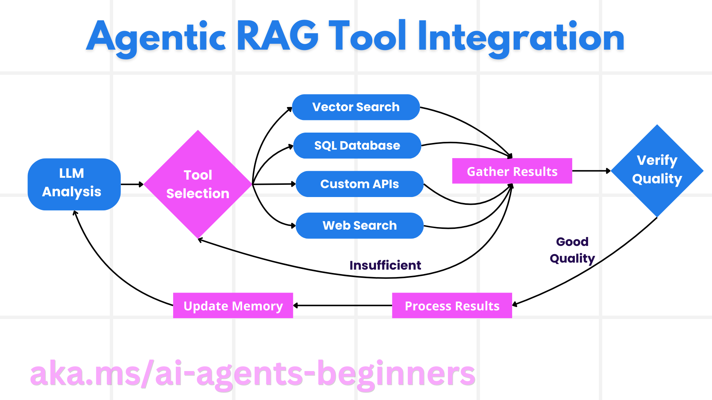
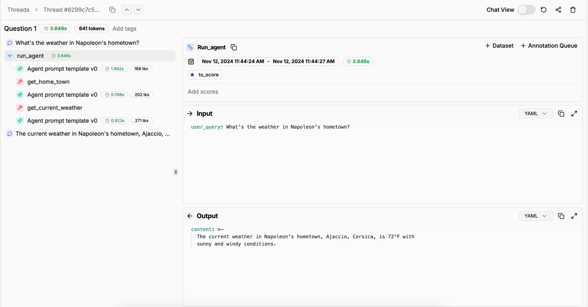

```markdown
# 에이전틱 RAG

이 강의는 에이전틱 정보검색-증강 생성(Agentic Retrieval-Augmented Generation, Agentic RAG)의 포괄적인 개요를 제공합니다. 이는 대형 언어 모델(LM)이 외부 소스에서 정보를 가져오면서 다음 단계를 자율적으로 계획하는 신흥 AI 패러다임입니다. 정적인 검색-읽기 패턴과는 달리, 에이전틱 RAG는 LLM에 반복적으로 호출하며, 도구나 함수 호출 및 구조화된 출력과 교차하여 작동합니다. 시스템은 결과를 평가하고, 쿼리를 개선하며, 필요 시 추가 도구를 호출하고, 만족스러운 솔루션이 나올 때까지 이 과정을 반복합니다.

## 소개

이 강의에서는 다음을 다룹니다:

- **에이전틱 RAG 이해하기:** 대형 언어 모델(LLM)이 외부 데이터 소스에서 정보를 가져오면서 다음 단계를 자율적으로 계획하는 AI의 새로운 패러다임에 대해 학습합니다.
- **반복적인 Maker-Checker 스타일 이해하기:** LLM에 대한 반복 호출과 도구 또는 함수 호출 및 구조화된 출력을 교차시키는 루프를 이해하여 정확성을 높이고 잘못된 쿼리를 처리하는 방법을 배웁니다.
- **실제 응용 사례 탐구:** 정확성이 중요한 환경, 복잡한 데이터베이스 상호작용, 확장된 워크플로우 등 에이전틱 RAG가 빛을 발하는 시나리오를 식별합니다.

## 학습 목표

이 강의를 완료한 후, 다음을 알거나 이해할 수 있습니다:

- **에이전틱 RAG 이해하기:** 대형 언어 모델(LLM)이 외부 데이터 소스에서 정보를 가져오면서 다음 단계를 자율적으로 계획하는 AI의 새로운 패러다임에 대해 학습합니다.
- **반복적인 Maker-Checker 스타일:** LLM에 대한 반복 호출과 도구 또는 함수 호출 및 구조화된 출력을 교차시키는 루프의 개념을 이해하여 정확성을 높이고 잘못된 쿼리를 처리하는 방법을 배웁니다.
- **추론 프로세스의 주도권:** 사전 정의된 경로에 의존하지 않고 문제를 접근하는 방법을 결정하는 시스템의 능력을 이해합니다.
- **워크플로우:** 에이전틱 모델이 시장 동향 보고서를 검색하고, 경쟁사 데이터를 식별하며, 내부 판매 지표를 상관시키고, 결과를 종합하여 전략을 평가하는 과정을 독립적으로 결정하는 방식을 이해합니다.
- **반복 루프, 도구 통합 및 메모리:** 반복 상호작용 패턴에 의존하며, 단계 간 상태와 메모리를 유지하여 반복 루프를 방지하고 정보에 입각한 결정을 내리는 시스템에 대해 학습합니다.
- **실패 모드 처리 및 자기 수정:** 진단 도구를 활용하거나 인간의 감독에 의존하는 등, 시스템의 견고한 자기 수정 메커니즘을 탐구합니다.
- **에이전시의 한계:** 도메인별 자율성, 인프라 의존성, 가드레일 준수에 중점을 둔 에이전틱 RAG의 한계를 이해합니다.
- **실제 응용 사례 및 가치:** 정확성이 중요한 환경, 복잡한 데이터베이스 상호작용, 확장된 워크플로우 등 에이전틱 RAG가 빛을 발하는 시나리오를 식별합니다.
- **거버넌스, 투명성 및 신뢰:** 설명 가능한 추론, 편향 제어, 인간 감독을 포함하여 거버넌스와 투명성의 중요성을 배웁니다.

## 에이전틱 RAG란 무엇인가?

에이전틱 정보검색-증강 생성(Agentic Retrieval-Augmented Generation, Agentic RAG)은 대형 언어 모델(LLM)이 외부 소스에서 정보를 가져오면서 다음 단계를 자율적으로 계획하는 신흥 AI 패러다임입니다. 정적인 검색-읽기 패턴과는 달리, 에이전틱 RAG는 LLM에 반복적으로 호출하며, 도구나 함수 호출 및 구조화된 출력과 교차하여 작동합니다. 시스템은 결과를 평가하고, 쿼리를 개선하며, 필요 시 추가 도구를 호출하고, 만족스러운 솔루션이 나올 때까지 이 과정을 반복합니다.

이러한 반복적인 “Maker-Checker” 스타일은 정확성을 높이고, 잘못된 쿼리를 처리하며, 고품질의 결과를 보장하기 위해 설계되었습니다. 시스템은 실패한 쿼리를 다시 작성하거나, 다른 검색 방법을 선택하거나, 여러 도구(예: Azure AI Search의 벡터 검색, SQL 데이터베이스, 맞춤형 API)를 통합하여 최종 답변을 완성합니다. 에이전틱 시스템의 가장 큰 차별점은 추론 프로세스를 스스로 주도한다는 점입니다. 기존 RAG 구현은 사전 정의된 경로에 의존하지만, 에이전틱 시스템은 발견한 정보의 품질에 따라 단계 순서를 자율적으로 결정합니다.

## 에이전틱 정보검색-증강 생성(Agentic RAG) 정의

에이전틱 정보검색-증강 생성(Agentic RAG)은 LLM이 외부 데이터 소스에서 정보를 가져오는 것뿐만 아니라, 다음 단계를 자율적으로 계획하는 AI 개발의 신흥 패러다임입니다. 정적인 검색-읽기 패턴이나 신중하게 스크립팅된 프롬프트 시퀀스와는 달리, 에이전틱 RAG는 LLM에 대한 반복 호출과 도구 또는 함수 호출 및 구조화된 출력으로 이루어진 루프를 포함합니다. 각 단계에서 시스템은 얻은 결과를 평가하고, 쿼리를 개선할지 여부를 결정하며, 필요 시 추가 도구를 호출하고, 만족스러운 솔루션이 나올 때까지 이 과정을 계속합니다.

이 반복적인 “Maker-Checker” 작동 방식은 정확성을 개선하고, 구조화된 데이터베이스(NL2SQL 등)에 대한 잘못된 쿼리를 처리하며, 균형 잡히고 고품질의 결과를 보장하기 위해 설계되었습니다. 신중하게 설계된 프롬프트 체인에만 의존하는 대신, 시스템은 추론 프로세스를 스스로 주도합니다. 실패한 쿼리를 다시 작성하거나, 다른 검색 방법을 선택하거나, 여러 도구(예: Azure AI Search의 벡터 검색, SQL 데이터베이스, 맞춤형 API)를 통합하여 최종 답변을 완성할 수 있습니다. 이를 통해 지나치게 복잡한 오케스트레이션 프레임워크의 필요성이 줄어들며, 상대적으로 간단한 “LLM 호출 → 도구 사용 → LLM 호출 → …”의 루프만으로도 정교하고 근거 있는 출력을 생성할 수 있습니다.


## 추론 프로세스의 주도권

시스템을 “에이전틱”하게 만드는 가장 큰 특징은 추론 프로세스를 스스로 주도하는 능력입니다. 기존 RAG 구현은 모델이 무엇을 검색하고 언제 검색할지에 대한 경로를 인간이 미리 정의하는 경우가 많습니다.  
그러나 진정으로 에이전틱한 시스템은 문제를 접근하는 방법을 내부적으로 결정합니다. 단순히 스크립트를 실행하는 것이 아니라, 발견한 정보의 품질에 따라 단계 순서를 자율적으로 결정합니다.  
예를 들어, 제품 출시 전략을 수립하라는 요청을 받았을 때, 연구 및 의사 결정 워크플로우 전체를 자세히 설명하는 프롬프트에만 의존하지 않습니다. 대신, 에이전틱 모델은 독립적으로 다음을 결정합니다:

1. Bing Web Grounding을 사용하여 현재 시장 동향 보고서를 검색합니다.
2. Azure AI Search를 사용하여 관련 경쟁사 데이터를 식별합니다.
3. Azure SQL Database를 활용하여 과거 내부 판매 지표를 상관 분석합니다.
4. Azure OpenAI Service를 통해 종합적인 전략을 작성합니다.
5. 전략의 간극이나 불일치를 평가하고, 필요하면 또 다른 검색 단계를 진행합니다.  
   
이 모든 단계—쿼리 개선, 소스 선택, “만족”할 때까지 반복—는 모델이 결정하며, 인간이 미리 스크립트로 정의하지 않습니다.

## 반복 루프, 도구 통합 및 메모리



에이전틱 시스템은 반복적인 상호작용 패턴에 의존합니다:

- **초기 호출:** 사용자의 목표(사용자 프롬프트)가 LLM에 제공됩니다.
- **도구 호출:** 모델이 누락된 정보나 모호한 지시사항을 발견하면, 벡터 데이터베이스 쿼리(예: Azure AI Search의 하이브리드 검색)나 구조화된 SQL 호출과 같은 도구 또는 검색 방법을 선택하여 추가 컨텍스트를 수집합니다.
- **평가 및 개선:** 반환된 데이터를 검토한 후, 모델은 정보가 충분한지 여부를 결정합니다. 충분하지 않을 경우 쿼리를 개선하거나, 다른 도구를 시도하거나, 접근 방식을 조정합니다.
- **만족할 때까지 반복:** 모델이 충분한 명확성과 증거를 확보하여 최종적이고 근거 있는 응답을 제공할 수 있다고 판단할 때까지 이 과정을 계속합니다.
- **메모리 및 상태:** 시스템은 단계 간 상태와 메모리를 유지하므로 이전 시도와 그 결과를 기억하여 반복 루프를 피하고 진행하면서 더 정보에 입각한 결정을 내릴 수 있습니다.

시간이 지남에 따라, 이는 진화하는 이해의 감각을 만들어내며, 모델이 복잡하고 다단계의 작업을 인간의 지속적인 개입이나 프롬프트 재구성이 없이도 처리할 수 있도록 합니다.

## 실패 모드 처리 및 자기 수정

에이전틱 RAG의 자율성은 견고한 자기 수정 메커니즘도 포함합니다. 시스템이 막다른 골목에 다다를 때—예를 들어, 관련 없는 문서를 검색하거나 잘못된 쿼리를 만날 경우—다음과 같은 작업을 수행할 수 있습니다:

- **반복 및 재쿼리:** 낮은 가치의 응답을 반환하는 대신, 모델은 새로운 검색 전략을 시도하거나 데이터베이스 쿼리를 다시 작성하거나 대체 데이터 세트를 검토합니다.
- **진단 도구 사용:** 시스템은 추론 단계를 디버그하거나 검색된 데이터의 정확성을 확인하기 위해 추가 기능을 호출할 수 있습니다. Azure AI Tracing과 같은 도구는 견고한 관찰 가능성과 모니터링을 가능하게 하는 데 중요합니다.
- **인간 감독에 의존:** 고위험 또는 반복적으로 실패하는 시나리오에서는 모델이 불확실성을 플래그로 표시하고 인간의 지침을 요청할 수 있습니다. 인간이 교정 피드백을 제공하면, 모델은 이를 향후 학습에 통합할 수 있습니다.

이 반복적이고 동적인 접근 방식은 모델이 계속해서 개선되도록 하며, 단발성 시스템이 아닌, 세션 내에서 자신의 실수를 학습하는 시스템으로 작동합니다.


## 에이전시의 한계

에이전틱 RAG는 작업 내에서 자율성을 가지지만, 인공지능 일반 지능(AGI)과 동일하지 않습니다. 에이전틱 기능은 인간 개발자가 제공한 도구, 데이터 소스 및 정책에 제한됩니다. 자체적으로 도구를 발명하거나 설정된 도메인 경계를 벗어날 수 없습니다. 대신, 제공된 자원을 동적으로 조율하는 데 탁월합니다.  
더 발전된 AI 형태와의 주요 차이점은 다음과 같습니다:

1. **도메인별 자율성:** 에이전틱 RAG 시스템은 알려진 도메인 내에서 사용자 정의 목표를 달성하는 데 초점을 맞추며, 쿼리 재작성이나 도구 선택과 같은 전략을 사용하여 결과를 개선합니다.
2. **인프라 의존성:** 시스템의 기능은 개발자가 통합한 도구와 데이터에 의존합니다. 인간의 개입 없이는 이러한 경계를 초월할 수 없습니다.
3. **가드레일 준수:** 윤리적 가이드라인, 규정 준수 규칙, 비즈니스 정책은 여전히 매우 중요합니다. 에이전트의 자유는 항상 안전 조치와 감독 메커니즘에 의해 제한됩니다.

## 실제 응용 사례 및 가치

에이전틱 RAG는 반복적 개선과 정확성이 필요한 시나리오에서 빛을 발합니다:

1. **정확성 우선 환경:** 규정 준수 점검, 규제 분석, 법률 연구와 같은 경우, 에이전틱 모델은 사실을 반복적으로 검증하고, 여러 소스를 참조하며, 철저히 검증된 답변을 생성할 때까지 쿼리를 재작성할 수 있습니다.
2. **복잡한 데이터베이스 상호작용:** 쿼리가 자주 실패하거나 조정이 필요한 구조화된 데이터를 다룰 때, 시스템은 Azure SQL 또는 Microsoft Fabric OneLake를 사용하여 쿼리를 자율적으로 개선하며 최종 검색 결과가 사용자의 의도에 부합하도록 보장합니다.
3. **확장된 워크플로우:** 세션이 진행되며 새로운 정보가 나타날 때, 에이전틱 RAG는 지속적으로 새로운 데이터를 통합하고 문제 공간에 대해 더 많이 학습하면서 전략을 변경할 수 있습니다.

## 거버넌스, 투명성 및 신뢰

이러한 시스템이 추론에서 더 자율적으로 변함에 따라, 거버넌스와 투명성은 매우 중요합니다:

- **설명 가능한 추론:** 모델은 자신이 수행한 쿼리, 참조한 소스, 결론에 도달하기 위해 거친 추론 단계를 감사 기록으로 제공할 수 있습니다. Azure AI Content Safety와 Azure AI Tracing / GenAIOps와 같은 도구는 투명성을 유지하고 위험을 완화하는 데 도움이 됩니다.
- **편향 제어 및 균형 잡힌 검색:** 개발자는 검색 전략을 조정하여 균형 잡히고 대표적인 데이터 소스가 고려되도록 하고, Azure Machine Learning을 사용하는 고급 데이터 과학 조직을 위한 맞춤형 모델을 통해 출력물을 정기적으로 감사하여 편향 또는 왜곡된 패턴을 감지할 수 있습니다.
- **인간 감독 및 규정 준수:** 민감한 작업의 경우, 인간 검토는 여전히 필수적입니다. 에이전틱 RAG는 고위험 결정에서 인간의 판단을 대체하지 않습니다. 대신, 철저히 검증된 옵션을 제공함으로써 이를 보완합니다.

행동 기록을 명확히 제공하는 도구가 필수적입니다. 이러한 도구 없이는 다단계 프로세스를 디버깅하는 것이 매우 어려울 수 있습니다. 아래는 Chainlit을 개발한 Literal AI의 예입니다:




## 결론

에이전틱 RAG는 AI 시스템이 복잡하고 데이터 중심적인 작업을 처리하는 방식에서 자연스러운 진화를 나타냅니다. 반복 상호작용 패턴을 채택하고, 도구를 자율적으로 선택하며, 고품질 결과를 얻을 때까지 쿼리를 개선함으로써, 시스템은 정적인 프롬프트 실행을 넘어 더 적응적이고 맥락을 이해하는 의사결정자로 진화합니다. 여전히 인간이 정의한 인프라와 윤리적 가이드라인에 의해 제한되지만, 이러한 에이전틱 기능은 기업과 최종 사용자 모두에게 더 풍부하고 역동적이며 궁극적으로 더 유용한 AI 상호작용을 가능하게 합니다.

## 추가 자료

- Azure OpenAI Service로 정보검색 증강 생성(RAG) 구현하기: Azure OpenAI Service를 사용하여 자체 데이터를 사용하는 방법을 배우세요. [이 Microsoft Learn 모듈은 RAG 구현에 대한 포괄적인 가이드를 제공합니다](https://learn.microsoft.com/training/modules/use-own-data-azure-openai)
- Azure AI Foundry를 사용한 생성형 AI 애플리케이션 평가: 이 기사는 [에이전틱 AI 애플리케이션 및 RAG 아키텍처](https://learn.microsoft.com/azure/ai-studio/concepts/evaluation-approach-gen-ai)를 포함하여 공개 데이터 세트에서 모델을 평가하고 비교하는 방법을 다룹니다.
- [Agentic RAG란? | Weaviate](https://weaviate.io/blog/what-is-agentic-rag)
- [Agentic RAG: 에이전트 기반 정보검색 증강 생성에 대한 완벽한 가이드 – RAG 뉴스](https://ragaboutit.com/agentic-rag-a-complete-guide-to-agent-based-retrieval-augmented-generation/)
- [Agentic RAG: 쿼리 재구성과 셀프 쿼리를 통해 RAG를 강화하세요! Hugging Face 오픈소스 AI 요리책](https://huggingface.co/learn/cookbook/agent_rag)
- [RAG에 에이전틱 레이어 추가하기](https://youtu.be/aQ4yQXeB1Ss?si=2HUqBzHoeB5tR04U)
- [지식 비서의 미래: Jerry Liu](https://www.youtube.com/watch?v=zeAyuLc_f3Q&t=244s)
- [에이전틱 RAG 시스템 구축 방법](https://www.youtube.com/watch?v=AOSjiXP1jmQ)
- [Azure AI Foundry Agent Service를 사용하여 AI 에이전트를 확장하기](https://ignite.microsoft.com/en-US/sessions/BRK102?source=sessions)

### 학술 논문

- [2303.17651 Self-Refine: Iterative Refinement with Self-Feedback](https://arxiv.org/abs/2303.17651)
- [2303.11366 Reflexion: Language Agents with Verbal Reinforcement Learning](https://arxiv.org/abs/2303.11366)
- [2305.11738 CRITIC: Large Language Models Can Self-Correct

**면책 조항**:  
이 문서는 기계 기반 AI 번역 서비스를 사용하여 번역되었습니다. 정확성을 위해 최선을 다하고 있으나, 자동 번역에는 오류나 부정확성이 포함될 수 있음을 유의하시기 바랍니다. 원본 문서의 원어 버전이 권위 있는 자료로 간주되어야 합니다. 중요한 정보에 대해서는 전문적인 인간 번역을 권장합니다. 이 번역 사용으로 인해 발생하는 오해나 잘못된 해석에 대해 당사는 책임을 지지 않습니다.