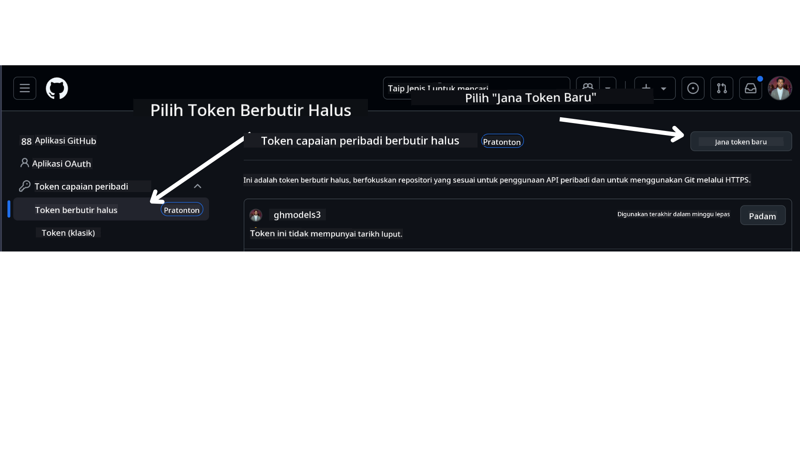

<!--
CO_OP_TRANSLATOR_METADATA:
{
  "original_hash": "76945069b52a49cd0432ae3e0b0ba22e",
  "translation_date": "2025-07-12T07:54:26+00:00",
  "source_file": "00-course-setup/README.md",
  "language_code": "ms"
}
-->
dalam Akaun GitHub anda.

Pilih pilihan `Fine-grained tokens` di sebelah kiri skrin anda.

Kemudian pilih `Generate new token`.



Anda akan diminta untuk memasukkan nama untuk token anda, pilih tarikh luput (Disyorkan: 30 Hari), dan pilih skop untuk token anda (Repositori Awam).

Anda juga perlu mengedit kebenaran token ini: Permissions -> Models -> Membenarkan akses ke GitHub Models

Salin token baru yang baru anda cipta. Anda kini akan menambahkannya ke dalam fail `.env` yang disertakan dalam kursus ini. 


### Langkah 2: Cipta Fail `.env` Anda

Untuk mencipta fail `.env` anda, jalankan arahan berikut dalam terminal anda.

```bash
cp .env.example .env
```

Ini akan menyalin fail contoh dan mencipta fail `.env` dalam direktori anda di mana anda mengisi nilai untuk pembolehubah persekitaran.

Dengan token anda yang telah disalin, buka fail `.env` dalam penyunting teks kegemaran anda dan tampal token anda ke dalam medan `GITHUB_TOKEN`.

Anda kini sepatutnya boleh menjalankan contoh kod dalam kursus ini.

## Persediaan untuk Contoh menggunakan Azure AI Foundry dan Azure AI Agent Service

### Langkah 1: Dapatkan Endpoint Projek Azure Anda

Ikuti langkah-langkah untuk mencipta hub dan projek dalam Azure AI Foundry yang boleh didapati di sini: [Hub resources overview](https://learn.microsoft.com/en-us/azure/ai-foundry/concepts/ai-resources)

Setelah anda mencipta projek anda, anda perlu mendapatkan string sambungan untuk projek anda.

Ini boleh dilakukan dengan pergi ke halaman **Overview** projek anda dalam portal Azure AI Foundry.


### Langkah 2: Cipta Fail `.env` Anda

Untuk mencipta fail `.env` anda, jalankan arahan berikut dalam terminal anda.

```bash
cp .env.example .env
```

Ini akan menyalin fail contoh dan mencipta fail `.env` dalam direktori anda di mana anda mengisi nilai untuk pembolehubah persekitaran.

Dengan token anda yang telah disalin, buka fail `.env` dalam penyunting teks kegemaran anda dan tampal token anda ke dalam medan `PROJECT_ENDPOINT`.

### Langkah 3: Log Masuk ke Azure

Sebagai amalan keselamatan terbaik, kita akan menggunakan [pengesahan tanpa kunci](https://learn.microsoft.com/azure/developer/ai/keyless-connections?tabs=csharp%2Cazure-cli?WT.mc_id=academic-105485-koreyst) untuk mengesahkan ke Azure OpenAI dengan Microsoft Entra ID. Sebelum anda boleh melakukannya, anda perlu memasang **Azure CLI** mengikut [arahan pemasangan](https://learn.microsoft.com/cli/azure/install-azure-cli?WT.mc_id=academic-105485-koreyst) untuk sistem operasi anda.

Seterusnya, buka terminal dan jalankan `az login --use-device-code` untuk log masuk ke akaun Azure anda.

Setelah anda log masuk, pilih langganan anda dalam terminal.


## Pembolehubah Persekitaran Tambahan - Azure Search dan Azure OpenAI 

Untuk Pelajaran Agentic RAG - Pelajaran 5 - terdapat contoh yang menggunakan Azure Search dan Azure OpenAI.

Jika anda ingin menjalankan contoh ini, anda perlu menambah pembolehubah persekitaran berikut ke dalam fail `.env` anda:

### Halaman Overview (Projek)

- `AZURE_SUBSCRIPTION_ID` - Semak **Project details** pada halaman **Overview** projek anda.

- `AZURE_AI_PROJECT_NAME` - Lihat di bahagian atas halaman **Overview** projek anda.

- `AZURE_OPENAI_SERVICE` - Cari ini dalam tab **Included capabilities** untuk **Azure OpenAI Service** pada halaman **Overview**.

### Pusat Pengurusan

- `AZURE_OPENAI_RESOURCE_GROUP` - Pergi ke **Project properties** pada halaman **Overview** di **Management Center**.

- `GLOBAL_LLM_SERVICE` - Di bawah **Connected resources**, cari nama sambungan **Azure AI Services**. Jika tidak disenaraikan, semak **Azure portal** di bawah kumpulan sumber anda untuk nama sumber AI Services.

### Halaman Models + Endpoints

- `AZURE_OPENAI_EMBEDDING_DEPLOYMENT_NAME` - Pilih model embedding anda (contoh: `text-embedding-ada-002`) dan catat **Deployment name** dari butiran model.

- `AZURE_OPENAI_CHAT_DEPLOYMENT_NAME` - Pilih model chat anda (contoh: `gpt-4o-mini`) dan catat **Deployment name** dari butiran model.

### Portal Azure

- `AZURE_OPENAI_ENDPOINT` - Cari **Azure AI services**, klik padanya, kemudian pergi ke **Resource Management**, **Keys and Endpoint**, tatal ke bawah ke "Azure OpenAI endpoints", dan salin yang bertulis "Language APIs".

- `AZURE_OPENAI_API_KEY` - Dari skrin yang sama, salin KEY 1 atau KEY 2.

- `AZURE_SEARCH_SERVICE_ENDPOINT` - Cari sumber **Azure AI Search** anda, klik padanya, dan lihat **Overview**.

- `AZURE_SEARCH_API_KEY` - Kemudian pergi ke **Settings** dan kemudian **Keys** untuk menyalin kunci pentadbir utama atau sekunder.

### Laman Web Luaran

- `AZURE_OPENAI_API_VERSION` - Lawati halaman [API version lifecycle](https://learn.microsoft.com/en-us/azure/ai-services/openai/api-version-deprecation#latest-ga-api-release) di bawah **Latest GA API release**.

### Sediakan pengesahan tanpa kunci

Daripada menulis secara keras kelayakan anda, kita akan menggunakan sambungan tanpa kunci dengan Azure OpenAI. Untuk melakukannya, kita akan mengimport `DefaultAzureCredential` dan kemudian memanggil fungsi `DefaultAzureCredential` untuk mendapatkan kelayakan.

```python
from azure.identity import DefaultAzureCredential, InteractiveBrowserCredential
```

## Tersangkut Di Mana-Mana?

Jika anda menghadapi sebarang masalah menjalankan persediaan ini, sertai kami di

atau

.

## Pelajaran Seterusnya

Anda kini bersedia untuk menjalankan kod untuk kursus ini. Selamat belajar lebih lanjut tentang dunia AI Agents!

[Introduction to AI Agents and Agent Use Cases](../01-intro-to-ai-agents/README.md)

**Penafian**:  
Dokumen ini telah diterjemahkan menggunakan perkhidmatan terjemahan AI [Co-op Translator](https://github.com/Azure/co-op-translator). Walaupun kami berusaha untuk ketepatan, sila ambil maklum bahawa terjemahan automatik mungkin mengandungi kesilapan atau ketidaktepatan. Dokumen asal dalam bahasa asalnya harus dianggap sebagai sumber yang sahih. Untuk maklumat penting, terjemahan profesional oleh manusia adalah disyorkan. Kami tidak bertanggungjawab atas sebarang salah faham atau salah tafsir yang timbul daripada penggunaan terjemahan ini.