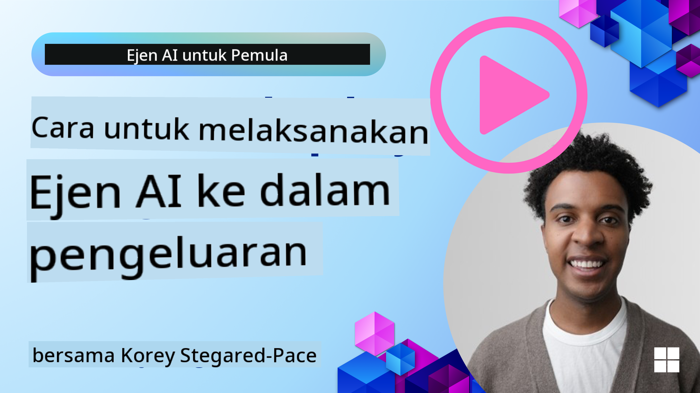

<!--
CO_OP_TRANSLATOR_METADATA:
{
  "original_hash": "1ad5de6a6388d02c145a92dd04358bab",
  "translation_date": "2025-07-12T13:40:47+00:00",
  "source_file": "10-ai-agents-production/README.md",
  "language_code": "ms"
}
-->

> _(Klik gambar di atas untuk menonton video pelajaran ini)_
# AI Agents dalam Pengeluaran

## Pengenalan

Pelajaran ini akan merangkumi:

- Cara merancang penyebaran AI Agent anda ke pengeluaran dengan berkesan.
- Kesilapan dan masalah biasa yang mungkin anda hadapi semasa menyebarkan AI Agent ke pengeluaran.
- Cara menguruskan kos sambil mengekalkan prestasi AI Agent anda.

## Matlamat Pembelajaran

Selepas menamatkan pelajaran ini, anda akan tahu cara/berfaham tentang:

- Teknik untuk meningkatkan prestasi, kos, dan keberkesanan sistem AI Agent dalam pengeluaran.
- Apa dan bagaimana untuk menilai AI Agents anda.
- Cara mengawal kos semasa menyebarkan AI Agents ke pengeluaran.

Adalah penting untuk menyebarkan AI Agents yang boleh dipercayai. Lihat juga pelajaran "Building Trustworthy AI Agents".

## Menilai AI Agents

Sebelum, semasa, dan selepas menyebarkan AI Agents, mempunyai sistem yang betul untuk menilai AI Agents anda adalah kritikal. Ini akan memastikan sistem anda selaras dengan matlamat anda dan pengguna anda.

Untuk menilai AI Agent, penting untuk dapat menilai bukan sahaja output agen tetapi juga keseluruhan sistem di mana AI Agent anda beroperasi. Ini termasuk tetapi tidak terhad kepada:

- Permintaan model awal.
- Keupayaan agen untuk mengenal pasti niat pengguna.
- Keupayaan agen untuk mengenal pasti alat yang betul untuk melaksanakan tugas.
- Respons alat terhadap permintaan agen.
- Keupayaan agen untuk mentafsir respons alat.
- Maklum balas pengguna terhadap respons agen.

Ini membolehkan anda mengenal pasti kawasan yang perlu diperbaiki dengan cara yang lebih modular. Anda kemudian boleh memantau kesan perubahan pada model, arahan, alat, dan komponen lain dengan lebih cekap.

## Masalah Biasa dan Penyelesaian Potensi dengan AI Agents

| **Masalah**                                    | **Penyelesaian Potensi**                                                                                                                                                                                                   |
| ---------------------------------------------- | -------------------------------------------------------------------------------------------------------------------------------------------------------------------------------------------------------------------------- |
| AI Agent tidak melaksanakan tugas dengan konsisten | - Perhalusi arahan yang diberikan kepada AI Agent; pastikan objektif jelas. - Kenal pasti di mana membahagikan tugas kepada subtugas dan mengendalikannya oleh beberapa agen boleh membantu.                              |
| AI Agent terperangkap dalam gelung berterusan  | - Pastikan anda mempunyai terma dan syarat penamatan yang jelas supaya Agen tahu bila untuk menghentikan proses. - Untuk tugas kompleks yang memerlukan penalaran dan perancangan, gunakan model yang lebih besar yang khusus untuk tugas penalaran. |
| Panggilan alat AI Agent tidak berfungsi dengan baik | - Uji dan sahkan output alat di luar sistem agen. - Perhalusi parameter, arahan, dan penamaan alat yang ditetapkan.                                                                                                      |
| Sistem Multi-Agent tidak berfungsi dengan konsisten | - Perhalusi arahan yang diberikan kepada setiap agen supaya ia spesifik dan berbeza antara satu sama lain. - Bina sistem hierarki menggunakan agen "routing" atau pengawal untuk menentukan agen yang betul.              |

## Menguruskan Kos

Berikut adalah beberapa strategi untuk menguruskan kos penyebaran AI Agents ke pengeluaran:

- **Caching Responses** - Mengenal pasti permintaan dan tugas yang biasa serta menyediakan respons sebelum ia melalui sistem agen anda adalah cara yang baik untuk mengurangkan jumlah permintaan yang serupa. Anda juga boleh melaksanakan aliran untuk mengenal pasti sejauh mana permintaan serupa dengan permintaan yang telah disimpan menggunakan model AI yang lebih asas.

- **Menggunakan Model Lebih Kecil** - Small Language Models (SLMs) boleh berfungsi dengan baik untuk beberapa kes penggunaan agen dan akan mengurangkan kos dengan ketara. Seperti yang disebutkan sebelum ini, membina sistem penilaian untuk menentukan dan membandingkan prestasi berbanding model yang lebih besar adalah cara terbaik untuk memahami sejauh mana SLM akan berfungsi dalam kes penggunaan anda.

- **Menggunakan Model Router** - Strategi serupa adalah menggunakan pelbagai model dan saiz. Anda boleh menggunakan LLM/SLM atau fungsi tanpa pelayan untuk mengarahkan permintaan berdasarkan kerumitan kepada model yang paling sesuai. Ini juga akan membantu mengurangkan kos sambil memastikan prestasi pada tugas yang betul.

## Tahniah

Ini adalah pelajaran terakhir untuk "AI Agents for Beginners" buat masa ini.

Kami merancang untuk terus menambah pelajaran berdasarkan maklum balas dan perubahan dalam industri yang sentiasa berkembang ini, jadi singgah lagi dalam masa terdekat.

Jika anda ingin meneruskan pembelajaran dan membina dengan AI Agents, sertai <a href="https://discord.gg/kzRShWzttr" target="_blank">Azure AI Community Discord</a>.

Kami menganjurkan bengkel, meja bulat komuniti dan sesi "tanya saya apa saja" di sana.

Kami juga mempunyai koleksi Learn bahan tambahan yang boleh membantu anda mula membina AI Agents dalam pengeluaran.

## Pelajaran Sebelumnya

[Metacognition Design Pattern](../09-metacognition/README.md)

**Penafian**:  
Dokumen ini telah diterjemahkan menggunakan perkhidmatan terjemahan AI [Co-op Translator](https://github.com/Azure/co-op-translator). Walaupun kami berusaha untuk ketepatan, sila ambil maklum bahawa terjemahan automatik mungkin mengandungi kesilapan atau ketidaktepatan. Dokumen asal dalam bahasa asalnya harus dianggap sebagai sumber yang sahih. Untuk maklumat penting, terjemahan profesional oleh manusia adalah disyorkan. Kami tidak bertanggungjawab atas sebarang salah faham atau salah tafsir yang timbul daripada penggunaan terjemahan ini.