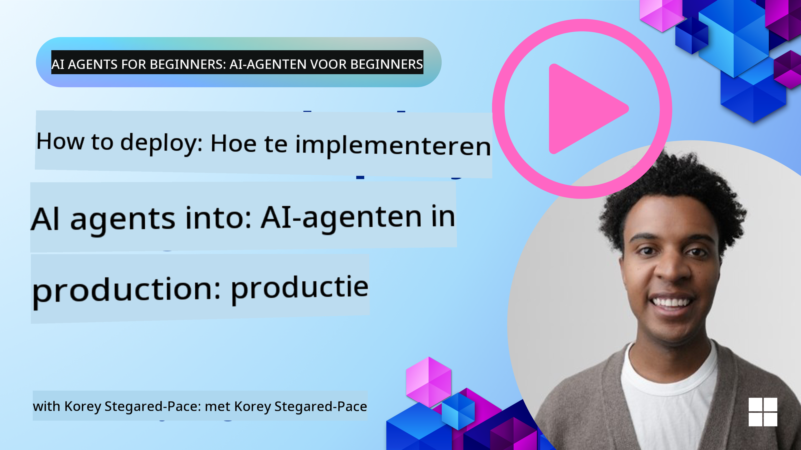

<!--
CO_OP_TRANSLATOR_METADATA:
{
  "original_hash": "1ad5de6a6388d02c145a92dd04358bab",
  "translation_date": "2025-07-12T13:40:05+00:00",
  "source_file": "10-ai-agents-production/README.md",
  "language_code": "nl"
}
-->

> _(Klik op de afbeelding hierboven om de video van deze les te bekijken)_
# AI Agents in Productie

## Introductie

In deze les behandelen we:

- Hoe je de uitrol van je AI Agent naar productie effectief plant.
- Veelvoorkomende fouten en problemen die je kunt tegenkomen bij het uitrollen van je AI Agent naar productie.
- Hoe je kosten beheert terwijl je toch de prestaties van je AI Agent behoudt.

## Leerdoelen

Na het voltooien van deze les weet je/begrijp je:

- Technieken om de prestaties, kosten en effectiviteit van een AI Agent-systeem in productie te verbeteren.
- Wat en hoe je je AI Agents kunt evalueren.
- Hoe je kosten onder controle houdt bij het uitrollen van AI Agents naar productie.

Het is belangrijk om AI Agents te implementeren die betrouwbaar zijn. Bekijk ook de les "Building Trustworthy AI Agents".

## AI Agents Evalueren

Voor, tijdens en na het uitrollen van AI Agents is het essentieel om een goed systeem te hebben om je AI Agents te evalueren. Dit zorgt ervoor dat je systeem aansluit bij jouw en de doelen van je gebruikers.

Om een AI Agent te evalueren, is het belangrijk om niet alleen de output van de agent te beoordelen, maar ook het hele systeem waarin je AI Agent opereert. Dit omvat onder andere:

- Het initiële modelverzoek.
- Het vermogen van de agent om de intentie van de gebruiker te herkennen.
- Het vermogen van de agent om het juiste hulpmiddel te kiezen om de taak uit te voeren.
- De reactie van het hulpmiddel op het verzoek van de agent.
- Het vermogen van de agent om de reactie van het hulpmiddel te interpreteren.
- De feedback van de gebruiker op de reactie van de agent.

Dit stelt je in staat om verbeterpunten op een meer modulaire manier te identificeren. Je kunt vervolgens de effecten van wijzigingen in modellen, prompts, tools en andere componenten efficiënter monitoren.

## Veelvoorkomende Problemen en Mogelijke Oplossingen met AI Agents

| **Probleem**                                   | **Mogelijke Oplossing**                                                                                                                                                                                                    |
| ---------------------------------------------- | -------------------------------------------------------------------------------------------------------------------------------------------------------------------------------------------------------------------------- |
| AI Agent voert taken niet consistent uit       | - Verfijn de prompt die aan de AI Agent wordt gegeven; wees duidelijk over de doelstellingen. - Bepaal waar het opdelen van taken in subtaken en het laten uitvoeren door meerdere agents kan helpen.                     |
| AI Agent raakt verstrikt in oneindige lussen   | - Zorg voor duidelijke stopvoorwaarden zodat de Agent weet wanneer het proces moet stoppen. - Voor complexe taken die redeneervermogen en planning vereisen, gebruik een groter model dat gespecialiseerd is in redeneren. |
| AI Agent tool-aanroepen presteren slecht       | - Test en valideer de output van het hulpmiddel buiten het agent-systeem. - Verfijn de gedefinieerde parameters, prompts en naamgeving van tools.                                                                        |
| Multi-Agent systeem presteert inconsistent      | - Verfijn de prompts voor elke agent zodat ze specifiek en onderscheidend zijn. - Bouw een hiërarchisch systeem met een "routing" of controller agent die bepaalt welke agent geschikt is.                                |

## Kosten Beheren

Hier zijn enkele strategieën om de kosten van het uitrollen van AI Agents naar productie te beheersen:

- **Caching van Reacties** - Het identificeren van veelvoorkomende verzoeken en taken en het vooraf leveren van de reacties voordat ze door je agent-systeem gaan, is een goede manier om het aantal vergelijkbare verzoeken te verminderen. Je kunt zelfs een flow implementeren om te bepalen hoe vergelijkbaar een verzoek is met je gecachte verzoeken met behulp van eenvoudigere AI-modellen.

- **Gebruik van Kleinere Modellen** - Kleine taalmodellen (SLM's) kunnen goed presteren bij bepaalde agent-gevallen en verlagen de kosten aanzienlijk. Zoals eerder genoemd, is het opzetten van een evaluatiesysteem om prestaties te bepalen en te vergelijken met grotere modellen de beste manier om te begrijpen hoe goed een SLM presteert voor jouw toepassing.

- **Gebruik van een Router Model** - Een vergelijkbare strategie is het gebruik van een diversiteit aan modellen en groottes. Je kunt een LLM/SLM of serverless functie gebruiken om verzoeken op basis van complexiteit te routeren naar de best passende modellen. Dit helpt ook om kosten te verlagen en tegelijkertijd prestaties op de juiste taken te waarborgen.

## Gefeliciteerd

Dit is momenteel de laatste les van "AI Agents for Beginners".

We zijn van plan om op basis van feedback en ontwikkelingen in deze snelgroeiende sector nieuwe lessen toe te voegen, dus kom binnenkort zeker nog eens terug.

Als je je wilt blijven ontwikkelen en bouwen met AI Agents, sluit je dan aan bij de <a href="https://discord.gg/kzRShWzttr" target="_blank">Azure AI Community Discord</a>.

We organiseren daar workshops, community roundtables en "ask me anything" sessies.

We hebben ook een Learn-collectie met extra materialen die je kunnen helpen om AI Agents in productie te bouwen.

## Vorige Les

[Metacognition Design Pattern](../09-metacognition/README.md)

**Disclaimer**:  
Dit document is vertaald met behulp van de AI-vertalingsdienst [Co-op Translator](https://github.com/Azure/co-op-translator). Hoewel we streven naar nauwkeurigheid, dient u er rekening mee te houden dat geautomatiseerde vertalingen fouten of onnauwkeurigheden kunnen bevatten. Het originele document in de oorspronkelijke taal moet als de gezaghebbende bron worden beschouwd. Voor cruciale informatie wordt professionele menselijke vertaling aanbevolen. Wij zijn niet aansprakelijk voor eventuele misverstanden of verkeerde interpretaties die voortvloeien uit het gebruik van deze vertaling.