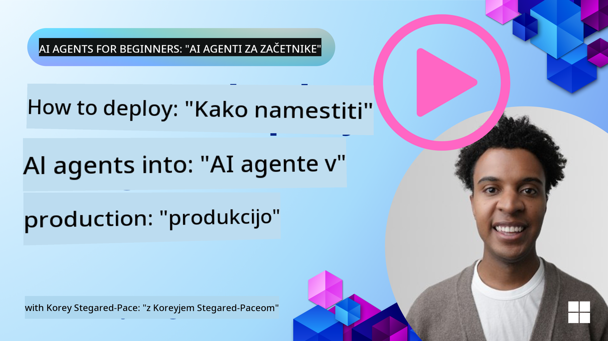

<!--
CO_OP_TRANSLATOR_METADATA:
{
  "original_hash": "1ad5de6a6388d02c145a92dd04358bab",
  "translation_date": "2025-07-12T13:42:56+00:00",
  "source_file": "10-ai-agents-production/README.md",
  "language_code": "sl"
}
-->

> _(Kliknite na zgornjo sliko za ogled videa te lekcije)_
# AI agenti v produkciji

## Uvod

V tej lekciji bomo obravnavali:

- Kako učinkovito načrtovati uvajanje vašega AI agenta v produkcijo.
- Pogoste napake in težave, s katerimi se lahko srečate pri uvajanju AI agenta v produkcijo.
- Kako upravljati stroške, hkrati pa ohranjati zmogljivost vašega AI agenta.

## Cilji učenja

Po zaključku te lekcije boste znali/razumeli:

- Tehnike za izboljšanje zmogljivosti, stroškov in učinkovitosti sistema AI agenta v produkciji.
- Kaj in kako ocenjevati vaše AI agente.
- Kako nadzorovati stroške pri uvajanju AI agentov v produkcijo.

Pomembno je, da uvajate AI agente, ki so zaupanja vredni. Oglejte si tudi lekcijo "Building Trustworthy AI Agents".

## Ocena AI agentov

Pred, med in po uvajanju AI agentov je ključnega pomena imeti ustrezen sistem za ocenjevanje vaših AI agentov. To zagotavlja, da je vaš sistem usklajen z vašimi in cilji uporabnikov.

Za ocenjevanje AI agenta je pomembno, da lahko ocenite ne le izhod agenta, temveč celoten sistem, v katerem vaš AI agent deluje. To vključuje, a ni omejeno na:

- Začetni zahtevek modelu.
- Sposobnost agenta, da prepozna namen uporabnika.
- Sposobnost agenta, da izbere pravi pripomoček za izvedbo naloge.
- Odziv pripomočka na zahtevo agenta.
- Sposobnost agenta, da interpretira odziv pripomočka.
- Povratne informacije uporabnika na odziv agenta.

To vam omogoča, da na modularen način prepoznate področja za izboljšave. Nato lahko z večjo učinkovitostjo spremljate učinek sprememb modelov, pozivov, orodij in drugih komponent.

## Pogoste težave in možne rešitve pri AI agentih

| **Težava**                                     | **Možna rešitev**                                                                                                                                                                                                          |
| ---------------------------------------------- | -------------------------------------------------------------------------------------------------------------------------------------------------------------------------------------------------------------------------- |
| AI agent ne opravlja nalog dosledno             | - Izboljšajte poziv, ki ga dajete AI agentu; bodite jasni glede ciljev. - Ugotovite, kje lahko razdelitev nalog na podnaloge in njihovo izvajanje z več agenti pomaga.                                                    |
| AI agent se zatakne v neskončne zanke           | - Poskrbite za jasne pogoje za prekinitev, da agent ve, kdaj naj ustavi postopek. - Za zahtevnejše naloge, ki zahtevajo razmišljanje in načrtovanje, uporabite večji model, specializiran za takšne naloge.               |
| Klici orodij AI agenta ne delujejo dobro        | - Preizkusite in preverite izhod orodja zunaj sistema agenta. - Izboljšajte definirane parametre, pozive in poimenovanje orodij.                                                                                        |
| Sistem z več agenti ne deluje dosledno          | - Izboljšajte pozive, ki jih dajete posameznim agentom, da bodo specifični in med seboj različni. - Zgradite hierarhični sistem z "usmerjevalnim" ali kontrolnim agentom, ki določi, kateri agent je pravi.             |

## Upravljanje stroškov

Tukaj je nekaj strategij za upravljanje stroškov uvajanja AI agentov v produkcijo:

- **Predpomnjenje odgovorov** – Prepoznavanje pogostih zahtev in nalog ter zagotavljanje odgovorov, preden gredo skozi vaš agentski sistem, je dober način za zmanjšanje števila podobnih zahtev. Lahko celo uvedete tok, ki oceni, kako podobna je zahteva vašim predpomnjenim zahtevam, z uporabo osnovnejših AI modelov.

- **Uporaba manjših modelov** – Majhni jezikovni modeli (SLM) lahko dobro delujejo pri določenih agentskih primerih uporabe in znatno znižajo stroške. Kot je bilo omenjeno prej, je najboljši način za razumevanje, kako dobro bo SLM deloval za vaš primer, gradnja sistema za ocenjevanje in primerjavo zmogljivosti z večjimi modeli.

- **Uporaba usmerjevalnega modela** – Podobna strategija je uporaba različnih modelov in velikosti. Lahko uporabite LLM/SLM ali brezstrežniško funkcijo za usmerjanje zahtev glede na kompleksnost do najbolj ustreznih modelov. To prav tako pomaga znižati stroške in hkrati zagotavlja zmogljivost pri pravih nalogah.

## Čestitke

To je trenutno zadnja lekcija "AI Agents for Beginners".

Načrtujemo nadaljnje dodajanje lekcij glede na povratne informacije in spremembe v tej hitro rastoči panogi, zato se kmalu spet oglasite.

Če želite nadaljevati z učenjem in gradnjo z AI agenti, se pridružite <a href="https://discord.gg/kzRShWzttr" target="_blank">Azure AI Community Discord</a>.

Tam organiziramo delavnice, okrogle mize skupnosti in seje "vprašaj me karkoli".

Imamo tudi zbirko Learn z dodatnimi materiali, ki vam lahko pomagajo začeti graditi AI agente v produkciji.

## Prejšnja lekcija

[Metacognition Design Pattern](../09-metacognition/README.md)

**Omejitev odgovornosti**:  
Ta dokument je bil preveden z uporabo AI prevajalske storitve [Co-op Translator](https://github.com/Azure/co-op-translator). Čeprav si prizadevamo za natančnost, vas opozarjamo, da avtomatizirani prevodi lahko vsebujejo napake ali netočnosti. Izvirni dokument v njegovem izvirnem jeziku velja za avtoritativni vir. Za ključne informacije priporočamo strokovni človeški prevod. Za morebitna nesporazume ali napačne interpretacije, ki izhajajo iz uporabe tega prevoda, ne odgovarjamo.