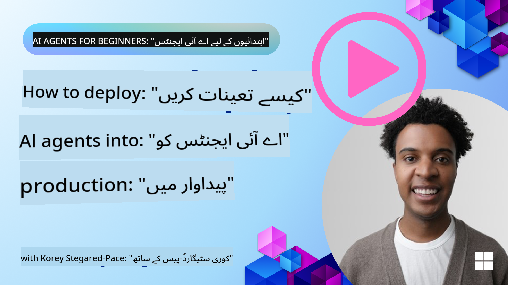

<!--
CO_OP_TRANSLATOR_METADATA:
{
  "original_hash": "1ad5de6a6388d02c145a92dd04358bab",
  "translation_date": "2025-07-12T13:35:26+00:00",
  "source_file": "10-ai-agents-production/README.md",
  "language_code": "ur"
}
-->

> _(اس سبق کی ویڈیو دیکھنے کے لیے اوپر تصویر پر کلک کریں)_
# AI Agents in Production

## تعارف

اس سبق میں درج ذیل موضوعات شامل ہوں گے:

- اپنے AI Agent کو مؤثر طریقے سے پروڈکشن میں تعینات کرنے کی منصوبہ بندی کیسے کریں۔
- عام غلطیاں اور مسائل جو آپ کو AI Agent کو پروڈکشن میں تعینات کرتے وقت پیش آ سکتے ہیں۔
- اپنے AI Agent کی کارکردگی برقرار رکھتے ہوئے اخراجات کو کیسے کنٹرول کریں۔

## سیکھنے کے مقاصد

اس سبق کو مکمل کرنے کے بعد، آپ جانیں گے/سمجھیں گے:

- پروڈکشن AI Agent سسٹم کی کارکردگی، اخراجات، اور مؤثریت کو بہتر بنانے کی تکنیکیں۔
- اپنے AI Agents کا جائزہ کیسے اور کیا لینا ہے۔
- AI Agents کو پروڈکشن میں تعینات کرتے وقت اخراجات کو کیسے کنٹرول کیا جائے۔

یہ ضروری ہے کہ AI Agents قابل اعتماد ہوں۔ "Building Trustworthy AI Agents" سبق بھی دیکھیں۔

## AI Agents کا جائزہ لینا

AI Agents کو تعینات کرنے سے پہلے، دوران، اور بعد میں، ایک مناسب نظام کے ذریعے اپنے AI Agents کا جائزہ لینا بہت اہم ہے۔ اس سے یہ یقینی بنتا ہے کہ آپ کا سسٹم آپ اور آپ کے صارفین کے مقاصد کے مطابق ہے۔

AI Agent کا جائزہ لینے کے لیے ضروری ہے کہ نہ صرف ایجنٹ کے نتائج بلکہ پورے سسٹم کا بھی جائزہ لیا جائے جس میں آپ کا AI Agent کام کر رہا ہے۔ اس میں شامل ہیں لیکن محدود نہیں:

- ابتدائی ماڈل کی درخواست۔
- صارف کی نیت کو پہچاننے کی ایجنٹ کی صلاحیت۔
- کام انجام دینے کے لیے صحیح ٹول کی شناخت کرنے کی ایجنٹ کی صلاحیت۔
- ٹول کا ایجنٹ کی درخواست پر ردعمل۔
- ٹول کے ردعمل کی تشریح کرنے کی ایجنٹ کی صلاحیت۔
- صارف کی ایجنٹ کے ردعمل پر رائے۔

اس سے آپ کو بہتری کے لیے مختلف حصوں کی نشاندہی کرنے میں مدد ملتی ہے۔ پھر آپ ماڈلز، پرامپٹس، ٹولز، اور دیگر اجزاء میں تبدیلیوں کے اثرات کو بہتر طریقے سے مانیٹر کر سکتے ہیں۔

## AI Agents کے عام مسائل اور ممکنہ حل

| **مسئلہ**                                      | **ممکنہ حل**                                                                                                                                                                                                             |
| ---------------------------------------------- | -------------------------------------------------------------------------------------------------------------------------------------------------------------------------------------------------------------------------- |
| AI Agent کام مستقل طور پر انجام نہیں دے رہا | - AI Agent کو دیے گئے پرامپٹ کو بہتر بنائیں؛ مقاصد واضح کریں۔ - کاموں کو ذیلی کاموں میں تقسیم کر کے مختلف ایجنٹس کے ذریعے سنبھالنے کی جگہ تلاش کریں۔                                                                |
| AI Agent مسلسل لوپ میں پھنس رہا ہے            | - واضح اختتامی شرائط مقرر کریں تاکہ ایجنٹ جان سکے کہ کب عمل روکنا ہے۔ - پیچیدہ کاموں کے لیے جو سوچ و بچار اور منصوبہ بندی چاہتے ہیں، ایسے بڑے ماڈل استعمال کریں جو خاص طور پر ان کاموں کے لیے بنائے گئے ہوں۔          |
| AI Agent کے ٹول کالز صحیح کام نہیں کر رہے     | - ٹول کے نتائج کو ایجنٹ سسٹم سے باہر ٹیسٹ اور تصدیق کریں۔ - ٹولز کے متعین کردہ پیرامیٹرز، پرامپٹس، اور ناموں کو بہتر بنائیں۔                                                                                          |
| ملٹی ایجنٹ سسٹم مستقل کارکردگی نہیں دے رہا  | - ہر ایجنٹ کو دیے گئے پرامپٹس کو بہتر بنائیں تاکہ وہ مخصوص اور ایک دوسرے سے مختلف ہوں۔ - "روٹنگ" یا کنٹرولر ایجنٹ استعمال کر کے ایک درجہ بندی نظام بنائیں جو درست ایجنٹ کا تعین کرے۔                                  |

## اخراجات کا انتظام

AI Agents کو پروڈکشن میں تعینات کرنے کے اخراجات کو کنٹرول کرنے کے لیے کچھ حکمت عملیاں درج ذیل ہیں:

- **جوابات کی کیشنگ** - عام درخواستوں اور کاموں کی نشاندہی کر کے ان کے جوابات پہلے سے فراہم کرنا تاکہ وہ آپ کے ایجنٹک سسٹم سے گزرنے سے پہلے دستیاب ہوں، اس سے ملتی جلتی درخواستوں کی تعداد کم ہو جاتی ہے۔ آپ ایک ایسا فلو بھی بنا سکتے ہیں جو بنیادی AI ماڈلز استعمال کر کے یہ جانچے کہ کوئی درخواست آپ کے کیشڈ جوابات سے کتنی مماثلت رکھتی ہے۔

- **چھوٹے ماڈلز کا استعمال** - چھوٹے لینگویج ماڈلز (SLMs) مخصوص ایجنٹک استعمال کے معاملات میں اچھی کارکردگی دکھا سکتے ہیں اور اخراجات کو نمایاں طور پر کم کر دیتے ہیں۔ جیسا کہ پہلے ذکر کیا گیا، ایک جائزہ نظام بنانا جو کارکردگی کا موازنہ بڑے ماڈلز سے کرے، یہ سمجھنے کا بہترین طریقہ ہے کہ SLM آپ کے استعمال کے کیس میں کتنا مؤثر ہوگا۔

- **روٹر ماڈل کا استعمال** - ایک اور حکمت عملی مختلف ماڈلز اور سائزز کا استعمال ہے۔ آپ LLM/SLM یا سرورلیس فنکشن استعمال کر کے درخواستوں کو ان کی پیچیدگی کی بنیاد پر بہترین ماڈلز کی طرف روٹ کر سکتے ہیں۔ اس سے اخراجات کم ہوتے ہیں اور درست کاموں پر کارکردگی بھی یقینی بنتی ہے۔

## مبارکباد

یہ اس وقت "AI Agents for Beginners" کا آخری سبق ہے۔

ہم اس تیزی سے بڑھتی ہوئی صنعت میں تبدیلیوں اور فیڈبیک کی بنیاد پر مزید اسباق شامل کرنے کا ارادہ رکھتے ہیں، لہٰذا مستقبل میں دوبارہ تشریف لائیں۔

اگر آپ AI Agents کے ساتھ اپنی تعلیم اور تعمیر جاری رکھنا چاہتے ہیں، تو <a href="https://discord.gg/kzRShWzttr" target="_blank">Azure AI Community Discord</a> میں شامل ہوں۔

ہم وہاں ورکشاپس، کمیونٹی راؤنڈ ٹیبلز، اور "کچھ بھی پوچھیں" سیشنز منعقد کرتے ہیں۔

ہمارے پاس اضافی مواد کا ایک Learn مجموعہ بھی ہے جو آپ کو پروڈکشن میں AI Agents بنانے میں مدد دے سکتا ہے۔

## پچھلا سبق

[Metacognition Design Pattern](../09-metacognition/README.md)

**دستخطی نوٹ**:  
یہ دستاویز AI ترجمہ سروس [Co-op Translator](https://github.com/Azure/co-op-translator) کے ذریعے ترجمہ کی گئی ہے۔ اگرچہ ہم درستگی کے لیے کوشاں ہیں، براہ کرم آگاہ رہیں کہ خودکار ترجمے میں غلطیاں یا عدم درستیاں ہو سکتی ہیں۔ اصل دستاویز اپنی مادری زبان میں ہی معتبر ماخذ سمجھی جانی چاہیے۔ اہم معلومات کے لیے پیشہ ور انسانی ترجمہ کی سفارش کی جاتی ہے۔ اس ترجمے کے استعمال سے پیدا ہونے والی کسی بھی غلط فہمی یا غلط تشریح کی ذمہ داری ہم پر عائد نہیں ہوتی۔