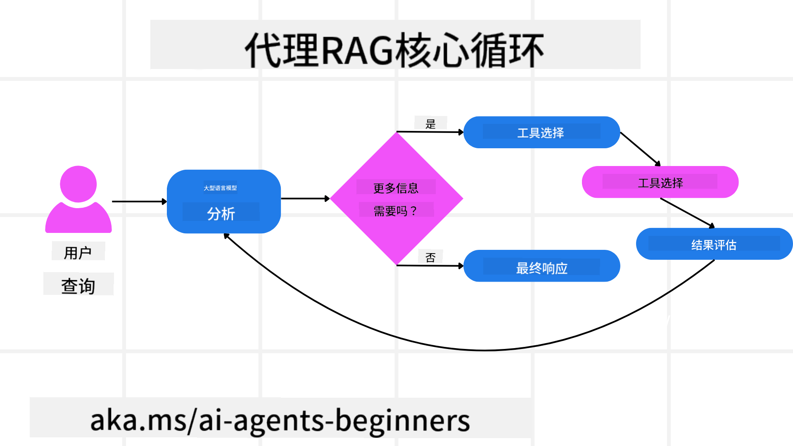
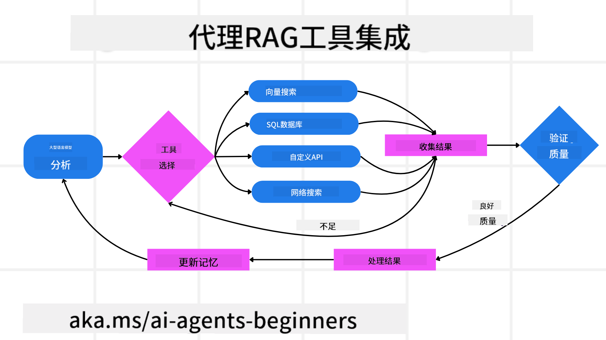
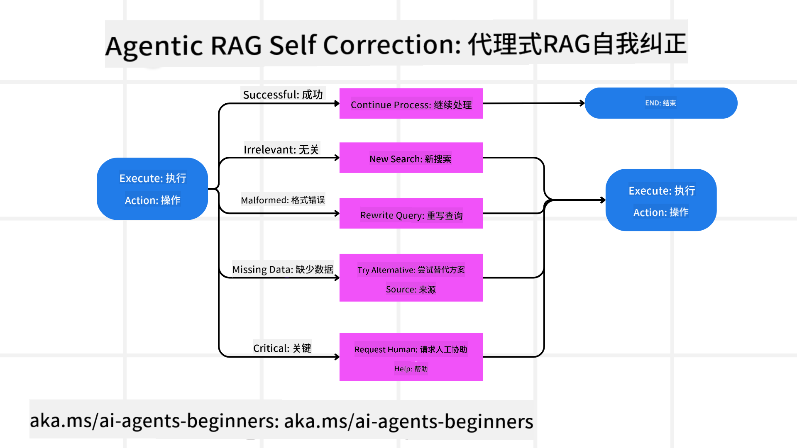
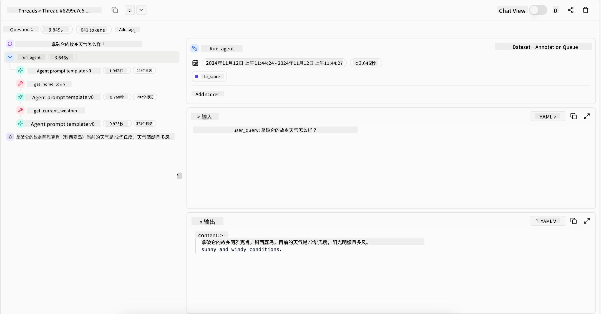
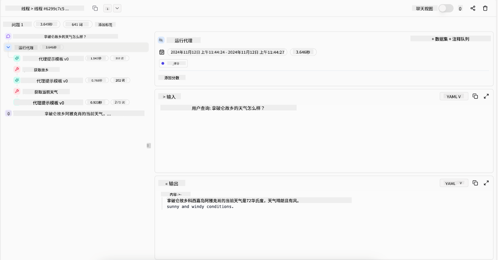

<!--
CO_OP_TRANSLATOR_METADATA:
{
  "original_hash": "7622aa72f9e676e593339f5f694ecd7d",
  "translation_date": "2025-07-12T09:52:56+00:00",
  "source_file": "05-agentic-rag/README.md",
  "language_code": "zh"
}
-->

> _(点击上方图片观看本课视频)_

# Agentic RAG

本课全面介绍了Agentic Retrieval-Augmented Generation（Agentic RAG），这是一种新兴的AI范式，大型语言模型（LLM）在从外部来源获取信息的同时，能够自主规划下一步行动。与静态的先检索后阅读模式不同，Agentic RAG涉及对LLM的迭代调用，穿插工具或函数调用以及结构化输出。系统会评估结果，优化查询，必要时调用额外工具，并持续循环，直到获得满意的解决方案。

## 介绍

本课内容包括：

- **理解Agentic RAG：** 了解这一新兴AI范式，大型语言模型（LLM）在从外部数据源获取信息的同时，能够自主规划下一步行动。
- **掌握迭代的制作者-审核者模式：** 理解对LLM的迭代调用循环，穿插工具或函数调用及结构化输出，旨在提升准确性并处理格式错误的查询。
- **探索实际应用场景：** 识别Agentic RAG的优势场景，如以准确性为先的环境、复杂数据库交互和延展工作流。

## 学习目标

完成本课后，您将能够/理解：

- **理解Agentic RAG：** 了解大型语言模型（LLM）在从外部数据源获取信息的同时，如何自主规划下一步行动。
- **迭代的制作者-审核者模式：** 掌握对LLM的迭代调用循环，穿插工具或函数调用及结构化输出，提升准确性并处理格式错误的查询。
- **掌控推理过程：** 理解系统如何自主掌控推理过程，决定如何解决问题，而非依赖预定义路径。
- **工作流：** 理解一个agentic模型如何独立决定检索市场趋势报告、识别竞争对手数据、关联内部销售指标、综合分析并评估策略。
- **迭代循环、工具集成与记忆：** 了解系统依赖循环交互模式，跨步骤维护状态和记忆，避免重复循环并做出更明智的决策。
- **处理失败模式与自我纠正：** 探索系统强大的自我纠正机制，包括迭代重查、使用诊断工具及依赖人工监督。
- **代理边界：** 理解Agentic RAG的局限性，聚焦于特定领域的自主性、基础设施依赖及对安全防护的遵守。
- **实际用例与价值：** 识别Agentic RAG的优势场景，如以准确性为先的环境、复杂数据库交互和延展工作流。
- **治理、透明度与信任：** 了解治理和透明度的重要性，包括可解释的推理、偏见控制和人工监督。

## 什么是Agentic RAG？

Agentic Retrieval-Augmented Generation（Agentic RAG）是一种新兴的AI范式，大型语言模型（LLM）在从外部来源获取信息的同时，能够自主规划下一步行动。与静态的先检索后阅读模式不同，Agentic RAG涉及对LLM的迭代调用，穿插工具或函数调用及结构化输出。系统会评估结果，优化查询，必要时调用额外工具，并持续循环，直到获得满意的解决方案。这种迭代的“制作者-审核者”模式提升了准确性，能处理格式错误的查询，确保高质量结果。

系统主动掌控推理过程，重写失败的查询，选择不同的检索方法，并整合多种工具——如Azure AI Search中的向量搜索、SQL数据库或自定义API——然后才给出最终答案。agentic系统的显著特点是其自主掌控推理过程的能力。传统的RAG实现依赖预定义路径，而agentic系统则根据所获得信息的质量自主决定步骤顺序。

## 定义Agentic Retrieval-Augmented Generation（Agentic RAG）

Agentic Retrieval-Augmented Generation（Agentic RAG）是AI开发中的一种新兴范式，LLM不仅从外部数据源获取信息，还能自主规划下一步行动。与静态的先检索后阅读模式或精心设计的提示序列不同，Agentic RAG涉及对LLM的迭代调用循环，穿插工具或函数调用及结构化输出。每一步，系统都会评估已获得的结果，决定是否优化查询，必要时调用额外工具，并持续循环，直到获得满意的解决方案。

这种迭代的“制作者-审核者”操作模式旨在提升准确性，处理格式错误的结构化数据库查询（如NL2SQL），并确保结果平衡且高质量。系统不再仅依赖精心设计的提示链，而是主动掌控推理过程。它可以重写失败的查询，选择不同的检索方法，并整合多种工具——如Azure AI Search中的向量搜索、SQL数据库或自定义API——然后才给出最终答案。这消除了对过于复杂的编排框架的需求。相反，一个相对简单的“LLM调用 → 工具使用 → LLM调用 → …”循环就能产生复杂且有据可依的输出。

## 掌控推理过程

使系统具备“agentic”特质的关键在于其自主掌控推理过程的能力。传统的RAG实现通常依赖人工预定义模型的路径：一条链式思考，指明何时检索什么内容。
但真正的agentic系统会内部决定如何解决问题。它不仅仅是执行脚本，而是根据所获得信息的质量自主确定步骤顺序。
例如，当被要求制定产品发布策略时，它不会仅依赖一个详细说明整个研究和决策流程的提示。相反，agentic模型会自主决定：

1. 使用Bing Web Grounding检索当前市场趋势报告
2. 利用Azure AI Search识别相关竞争对手数据
3. 通过Azure SQL Database关联历史内部销售指标
4. 通过Azure OpenAI Service将发现综合成连贯策略
5. 评估策略中的漏洞或不一致，必要时再次检索
所有这些步骤——优化查询、选择信息源、迭代直到“满意”答案——均由模型自主决定，而非人工预设。

## 迭代循环、工具集成与记忆

agentic系统依赖循环交互模式：

- **初始调用：** 用户目标（即用户提示）传递给LLM。
- **工具调用：** 如果模型发现信息缺失或指令模糊，它会选择工具或检索方法——如向量数据库查询（例如Azure AI Search对私有数据的混合搜索）或结构化SQL调用——以获取更多上下文。
- **评估与优化：** 审查返回数据后，模型决定信息是否充足。如不足，则优化查询，尝试不同工具或调整策略。
- **循环直至满意：** 该循环持续，直到模型认为已获得足够清晰和有力的证据，能给出最终合理回答。
- **记忆与状态：** 由于系统跨步骤维护状态和记忆，它能回忆之前的尝试及结果，避免重复循环，并在前进中做出更明智的决策。

随着时间推移，这种模式形成了逐步深化的理解，使模型能处理复杂多步骤任务，而无需人工持续干预或重塑提示。

## 处理失败模式与自我纠正

Agentic RAG的自主性还体现在强大的自我纠正机制。当系统遇到死胡同——如检索到无关文档或遇到格式错误的查询时，它可以：

- **迭代重查：** 不返回低价值回答，而是尝试新的搜索策略，重写数据库查询，或查看替代数据集。
- **使用诊断工具：** 系统可能调用额外函数，帮助调试推理步骤或确认检索数据的正确性。Azure AI Tracing等工具对实现强健的可观察性和监控至关重要。
- **依赖人工监督：** 对于高风险或反复失败的场景，模型可能标记不确定性并请求人工指导。人工提供纠正反馈后，模型能将其纳入后续学习。

这种迭代且动态的方法使模型持续改进，确保它不仅是一次性系统，而是在会话中从错误中学习。

## 代理边界

尽管在任务中具备自主性，Agentic RAG并不等同于通用人工智能。其“agentic”能力局限于人类开发者提供的工具、数据源和策略。它无法自行发明工具或超越既定领域边界。相反，它擅长动态协调现有资源。
与更高级AI形式的主要区别包括：

1. **领域特定自主性：** Agentic RAG系统专注于在已知领域内实现用户定义目标，采用查询重写或工具选择等策略提升结果。
2. **依赖基础设施：** 系统能力依赖开发者集成的工具和数据，无法无人工干预突破这些限制。
3. **遵守安全防护：** 伦理准则、合规规则和业务政策始终重要。agent的自由度受安全措施和监督机制约束（希望如此）。

## 实际用例与价值

Agentic RAG在需要迭代优化和精准度的场景中表现出色：

1. **以准确性为先的环境：** 在合规检查、法规分析或法律研究中，agentic模型可反复核实事实，咨询多方信息源，重写查询，直到产出彻底审查的答案。
2. **复杂数据库交互：** 处理结构化数据时，查询常失败或需调整，系统能自主优化查询，利用Azure SQL或Microsoft Fabric OneLake，确保最终检索符合用户意图。
3. **延展工作流：** 长时间运行的会话可能随着新信息出现而演变。Agentic RAG能持续整合新数据，随着对问题空间的深入了解调整策略。

## 治理、透明度与信任

随着系统推理自主性增强，治理和透明度变得尤为重要：

- **可解释的推理：** 模型能提供查询记录、所咨询来源及推理步骤的审计轨迹。Azure AI Content Safety和Azure AI Tracing / GenAIOps等工具有助于保持透明度并降低风险。
- **偏见控制与平衡检索：** 开发者可调整检索策略，确保考虑平衡且具代表性的数据源，定期审计输出，利用Azure Machine Learning为高级数据科学组织检测偏见或偏斜模式。
- **人工监督与合规：** 对敏感任务，人工审核依然必不可少。Agentic RAG不替代高风险决策中的人工判断，而是通过提供更彻底审查的选项来辅助。

拥有能清晰记录操作的工具至关重要。没有这些工具，调试多步骤流程将非常困难。以下是Literal AI（Chainlit背后的公司）提供的一个Agent运行示例：

## 结论

Agentic RAG代表了AI系统处理复杂数据密集型任务的自然演进。通过采用循环交互模式，自主选择工具，优化查询直至获得高质量结果，系统超越了静态提示执行，成为更具适应性和上下文感知的决策者。尽管仍受限于人类定义的基础设施和伦理准则，这些agentic能力使企业和终端用户能够获得更丰富、更动态且更实用的AI交互体验。

## 额外资源

- <a href="https://learn.microsoft.com/training/modules/use-own-data-azure-openai" target="_blank">使用Azure OpenAI Service实现检索增强生成（RAG）：学习如何使用自己的数据与Azure OpenAI Service。本Microsoft Learn模块提供了实现RAG的全面指南</a>
</a>
- <a href="https://learn.microsoft.com/azure/ai-studio/concepts/evaluation-approach-gen-ai" target="_blank">使用 Azure AI Foundry 评估生成式 AI 应用：本文介绍了在公开数据集上对模型进行评估和比较，包括 Agentic AI 应用和 RAG 架构</a>
- <a href="https://weaviate.io/blog/what-is-agentic-rag" target="_blank">什么是 Agentic RAG | Weaviate</a>
- <a href="https://ragaboutit.com/agentic-rag-a-complete-guide-to-agent-based-retrieval-augmented-generation/" target="_blank">Agentic RAG：基于代理的检索增强生成完整指南 – 来自 generation RAG 的新闻</a>
- <a href="https://huggingface.co/learn/cookbook/agent_rag" target="_blank">Agentic RAG：通过查询重构和自查询为你的 RAG 加速！Hugging Face 开源 AI 食谱</a>
- <a href="https://youtu.be/aQ4yQXeB1Ss?si=2HUqBzHoeB5tR04U" target="_blank">为 RAG 添加 Agentic 层</a>
- <a href="https://www.youtube.com/watch?v=zeAyuLc_f3Q&t=244s" target="_blank">知识助手的未来：Jerry Liu</a>
- <a href="https://www.youtube.com/watch?v=AOSjiXP1jmQ" target="_blank">如何构建 Agentic RAG 系统</a>
- <a href="https://ignite.microsoft.com/sessions/BRK102?source=sessions" target="_blank">使用 Azure AI Foundry Agent 服务扩展你的 AI 代理</a>

### 学术论文

- <a href="https://arxiv.org/abs/2303.17651" target="_blank">2303.17651 Self-Refine：基于自我反馈的迭代优化</a>
- <a href="https://arxiv.org/abs/2303.11366" target="_blank">2303.11366 Reflexion：具备语言强化学习的语言代理</a>
- <a href="https://arxiv.org/abs/2305.11738" target="_blank">2305.11738 CRITIC：大型语言模型通过工具交互式批评实现自我纠正</a>
- <a href="https://arxiv.org/abs/2501.09136" target="_blank">2501.09136 Agentic 检索增强生成：Agentic RAG 调查综述</a>

## 上一课

[工具使用设计模式](../04-tool-use/README.md)

## 下一课

[构建可信赖的 AI 代理](../06-building-trustworthy-agents/README.md)

**免责声明**：  
本文件使用 AI 翻译服务 [Co-op Translator](https://github.com/Azure/co-op-translator) 进行翻译。虽然我们力求准确，但请注意，自动翻译可能包含错误或不准确之处。原始文件的母语版本应被视为权威来源。对于重要信息，建议使用专业人工翻译。对于因使用本翻译而产生的任何误解或误释，我们不承担任何责任。