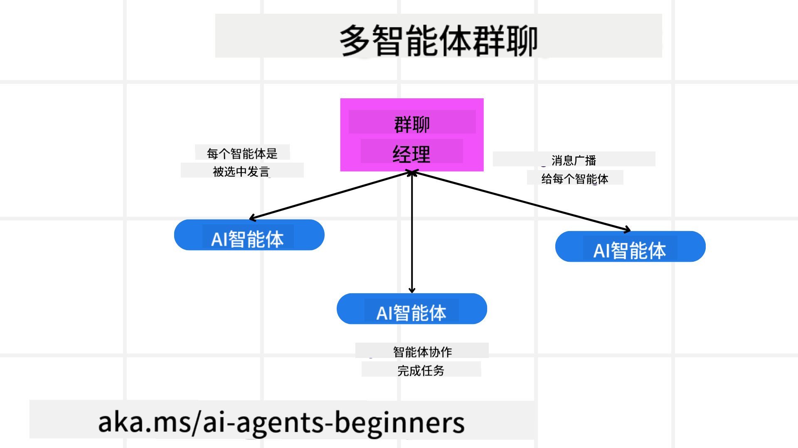
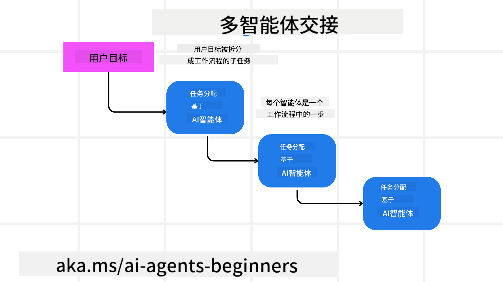
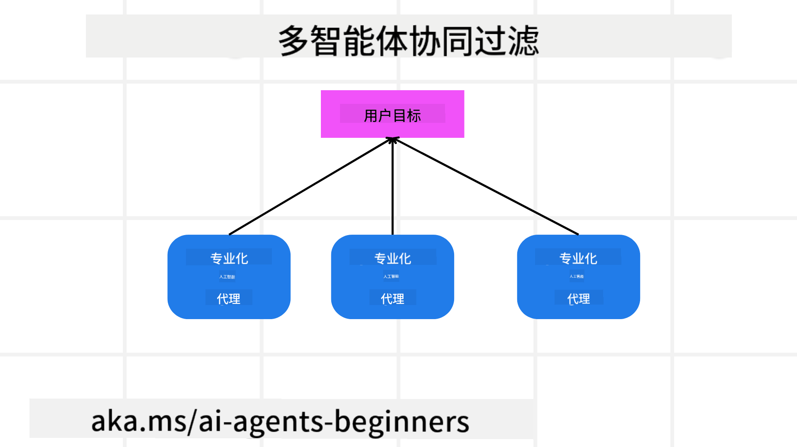

<!--
CO_OP_TRANSLATOR_METADATA:
{
  "original_hash": "c692a8975d7d5b99575a553de1c5e8a7",
  "translation_date": "2025-07-12T10:55:42+00:00",
  "source_file": "08-multi-agent/README.md",
  "language_code": "zh"
}
-->

> _(点击上方图片观看本课视频)_

# 多智能体设计模式

一旦你开始着手一个涉及多个智能体的项目，就需要考虑多智能体设计模式。然而，何时切换到多智能体以及其优势可能并不立即明了。

## 介绍

本课将解答以下问题：

- 多智能体适用的场景有哪些？
- 使用多智能体相比单一智能体执行多任务有哪些优势？
- 实现多智能体设计模式的构建模块有哪些？
- 如何监控多个智能体之间的交互？

## 学习目标

完成本课后，你应能：

- 识别多智能体适用的场景
- 了解多智能体相较于单一智能体的优势
- 理解实现多智能体设计模式的构建模块

更大的视角是什么？

*多智能体是一种设计模式，允许多个智能体协同工作以实现共同目标*。

该模式广泛应用于机器人技术、自治系统和分布式计算等领域。

## 多智能体适用的场景

那么，哪些场景适合使用多智能体？答案是很多，尤其在以下情况下多智能体更有优势：

- **大规模工作量**：大规模工作可以拆分成更小的任务分配给不同智能体，实现并行处理，加快完成速度。比如大数据处理任务。
- **复杂任务**：复杂任务同样可以拆分成多个子任务，分配给各自专长的智能体。例如自动驾驶车辆中，不同智能体分别负责导航、障碍物检测和车辆间通信。
- **多样化专业技能**：不同智能体具备不同专业技能，能更有效地处理任务的不同方面。比如医疗领域中，智能体分别负责诊断、治疗方案和患者监控。

## 多智能体相较于单一智能体的优势

单一智能体系统适合简单任务，但面对复杂任务，使用多智能体有以下优势：

- **专业化**：每个智能体专注于特定任务。单一智能体缺乏专业化，面对复杂任务时可能不知所措，甚至执行不适合自己的任务。
- **可扩展性**：通过增加智能体更容易扩展系统，而不是让单一智能体负载过重。
- **容错性**：某个智能体失败时，其他智能体仍能继续工作，保证系统可靠性。

举个例子，帮用户预订旅行。单一智能体需处理所有环节，从查找航班到预订酒店和租车。为此，智能体必须具备处理所有任务的工具，导致系统复杂且难以维护和扩展。而多智能体系统则可由专门负责查航班、订酒店和租车的智能体组成，使系统更模块化、易维护且可扩展。

这就像一家由夫妻经营的小旅行社与连锁加盟旅行社的对比。小旅行社由单一智能体处理所有预订环节，而连锁加盟则由不同智能体分别负责不同环节。

## 实现多智能体设计模式的构建模块

在实现多智能体设计模式前，你需要了解构成该模式的基本模块。

以帮用户预订旅行为例，构建模块包括：

- **智能体通信**：负责查航班、订酒店和租车的智能体需要交流用户偏好和限制信息。你需要确定通信协议和方式。具体来说，查航班智能体需与订酒店智能体沟通，确保酒店预订日期与航班日期一致。也就是说，智能体间需共享用户出行日期信息，你需要决定*哪些智能体共享信息以及如何共享*。
- **协调机制**：智能体需协调行动，确保满足用户偏好和限制。比如用户偏好住机场附近的酒店，而租车只能在机场取车，订酒店智能体需与租车智能体协调，确保满足这些条件。你需要决定*智能体如何协调行动*。
- **智能体架构**：智能体需具备内部结构以做决策并从与用户的交互中学习。比如查航班智能体需具备决策结构，推荐合适航班。你需要决定*智能体如何做决策并从交互中学习*。例如，查航班智能体可使用机器学习模型，根据用户过往偏好推荐航班。
- **多智能体交互的可视化**：你需要监控多个智能体间的交互情况。为此，需要具备跟踪智能体活动和交互的工具和技术，如日志记录、监控工具、可视化工具和性能指标。
- **多智能体模式**：多智能体系统有多种实现模式，如集中式、分散式和混合架构。你需选择最适合用例的模式。
- **人机交互**：大多数情况下，系统中会有人类参与，你需要指示智能体何时请求人工干预。比如用户要求特定酒店或航班，智能体未推荐时，或预订前需用户确认。

## 多智能体交互的可视化

了解多个智能体如何相互作用非常重要。这对于调试、优化和确保系统整体有效性至关重要。为此，你需要具备跟踪智能体活动和交互的工具和技术，如日志记录、监控工具、可视化工具和性能指标。

举例来说，帮用户预订旅行时，你可以有一个仪表盘显示每个智能体的状态、用户偏好和限制，以及智能体间的交互。仪表盘可显示用户出行日期、航班智能体推荐的航班、酒店智能体推荐的酒店和租车智能体推荐的车辆。这样你能清晰看到智能体间的交互情况，以及用户偏好和限制是否得到满足。

下面详细介绍这些方面：

- **日志记录和监控工具**：你需要为每个智能体的操作记录日志。日志条目可包含执行操作的智能体、操作内容、操作时间和结果。这些信息可用于调试和优化。
- **可视化工具**：可视化工具帮助你更直观地观察智能体间的交互。例如，你可以用图表展示智能体间信息流动，有助于发现瓶颈、低效和其他问题。
- **性能指标**：性能指标帮助你跟踪多智能体系统的效果。例如，任务完成时间、单位时间内完成的任务数，以及智能体推荐的准确度。这些信息有助于发现改进点并优化系统。

## 多智能体模式

让我们深入了解一些创建多智能体应用的具体模式。以下是值得考虑的几个有趣模式：

### 群聊

当你想创建一个多智能体可以相互通信的群聊应用时，这个模式非常有用。典型用例包括团队协作、客户支持和社交网络。

在该模式中，每个智能体代表群聊中的一个用户，智能体间通过消息协议交换信息。智能体可以向群聊发送消息、接收群聊消息，并回复其他智能体的消息。

该模式可通过集中式架构实现，所有消息通过中央服务器转发，或通过分散式架构实现，智能体间直接交换消息。

### 任务交接

当你想创建一个多智能体可以相互交接任务的应用时，这个模式非常有用。

典型用例包括客户支持、任务管理和工作流自动化。

在该模式中，每个智能体代表一个任务或工作流中的步骤，智能体可根据预定义规则将任务交接给其他智能体。

### 协同过滤

当你想创建一个多智能体协作为用户提供推荐的应用时，这个模式非常有用。

多智能体协作的原因是每个智能体具备不同专长，能以不同方式贡献推荐过程。

举例来说，用户想获得股票市场最佳买入股票的推荐。

- **行业专家**：一个智能体专注于特定行业。
- **技术分析**：另一个智能体专注于技术分析。
- **基本面分析**：还有一个智能体专注于基本面分析。通过协作，这些智能体能为用户提供更全面的推荐。

## 场景：退款流程

考虑一个客户申请产品退款的场景，可能涉及多个智能体。我们将智能体分为专门处理退款流程的智能体和可用于其他流程的通用智能体。

**专门处理退款流程的智能体**：

以下是可能参与退款流程的智能体：

- **客户智能体**：代表客户，负责发起退款流程。
- **卖家智能体**：代表卖家，负责处理退款。
- **支付智能体**：代表支付流程，负责退还客户款项。
- **解决智能体**：代表解决流程，负责处理退款过程中出现的问题。
- **合规智能体**：代表合规流程，确保退款流程符合相关法规和政策。

**通用智能体**：

这些智能体可被业务其他部分使用。

- **运输智能体**：代表运输流程，负责将产品退回卖家。该智能体既可用于退款流程，也可用于一般购买产品的运输。
- **反馈智能体**：代表反馈流程，负责收集客户反馈。反馈可在任何时间收集，不仅限于退款流程。
- **升级智能体**：代表升级流程，负责将问题升级到更高级别的支持。适用于任何需要升级问题的流程。
- **通知智能体**：代表通知流程，负责在退款流程的各个阶段向客户发送通知。
- **分析智能体**：代表分析流程，负责分析与退款流程相关的数据。
- **审计智能体**：代表审计流程，负责审计退款流程，确保其正确执行。
- **报告智能体**：代表报告流程，负责生成退款流程的报告。
- **知识智能体**：代表知识流程，负责维护与退款流程相关的信息知识库。该智能体既了解退款，也了解业务其他部分。
- **安全智能体**：代表安全流程，负责保障退款流程的安全。
- **质量智能体**：代表质量流程，负责确保退款流程的质量。

以上列出了不少智能体，既有专门处理退款流程的，也有可用于业务其他部分的通用智能体。希望这能帮助你理解如何决定在多智能体系统中使用哪些智能体。

## 任务
## 上一课

[规划设计](../07-planning-design/README.md)

## 下一课

[AI 代理中的元认知](../09-metacognition/README.md)

**免责声明**：  
本文件使用 AI 翻译服务 [Co-op Translator](https://github.com/Azure/co-op-translator) 进行翻译。虽然我们力求准确，但请注意，自动翻译可能包含错误或不准确之处。原始文件的母语版本应被视为权威来源。对于重要信息，建议使用专业人工翻译。对于因使用本翻译而产生的任何误解或误释，我们不承担任何责任。